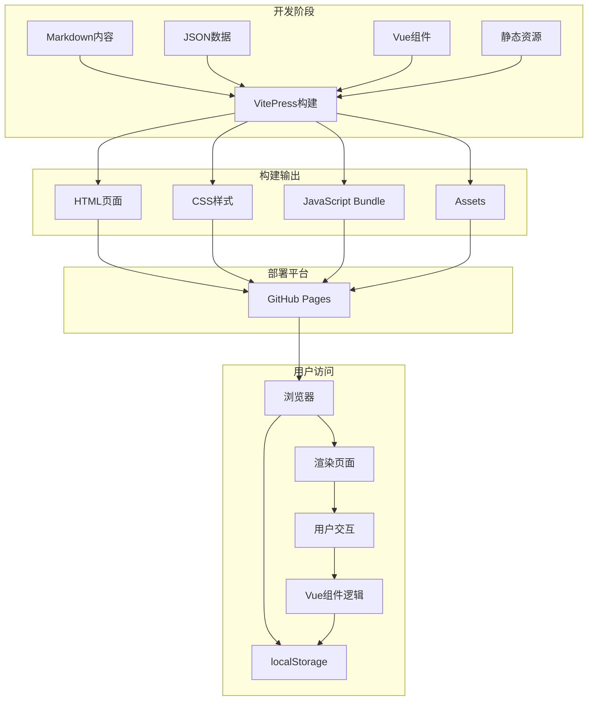
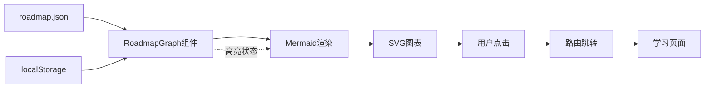
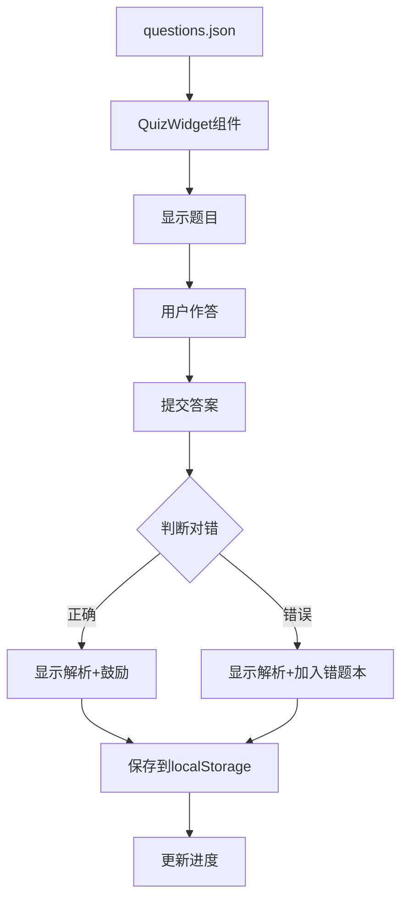
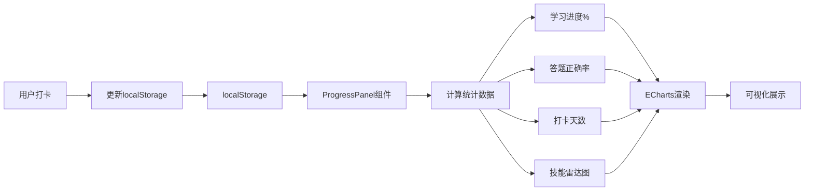
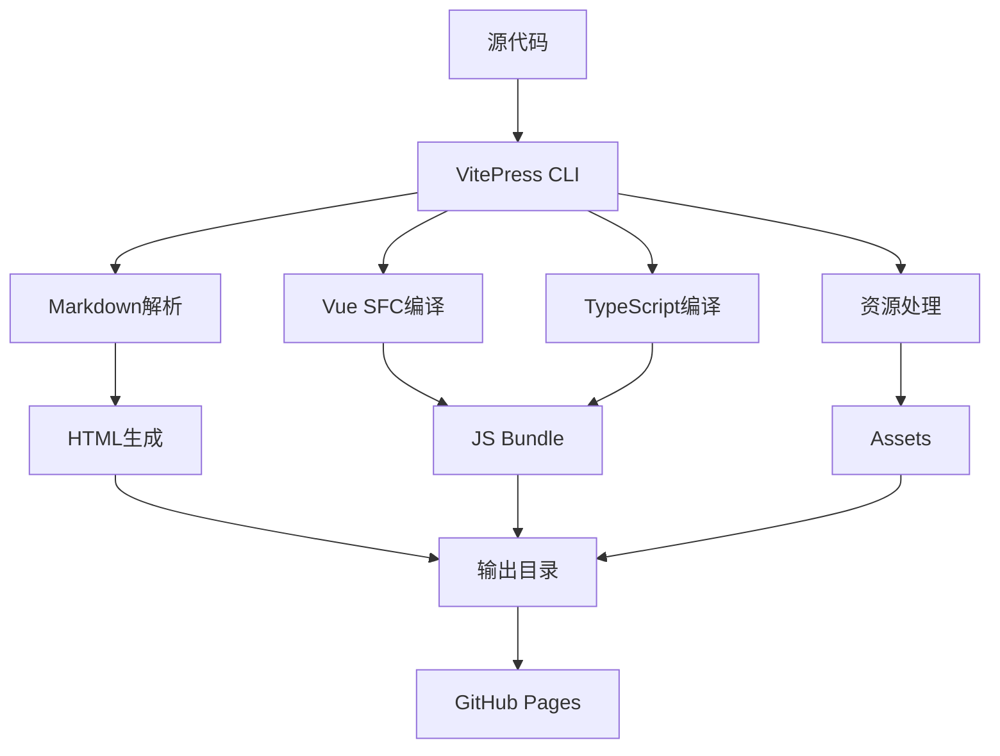
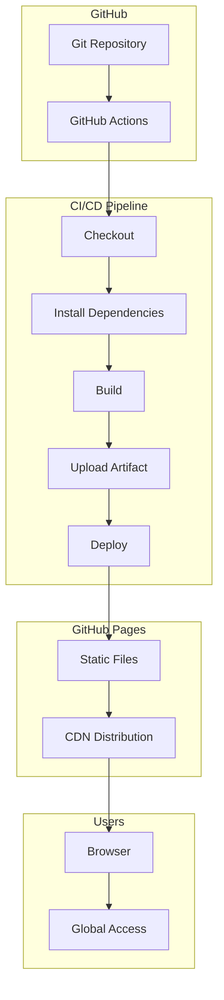

# LearnPlace 系统架构

## 🏗️ 整体架构



## 📦 模块架构

### 1. 内容层 (Content Layer)

```
docs/
├── Markdown文档 (.md)          # 学习内容
├── JSON数据 (.json)            # 结构化数据
└── 静态资源 (images, etc.)     # 图片、图标等
```

**职责**:
- 存储所有学习内容
- 定义数据结构
- 管理元数据

**技术选型理由**:
- Markdown: 易读易写,版本控制友好
- JSON: 结构化数据,易于解析和扩展
- 静态资源: CDN加速,缓存优化

### 2. 表现层 (Presentation Layer)

```
docs/.vitepress/
├── config.ts                   # 站点配置
├── theme/
│   ├── index.ts                # 主题入口
│   ├── Layout.vue              # 布局组件
│   └── components/             # 自定义组件
│       ├── RoadmapGraph.vue    # 路线图
│       ├── QuizWidget.vue      # 答题组件
│       └── ProgressPanel.vue   # 进度面板
```

**职责**:
- 页面布局和导航
- 交互式组件实现
- 样式和主题定制

**技术选型理由**:
- VitePress: 专为文档优化的SSG
- Vue 3: 响应式UI,组件化开发
- TypeScript: 类型安全,可维护性

### 3. 数据层 (Data Layer)

```
localStorage {
  user-progress: {
    completedNodes: [],
    quizResults: [],
    checkinRecords: []
  },
  quiz-progress: {
    history: [],
    wrongQuestions: []
  }
}
```

**职责**:
- 用户数据持久化
- 学习进度追踪
- 状态管理

**技术选型理由**:
- localStorage: 简单可靠,无需后端
- 为后续迁移到API预留接口

### 4. 工具层 (Tools Layer)

```
tools/
├── quiz.vue                    # 答题工具
├── progress.vue                # 进度工具
└── calculator.vue              # Token计算器
```

**职责**:
- 提供实用工具
- 增强学习体验
- 数据可视化

## 🔄 数据流

### 学习路线数据流



### 答题系统数据流



### 进度追踪数据流



## 🎨 组件架构

### 组件层次结构

```
App (VitePress)
├── Layout (自定义布局)
│   ├── Header (导航栏)
│   ├── Sidebar (侧边栏)
│   ├── Content (页面内容)
│   │   ├── Markdown渲染
│   │   └── Vue组件嵌入
│   │       ├── RoadmapGraph
│   │       ├── QuizWidget
│   │       └── ProgressPanel
│   └── Footer (页脚)
└── Tools Pages
    ├── Quiz Page
    │   └── QuizWidget
    ├── Progress Page
    │   └── ProgressPanel
    └── Calculator Page
        └── TokenCalculator
```

### 组件通信

```typescript
// Props向下传递
Parent Component
  ↓ props: phases, completedNodes
RoadmapGraph Component

// Events向上传递
Child Component
  ↓ emit: 'node-click'
Parent Component

// localStorage共享状态
Component A → localStorage → Component B
```

## 🔌 集成点

### 第三方库集成

#### 1. Mermaid.js (流程图渲染)
```typescript
import mermaid from 'mermaid'

// 初始化
mermaid.initialize({
  startOnLoad: false,
  theme: 'default'
})

// 渲染
const { svg } = await mermaid.render(id, definition)
```

**集成位置**: RoadmapGraph.vue  
**用途**: 动态生成学习路线图

#### 2. ECharts (数据可视化)
```typescript
import * as echarts from 'echarts'

// 初始化
const chart = echarts.init(domElement)

// 配置
chart.setOption({
  radar: { ... },
  series: [{ type: 'radar', ... }]
})
```

**集成位置**: ProgressPanel.vue  
**用途**: 技能雷达图

#### 3. VitePress (SSG框架)
```typescript
// config.ts
export default defineConfig({
  // 配置项
})
```

**集成位置**: 全局  
**用途**: 站点构建和路由

## 🚀 构建流程



### 构建优化

1. **代码分割**: 按路由自动分割chunk
2. **Tree Shaking**: 移除未使用代码
3. **Minification**: 压缩JS/CSS
4. **Gzip**: 自动压缩传输
5. **Cache Busting**: 文件名hash

## 🌐 部署架构



### 部署特点
- ✅ 自动化部署(GitHub Actions)
- ✅ 全球CDN加速
- ✅ HTTPS加密
- ✅ 零运维成本

## 🔐 安全架构

### 纯静态优势

```
传统动态应用:
Client → Server → Database
         ↑
      攻击面

LearnPlace静态应用:
Client → CDN → Static Files
         ↑
      无攻击面
```

### 数据安全

1. **用户隐私**: 数据存储在本地,不上传服务器
2. **XSS防护**: 所有内容静态,无用户输入
3. **CSRF防护**: 无服务端会话
4. **合规性**: 符合GDPR要求

## 📊 性能架构

### 加载性能

```
关键路径:
1. HTML加载 (<1s)
2. CSS解析 (<100ms)
3. JS执行 (<500ms)
4. 组件渲染 (<200ms)

总FCP: <2s
```

### 优化策略

1. **Preload**: 预加载关键资源
2. **Lazy Load**: 懒加载非关键组件
3. **Code Splitting**: 按需加载代码
4. **Caching**: 浏览器缓存策略
5. **Compression**: Gzip/Brotli压缩

## 🔄 扩展架构

### 内容扩展

```
新增学习节点:
1. 创建 .md 文件
2. 更新 roadmap.json
3. 更新 config.ts sidebar
4. 自动重新构建部署
```

### 功能扩展

```
新增工具页面:
1. 创建 Vue 组件
2. 在 tools/ 目录创建页面
3. 注册到 config.ts
4. 自动集成到导航
```

### 动态化演进

```
Phase 1 (当前): localStorage
Phase 2: Backend API (可选)
Phase 3: User Auth (可选)
Phase 4: Real-time Sync (可选)

每一步都可独立演进,不影响现有功能
```

## 🎯 架构决策记录 (ADR)

### ADR-001: 选择VitePress而非Next.js/Nuxt

**背景**: 需要构建静态学习平台

**决策**: 使用VitePress

**理由**:
- ✅ 专为文档优化
- ✅ 内置Markdown支持
- ✅ 零配置启动
- ✅ 优秀的默认主题
- ✅ 更快的构建速度

**后果**:
- + 开发效率高
- + 维护成本低
- - 灵活性略低于通用框架(但足够使用)

### ADR-002: 使用localStorage而非Backend API

**背景**: 需要存储用户进度

**决策**: 使用localStorage

**理由**:
- ✅ 零后端依赖
- ✅ 免费托管(GitHub Pages)
- ✅ 隐私保护(数据本地)
- ✅ 快速原型验证

**后果**:
- + 架构简单
- + 部署容易
- - 数据无法跨设备同步(可通过导出/导入解决)

### ADR-003: 数据与代码分离(JSON驱动)

**背景**: 需要频繁更新学习内容

**决策**: 学习内容存储在JSON文件

**理由**:
- ✅ 内容与代码分离
- ✅ 非技术人员也可更新
- ✅ 版本控制友好
- ✅ 易于迁移到CMS

**后果**:
- + 维护方便
- + 扩展灵活
- - 需要额外的数据验证

---

**架构版本**: v1.0  
**最后更新**: 2026-06-20  
**维护者**: LearnPlace Team
