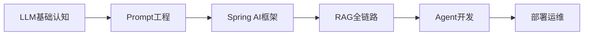

# LearnPlace - Java后端开发者AI/Agent学习平台

<div align="center">


**系统化学习路线 · 实战项目训练 · 能力评估体系**

[🌐 在线预览](https://your-org.github.io/learn-place/) | [📖 快速开始](#-快速开始) | [💬 讨论区](https://github.com/your-org/learn-place/discussions)

</div>

---

## 🎯 项目简介

**LearnPlace** 是专为 **Java后端开发者** 设计的 **AI/Agent应用开发** 系统化学习平台。我们帮助你从传统的CRUD开发思维,平滑过渡到AI时代的Prompt-Response模式,掌握大语言模型(LLM)、检索增强生成(RAG)、智能体(Agent)等前沿技术。

### 为什么选择 LearnPlace?

✅ **专为Java开发者打造** - 基于Spring Boot和Spring AI框架,充分利用你已有的技术栈  
✅ **渐进式学习路径** - 从LLM基础到Agent开发,6个阶段循序渐进,避免知识断层  
✅ **理论与实践结合** - 每个知识点都配有可运行的代码示例和实战项目  
✅ **交互式学习体验** - 在线答题、进度追踪、技能雷达图,让学习过程可视化  
✅ **纯静态部署** - 基于VitePress构建,GitHub Pages零运维成本托管  

---

## ✨ 核心特性

### 📚 6阶段系统化学习路线



| 阶段 | 主题 | 预计时长 | 难度等级 |
|------|------|----------|----------|
| Stage 1 | LLM基础认知 | 2周 | ⭐ L1 |
| Stage 2 | Prompt工程 | 2周 | ⭐⭐ L1-L2 |
| Stage 3 | Spring AI框架 | 2周 | ⭐⭐ L2 |
| Stage 4 | RAG全链路 | 2周 | ⭐⭐⭐ L2-L3 |
| Stage 5 | Agent开发 | 2周 | ⭐⭐⭐⭐ L3 |
| Stage 6 | 部署运维 | 2周 | ⭐⭐⭐ L2-L3 |

**总学习周期**: 12周 (每天2小时)

### 💻 5个实战项目

从简单到复杂,逐步提升实战能力:

| 项目 | 难度 | 核心技术 | 学习价值 |
|------|------|----------|----------|
| **L1: 智能问答机器人** | ⭐ | Spring AI + OpenAI API | 理解LLM基础调用 |
| **L2: RAG知识库** | ⭐⭐ | Vector DB + Embedding | 掌握RAG架构原理 |
| **L2: 代码生成Agent** | ⭐⭐ | Function Calling | 学会工具集成 |
| **L3: 多Agent协作系统** | ⭐⭐⭐⭐ | AutoGen/LangGraph | 理解Agent编排 |
| **L3: 智能客服系统** | ⭐⭐⭐⭐ | 多Agent + RAG | 生产级系统设计 |

每个项目包含:
- 📖 完整的需求分析和架构设计
- 🔧 可运行的源代码(GitHub仓库链接)
- 📝 关键代码片段讲解
- 🧪 测试用例和自测清单
- 🚀 部署指南和性能优化建议

### 🎮 交互式题库

- **65+道精选题目** - 覆盖LLM理论、Prompt工程、RAG架构、Agent设计等核心知识点
- **即时反馈机制** - 答题后立即显示正确答案和详细解析
- **错题本功能** - 自动记录答错题目,支持针对性复习
- **难度分级** - L1入门、L2进阶、L3挑战,适合不同阶段学习者
- **随机抽题** - 每次练习随机抽取10道题,避免记忆答案

### 📊 进度追踪与能力评估

- **学习打卡统计** - 可视化展示连续学习天数和累计学习时长
- **ECharts技能雷达图** - 6个维度(理论/框架/RAG/Agent/部署/安全)直观展示掌握程度
- **阶段性自测** - 每完成一个阶段,提供综合测试检验学习效果
- **个性化学习建议** - 根据薄弱环节推荐针对性学习资源

### 🔧 丰富学习资源

- **50+优质文章** - 精选Spring AI、LangChain4j、RAG、Agent等领域高质量博客
- **30+视频教程** - B站、YouTube、Coursera平台精品课程,标注播放量和时长
- **40+官方文档** - 确保链接有效性和版本时效性,优先推荐官方渠道
- **25+开源项目** - GitHub Stars>1K的活跃项目,可直接运行学习

---

## 🚀 快速开始

### 前置要求

- Node.js 18+ 
- npm 9+ 或 pnpm 8+
- Git

### 本地运行

```bash
# 1. 克隆仓库
git clone https://github.com/your-org/learn-place.git
cd learn-place

# 2. 安装依赖
npm install

# 3. 启动开发服务器
npm run dev

# 4. 浏览器访问
# http://localhost:5173/learn-place/
```

### 生产构建

```bash
# 构建静态站点(包含sitemap生成)
npm run build

# 预览构建结果
npm run preview
```

构建产物位于 `docs/.vitepress/dist/` 目录,可直接部署到任何静态托管服务。

---

## 📁 项目结构

```
learn-place/
├── docs/                      # VitePress文档根目录
│   ├── .vitepress/           # VitePress配置
│   │   ├── config.ts         # 主配置文件(路由/SEO/主题)
│   │   ├── theme/            # 自定义主题组件
│   │   └── components/       # Vue组件(QuizWidget等)
│   │
│   ├── guide/                # 学习指南
│   │   ├── roadmap.md        # 学习路线总览
│   │   ├── llm-basics/       # LLM基础认知
│   │   ├── prompt-eng/       # Prompt工程
│   │   ├── spring-ai/        # Spring AI框架
│   │   ├── rag/              # RAG全链路
│   │   ├── agent/            # Agent开发
│   │   └── deployment/       # 部署运维
│   │
│   ├── resources/            # 学习资料汇总
│   │   ├── articles.md       # 优质技术文章(50+)
│   │   ├── videos.md         # 视频教程(30+)
│   │   ├── docs.md           # 官方文档(40+)
│   │   └── projects.md       # 开源项目(25+)
│   │
│   ├── projects/             # 练手项目
│   │   ├── overview.md       # 项目总览
│   │   ├── project-1-qa-bot.md
│   │   ├── project-2-rag-kb.md
│   │   ├── project-3-code-agent.md
│   │   ├── project-4-multi-agent.md
│   │   └── project-5-customer-service.md
│   │
│   ├── interview/            # 面试题库
│   │   ├── overview.md       # 使用说明
│   │   ├── llm-theory/       # LLM理论基础
│   │   ├── prompt-eng/       # Prompt工程
│   │   ├── rag/              # RAG架构
│   │   ├── agent/            # Agent开发
│   │   ├── frameworks/       # 框架使用
│   │   └── system-design/    # 系统设计
│   │
│   ├── tools/                # 实用工具
│   │   ├── quiz.vue          # 交互式答题组件
│   │   ├── progress.vue      # 进度追踪组件
│   │   └── calculator.vue    # Token计算器
│   │
│   ├── data/                 # JSON数据文件
│   │   ├── questions.json    # 题库数据(65+题)
│   │   ├── roadmap.json      # 学习路线数据
│   │   └── projects.json     # 项目元数据
│   │
│   ├── public/               # 静态资源
│   │   ├── logo.svg          # Logo图标
│   │   ├── favicon.ico       # 网站图标
│   │   └── robots.txt        # SEO爬虫配置
│   │
│   └── index.md              # 首页
│
├── package.json              # 项目依赖配置
├── tsconfig.json             # TypeScript配置
├── generate-sitemap.js       # Sitemap生成脚本
├── .github/workflows/        # GitHub Actions CI/CD
│   └── deploy.yml            # 自动部署配置
├── README.md                 # 项目说明(本文件)
├── QUICKSTART.md             # 5分钟快速上手指南
├── LICENSE                   # MIT许可证
└── .gitignore                # Git忽略文件配置
```

---

## 🛠️ 技术栈

### 核心框架

- **[VitePress 1.5+](https://vitepress.dev/)** - 基于Vite和Vue 3的静态站点生成器
- **[Vue 3.4+](https://vuejs.org/)** - 渐进式JavaScript框架,Composition API
- **[TypeScript 5.3+](https://www.typescriptlang.org/)** - 类型安全的JavaScript超集

### 可视化库

- **[Mermaid 10.6+](https://mermaid.js.org/)** - 流程图、时序图、甘特图渲染
- **[ECharts 5.4+](https://echarts.apache.org/)** - 数据可视化(技能雷达图、进度统计)

### 构建优化

- **代码分割** - Vue/Mermaid/ECharts独立chunk,按需加载
- **Tree Shaking** - 移除未使用的代码,减小包体积
- **Minification** - Terser压缩,移除console.log和debugger
- **Gzip压缩** - VitePress内置gzip支持,传输体积减少70%
- **Cache Busting** - 文件名哈希,浏览器缓存策略优化

### 部署方案

- **GitHub Pages** - 免费静态托管,自动HTTPS
- **GitHub Actions** - CI/CD自动化部署,push即部署
- **自定义域名** - 支持CNAME配置,绑定个人域名

---

## 🌐 在线预览

访问 **[https://your-org.github.io/learn-place/](https://your-org.github.io/learn-place/)** 即可浏览完整内容。

> 💡 **提示**: 首次加载可能需要几秒时间,因为需要下载Mermaid和ECharts库。后续访问会使用浏览器缓存,速度更快。

---

## 🤝 贡献指南

我们欢迎所有形式的贡献!无论是修正错别字、补充学习内容,还是优化UI交互,你的每一份贡献都会让LearnPlace变得更好。

### 贡献流程

1. **Fork本仓库** - 点击右上角Fork按钮
2. **创建分支** - `git checkout -b feature/your-feature`
3. **提交改动** - `git commit -am 'Add some feature'`
4. **推送分支** - `git push origin feature/your-feature`
5. **提交PR** - 在GitHub上创建Pull Request

### 贡献内容建议

#### 📝 内容补充
- 新增学习章节(如Fine-tuning、Model Distillation等)
- 补充实战项目案例
- 更新过时的技术文档
- 添加更多面试题目

#### 🎨 UI优化
- 改进页面布局和响应式设计
- 优化配色方案和字体大小
- 添加动画效果和交互反馈
- 提升无障碍访问(Accessibility)支持

#### 🔧 功能增强
- 新增实用工具(如Prompt模板生成器)
- 优化QuizWidget交互体验
- 添加学习进度导出功能
- 实现暗黑模式切换

#### 🐛 Bug修复
- 修复死链和404错误
- 修正代码示例中的bug
- 优化移动端显示效果
- 解决浏览器兼容性问题

### 代码规范

- 遵循 [Vue 3风格指南](https://vuejs.org/style-guide/)
- 使用TypeScript编写新组件
- 添加必要的注释和文档
- 确保ESLint检查通过

### 提交PR前检查清单

- [ ] 本地运行 `npm run build` 无错误
- [ ] 所有页面在Chrome/Firefox/Safari中正常显示
- [ ] 移动端(iPhone 12/Pixel 5)布局正常
- [ ] 外部链接无404错误
- [ ] Mermaid图表渲染正确
- [ ] QuizWidget功能正常

---

## 📄 License

本项目采用 **MIT License** 开源协议。

```
MIT License

Copyright (c) 2026 LearnPlace Team

Permission is hereby granted, free of charge, to any person obtaining a copy
of this software and associated documentation files (the "Software"), to deal
in the Software without restriction, including without limitation the rights
to use, copy, modify, merge, publish, distribute, sublicense, and/or sell
copies of the Software, and to permit persons to whom the Software is
furnished to do so, subject to the following conditions:

The above copyright notice and this permission notice shall be included in all
copies or substantial portions of the Software.

THE SOFTWARE IS PROVIDED "AS IS", WITHOUT WARRANTY OF ANY KIND, EXPRESS OR
IMPLIED, INCLUDING BUT NOT LIMITED TO THE WARRANTIES OF MERCHANTABILITY,
FITNESS FOR A PARTICULAR PURPOSE AND NONINFRINGEMENT. IN NO EVENT SHALL THE
AUTHORS OR COPYRIGHT HOLDERS BE LIABLE FOR ANY CLAIM, DAMAGES OR OTHER
LIABILITY, WHETHER IN AN ACTION OF CONTRACT, TORT OR OTHERWISE, ARISING FROM,
OUT OF OR IN CONNECTION WITH THE SOFTWARE OR THE USE OR OTHER DEALINGS IN THE
SOFTWARE.
```

---

## 🙏 致谢

感谢以下开源项目的杰出工作:

- [VitePress](https://vitepress.dev/) - 优秀的静态站点生成器
- [Vue.js](https://vuejs.org/) - 渐进式JavaScript框架
- [Spring AI](https://spring.io/projects/spring-ai) - Spring生态AI框架
- [LangChain4j](https://langchain4j.dev/) - Java版LangChain
- [Mermaid](https://mermaid.js.org/) - 图表渲染库
- [ECharts](https://echarts.apache.org/) - 数据可视化库

---

## 📬 联系方式

- 🐛 **问题反馈**: [GitHub Issues](https://github.com/your-org/learn-place/issues)
- 💬 **讨论交流**: [GitHub Discussions](https://github.com/your-org/learn-place/discussions)
- 📧 **邮件联系**: contact@learnplace.dev (示例邮箱)
- 🌟 **Star支持**: 如果本项目对你有帮助,请给我们一个Star ⭐

---

<div align="center">

**Made with ❤️ by LearnPlace Team**

[⬆ 回到顶部](#learnplace---java后端开发者aiagent学习平台)

</div>
