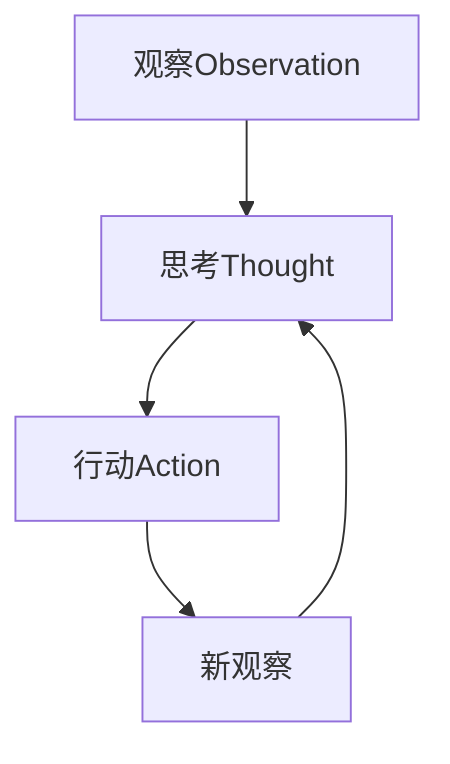

# Agent设计模式

## 什么是Agent?

Agent(智能体)是能够感知环境、做出决策并执行行动的自主系统。在AI应用中,Agent通过调用工具、规划任务来实现复杂目标。

## 核心组件

### 1. 感知(Perception)
- 接收用户输入
- 理解上下文信息
- 识别当前状态

### 2. 推理(Reasoning)
- 分析任务需求
- 制定执行计划
- 选择合适的工具

### 3. 行动(Action)
- 调用外部工具
- 执行具体操作
- 收集执行结果

### 4. 反思(Reflection)
- 评估行动效果
- 调整后续策略
- 学习和优化

## 常见设计模式

### ReAct模式
Reasoning + Acting,交替进行推理和行动。



### Plan-and-Execute模式
先制定完整计划,再逐步执行。

### Multi-Agent协作
多个Agent分工合作,完成复杂任务。

## 代码示例

```java
@Component
public class WeatherAgent {
    
    @Autowired
    private ChatClient chatClient;
    
    @Autowired
    private WeatherTool weatherTool;
    
    public String execute(String userQuery) {
        String thought = chatClient.prompt()
            .system("你是一个天气查询助手")
            .user(userQuery)
            .call()
            .content();
        
        // 提取城市名称
        String city = extractCity(thought);
        
        // 调用天气工具
        String weather = weatherTool.getWeather(city);
        
        // 生成最终回答
        return chatClient.prompt()
            .user("基于天气信息回答: " + weather)
            .call()
            .content();
    }
}
```

## 相关资源

- [Agent设计模式详解](https://lilianweng.github.io/posts/2023-06-23-agent/)
- [LangChain4j Agent教程](https://docs.langchain4j.dev/tutorials/agents)

## 练习题

<ClientOnly>
  <QuizWidget category-id="agent" />
</ClientOnly>
