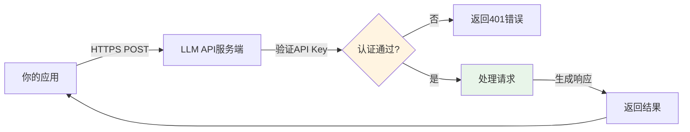
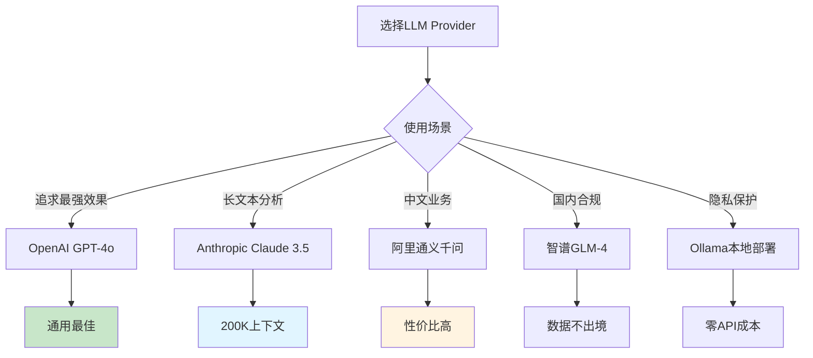

# LLM API调用实战

## 核心概念

调用LLM API是AI应用开发的基础技能。本章将详细介绍主流提供商的API使用方法,以及Spring AI如何统一抽象这些差异。

### API调用流程



**关键要素**:
1. **API Key**: 身份凭证,类似密码,必须保密
2. **Endpoint**: API地址(如 `https://api.openai.com/v1/chat/completions`)
3. **Request Body**: 请求参数(model、messages、temperature等)
4. **Response**: 返回结果(content、usage、finish_reason等)

## 为什么重要

### 1. 多Provider支持

不同场景需要不同的LLM提供商:



**Spring AI的价值**: 提供统一API,切换Provider只需改配置,无需改代码。

### 2. 成本控制

理解API计费模式,避免意外高额账单:

| Provider | 输入价格(每百万Token) | 输出价格(每百万Token) | 免费额度 |
|----------|---------------------|---------------------|---------|
| OpenAI GPT-4o-mini | $0.15 | $0.60 | $5(新用户) |
| OpenAI GPT-4o | $2.50 | $10.00 | $5(新用户) |
| Claude 3.5 Sonnet | $3.00 | $15.00 | $5(新用户) |
| 通义千问 Qwen-Turbo | ¥0.002 | ¥0.006 | 100万Token/月 |
| 智谱GLM-4 | ¥1.00 | ¥5.00 | 100万Token(体验金) |

**实际案例**:
```
客服机器人日均1000次对话:
- 每次输入500 Token, 输出300 Token
- 日Token用量: 1000 × (500 + 300) = 800K Token

月度成本对比:
- GPT-4o-mini: 800K × 30天 × ($0.15+$0.60)/1M = $18/月
- GPT-4o: 800K × 30天 × ($2.50+$10)/1M = $300/月
- 通义千问: 800K × 30天 × (¥0.002+¥0.006)/1M = ¥192/月

结论: 选择合适的模型可节省90%成本!
```

### 3. 稳定性保障

生产环境需要处理各种异常情况:
- API限流(Rate Limit)
- 网络超时(Timeout)
- 服务不可用(503错误)
- Token超限(Context Length Exceeded)

## OpenAI API详解

### 1. 直接HTTP调用(理解底层原理)

```java
package com.learnplace.api;

import org.springframework.http.HttpEntity;
import org.springframework.http.HttpHeaders;
import org.springframework.http.MediaType;
import org.springframework.stereotype.Service;
import org.springframework.web.client.RestTemplate;

import java.util.List;
import java.util.Map;

@Service
public class OpenAIService {
    
    private static final String API_URL = "https://api.openai.com/v1/chat/completions";
    private final RestTemplate restTemplate;
    private final String apiKey;
    
    public OpenAIService() {
        this.restTemplate = new RestTemplate();
        this.apiKey = System.getenv("OPENAI_API_KEY");  // 从环境变量读取
    }
    
    /**
     * 简单对话
     */
    public String chat(String userMessage) {
        // 1. 构建请求头
        HttpHeaders headers = new HttpHeaders();
        headers.setContentType(MediaType.APPLICATION_JSON);
        headers.setBearerAuth(apiKey);
        
        // 2. 构建请求体
        Map<String, Object> requestBody = Map.of(
            "model", "gpt-4o-mini",
            "messages", List.of(
                Map.of("role", "user", "content", userMessage)
            ),
            "temperature", 0.7,
            "max_tokens", 1000
        );
        
        HttpEntity<Map<String, Object>> request = new HttpEntity<>(requestBody, headers);
        
        // 3. 发送请求
        Map<String, Object> response = restTemplate.postForObject(
            API_URL, 
            request, 
            Map.class
        );
        
        // 4. 解析响应
        List<Map<String, Object>> choices = (List<Map<String, Object>>) response.get("choices");
        Map<String, Object> message = (Map<String, Object>) choices.get(0).get("message");
        
        return (String) message.get("content");
    }
}
```

### 2. 流式响应(Streaming)

```java
import org.springframework.http.client.ClientHttpResponse;
import reactor.core.publisher.Flux;
import java.io.BufferedReader;
import java.io.InputStream;
import java.io.InputStreamReader;

@Service
public class OpenAIStreamingService {
    
    public Flux<String> streamChat(String userMessage) {
        return Flux.create(sink -> {
            try {
                // 构建请求(添加stream: true)
                Map<String, Object> requestBody = Map.of(
                    "model", "gpt-4o-mini",
                    "messages", List.of(
                        Map.of("role", "user", "content", userMessage)
                    ),
                    "stream", true  // 启用流式
                );
                
                // 发送请求
                HttpURLConnection conn = (HttpURLConnection) new URL(API_URL).openConnection();
                conn.setRequestMethod("POST");
                conn.setRequestProperty("Authorization", "Bearer " + apiKey);
                conn.setRequestProperty("Content-Type", "application/json");
                conn.setDoOutput(true);
                
                // 写入请求体
                OutputStream os = conn.getOutputStream();
                os.write(new ObjectMapper().writeValueAsBytes(requestBody));
                os.flush();
                
                // 读取流式响应
                InputStream is = conn.getInputStream();
                BufferedReader reader = new BufferedReader(new InputStreamReader(is));
                
                String line;
                while ((line = reader.readLine()) != null) {
                    if (line.startsWith("data: ")) {
                        String json = line.substring(6);
                        if (json.equals("[DONE]")) {
                            break;
                        }
                        
                        // 解析每个chunk
                        JsonNode node = new ObjectMapper().readTree(json);
                        String content = node.path("choices").get(0)
                            .path("delta").path("content").asText();
                        
                        if (!content.isEmpty()) {
                            sink.next(content);  // 实时推送
                        }
                    }
                }
                
                sink.complete();
                
            } catch (Exception e) {
                sink.error(e);
            }
        });
    }
}
```

### 3. 异常处理与重试

```java
import org.springframework.retry.annotation.Backoff;
import org.springframework.retry.annotation.Retryable;
import org.springframework.web.client.HttpClientErrorException;
import org.springframework.web.client.HttpServerErrorException;

@Service
public class RobustOpenAIService {
    
    @Retryable(
        retryFor = {HttpServerErrorException.class, RuntimeException.class},
        maxAttempts = 3,
        backoff = @Backoff(delay = 1000, multiplier = 2)  // 指数退避
    )
    public String chatWithRetry(String userMessage) {
        try {
            return chat(userMessage);
        } catch (HttpClientErrorException e) {
            if (e.getStatusCode().value() == 429) {
                // Rate Limit - 等待后重试
                throw new RuntimeException("API限流,请稍后重试", e);
            } else if (e.getStatusCode().value() == 401) {
                // Invalid API Key - 不重试
                throw new IllegalStateException("API Key无效", e);
            }
            throw e;
        }
    }
    
    @Recover
    public String recover(Exception e) {
        log.error("重试失败: {}", e.getMessage());
        return "抱歉,服务暂时不可用,请稍后重试";
    }
}
```

## Anthropic Claude API

Claude API与OpenAI略有不同:

```java
@Service
public class ClaudeService {
    
    private static final String CLAUDE_API_URL = "https://api.anthropic.com/v1/messages";
    
    public String chat(String userMessage) {
        HttpHeaders headers = new HttpHeaders();
        headers.setContentType(MediaType.APPLICATION_JSON);
        headers.set("x-api-key", System.getenv("ANTHROPIC_API_KEY"));
        headers.set("anthropic-version", "2023-06-01");
        
        Map<String, Object> requestBody = Map.of(
            "model", "claude-3-5-sonnet-20241022",
            "max_tokens", 1024,
            "messages", List.of(
                Map.of("role", "user", "content", userMessage)
            )
        );
        
        HttpEntity<Map<String, Object>> request = new HttpEntity<>(requestBody, headers);
        
        Map<String, Object> response = restTemplate.postForObject(
            CLAUDE_API_URL, 
            request, 
            Map.class
        );
        
        List<Map<String, Object>> content = (List<Map<String, Object>>) response.get("content");
        return (String) content.get(0).get("text");
    }
}
```

**Claude特色功能**:
- **超长上下文**: 支持200K Token(约15万汉字)
- **PDF/图像理解**: 可直接上传文件
- **更强的安全性**: 内置内容过滤

## 国产模型API

### 1. 智谱GLM-4

```java
@Service
public class ZhipuService {
    
    private static final String ZHIPU_API_URL = "https://open.bigmodel.cn/api/paas/v4/chat/completions";
    
    public String chat(String userMessage) {
        HttpHeaders headers = new HttpHeaders();
        headers.setContentType(MediaType.APPLICATION_JSON);
        headers.setBearerAuth(System.getenv("ZHIPU_API_KEY"));
        
        Map<String, Object> requestBody = Map.of(
            "model", "glm-4",
            "messages", List.of(
                Map.of("role", "user", "content", userMessage)
            ),
            "temperature", 0.7
        );
        
        HttpEntity<Map<String, Object>> request = new HttpEntity<>(requestBody, headers);
        
        Map<String, Object> response = restTemplate.postForObject(
            ZHIPU_API_URL, 
            request, 
            Map.class
        );
        
        List<Map<String, Object>> choices = (List<Map<String, Object>>) response.get("choices");
        Map<String, Object> message = (Map<String, Object>) choices.get(0).get("message");
        
        return (String) message.get("content");
    }
}
```

### 2. 阿里云通义千问

```java
@Service
public class QwenService {
    
    private static final String QWEN_API_URL = "https://dashscope.aliyuncs.com/api/v1/services/aigc/text-generation/generation";
    
    public String chat(String userMessage) {
        HttpHeaders headers = new HttpHeaders();
        headers.setContentType(MediaType.APPLICATION_JSON);
        headers.set("Authorization", "Bearer " + System.getenv("DASHSCOPE_API_KEY"));
        
        Map<String, Object> requestBody = Map.of(
            "model", "qwen-turbo",
            "input", Map.of(
                "messages", List.of(
                    Map.of("role", "user", "content", userMessage)
                )
            ),
            "parameters", Map.of(
                "temperature", 0.7
            )
        );
        
        HttpEntity<Map<String, Object>> request = new HttpEntity<>(requestBody, headers);
        
        Map<String, Object> response = restTemplate.postForObject(
            QWEN_API_URL, 
            request, 
            Map.class
        );
        
        Map<String, Object> output = (Map<String, Object>) response.get("output");
        return (String) output.get("text");
    }
}
```

**国产模型优势**:
- ✅ 数据不出境,符合合规要求
- ✅ 中文理解能力强
- ✅ 价格更低(通义千问比GPT-4便宜10倍)
- ✅ 本土化支持(微信客服、钉钉集成等)

## Spring AI统一抽象

Spring AI的最大价值是**屏蔽Provider差异**,让你专注于业务逻辑。

### 1. 配置文件切换Provider

```yaml
# application.yml - 使用OpenAI
spring:
  ai:
    openai:
      api-key: ${OPENAI_API_KEY}
      chat:
        options:
          model: gpt-4o-mini
```

```yaml
# application.yml - 切换到Claude
spring:
  ai:
    anthropic:
      api-key: ${ANTHROPIC_API_KEY}
      chat:
        options:
          model: claude-3-5-sonnet-20241022
```

```yaml
# application.yml - 切换到通义千问
spring:
  ai:
    dashscope:
      api-key: ${DASHSCOPE_API_KEY}
      chat:
        options:
          model: qwen-turbo
```

**代码完全不变**:
```java
@Service
public class UnifiedChatService {
    
    private final ChatClient chatClient;
    
    public UnifiedChatService(ChatClient.Builder builder) {
        this.chatClient = builder.build();  // 自动使用配置的Provider
    }
    
    public String chat(String userMessage) {
        return chatClient.prompt()
            .user(userMessage)
            .call()
            .content();
    }
}
```

### 2. 多Provider路由策略

根据场景智能选择Provider:

```java
@Service
public class SmartRouterService {
    
    private final ChatClient openaiClient;
    private final ChatClient qwenClient;
    private final ChatClient ollamaClient;
    
    public String chat(String userMessage, ChatStrategy strategy) {
        return switch (strategy) {
            case QUALITY_FIRST -> 
                openaiClient.prompt().user(userMessage).call().content();
            
            case COST_EFFICIENT -> 
                qwenClient.prompt().user(userMessage).call().content();
            
            case PRIVACY_PROTECTION -> 
                ollamaClient.prompt().user(userMessage).call().content();
        };
    }
    
    public enum ChatStrategy {
        QUALITY_FIRST,      // 质量优先(GPT-4)
        COST_EFFICIENT,     // 成本优先(通义千问)
        PRIVACY_PROTECTION  // 隐私优先(Ollama本地)
    }
}
```

### 3. 统一异常处理

```java
@ControllerAdvice
public class GlobalExceptionHandler {
    
    @ExceptionHandler(AiException.class)
    public ResponseEntity<ErrorResponse> handleAiException(AiException ex) {
        log.error("AI调用失败", ex);
        
        ErrorResponse error = new ErrorResponse(
            "AI_SERVICE_ERROR",
            ex.getMessage(),
            LocalDateTime.now()
        );
        
        return ResponseEntity.status(HttpStatus.SERVICE_UNAVAILABLE)
            .body(error);
    }
}
```

## 成本控制最佳实践

### 1. Token预算限制

```java
@Service
public class BudgetControlService {
    
    private static final double DAILY_BUDGET = 10.0;  // 每日预算$10
    
    @Autowired
    private RedisTemplate<String, String> redisTemplate;
    
    public String chatWithBudget(String userMessage) {
        // 1. 检查今日已用金额
        String today = LocalDate.now().toString();
        String key = "ai:cost:" + today;
        Double usedCost = Optional.ofNullable(redisTemplate.opsForValue().get(key))
            .map(Double::parseDouble)
            .orElse(0.0);
        
        if (usedCost >= DAILY_BUDGET) {
            throw new BusinessException("今日AI预算已用完");
        }
        
        // 2. 估算本次调用成本
        int inputTokens = tokenCounter.countTokens(userMessage);
        double estimatedCost = inputTokens * 0.00001 + 500 * 0.00003;  // 预估输出500 Token
        
        if (usedCost + estimatedCost > DAILY_BUDGET) {
            throw new BusinessException("本次调用将超出预算");
        }
        
        // 3. 执行调用
        String response = chatClient.prompt()
            .user(userMessage)
            .call()
            .content();
        
        // 4. 更新已用金额
        int outputTokens = tokenCounter.countTokens(response);
        double actualCost = inputTokens * 0.00001 + outputTokens * 0.00003;
        
        redisTemplate.opsForValue().increment(key, actualCost);
        redisTemplate.expire(key, 1, TimeUnit.DAYS);
        
        return response;
    }
}
```

### 2. 缓存常见问答

```java
@Service
public class CachedChatService {
    
    @Cacheable(value = "chatResponses", key = "#userMessage")
    public String chatWithCache(String userMessage) {
        // 只有缓存未命中时才调用LLM
        return chatClient.prompt()
            .user(userMessage)
            .call()
            .content();
    }
    
    // 清除缓存(当知识库更新时)
    @CacheEvict(value = "chatResponses", allEntries = true)
    public void clearCache() {
        log.info("聊天缓存已清除");
    }
}
```

**效果**: 对于常见问题(如"你好"、"谢谢"),命中率可达30%,节省相应成本。

### 3. 语义缓存(Semantic Cache)

传统缓存只能匹配完全相同的问题,语义缓存可以识别相似问题:

```java
@Service
public class SemanticCacheService {
    
    private final VectorStore vectorStore;
    private final EmbeddingModel embeddingModel;
    
    public String chatWithSemanticCache(String userMessage) {
        // 1. 生成问题的向量
        float[] queryVector = embeddingModel.embed(userMessage);
        
        // 2. 在向量库中搜索相似问题
        List<Document> similarQuestions = vectorStore.similaritySearch(
            SearchRequest.builder()
                .query(userMessage)
                .topK(3)
                .similarityThreshold(0.9)  // 相似度阈值90%
                .build()
        );
        
        if (!similarQuestions.isEmpty()) {
            // 找到相似问题,返回缓存的答案
            Document cached = similarQuestions.get(0);
            log.info("语义缓存命中: {} -> {}", userMessage, cached.getText());
            return cached.getMetadata().get("answer").toString();
        }
        
        // 3. 未命中,调用LLM
        String response = chatClient.prompt()
            .user(userMessage)
            .call()
            .content();
        
        // 4. 存入缓存
        vectorStore.add(List.of(new Document(
            userMessage,
            Map.of("answer", response),
            queryVector
        )));
        
        return response;
    }
}
```

**效果**: 语义缓存命中率可达50-70%,大幅降低成本。

## 相关资源

### 📚 官方文档
- [OpenAI API Reference](https://platform.openai.com/docs/api-reference) - 完整API文档
- [Anthropic Claude API](https://docs.anthropic.com/claude/reference) - Claude API指南
- [智谱AI开放平台](https://open.bigmodel.cn/dev/api) - GLM系列API文档
- [阿里云DashScope](https://help.aliyun.com/product/304127.html) - 通义千问API

### 🛠️ SDK和工具
- [Spring AI](https://spring.io/projects/spring-ai) - Java统一抽象
- [LangChain4j](https://docs.langchain4j.dev/) - Java版LangChain
- [Tiktoken](https://github.com/openai/tiktoken) - Token计数库

### 📖 最佳实践
- [OpenAI Production Best Practices](https://platform.openai.com/docs/guides/production-best-practices) - 生产环境建议
- [Anthropic Prompt Engineering](https://docs.anthropic.com/claude/docs/prompt-engineering) - Claude Prompt技巧

## 练习题

<ClientOnly>
  <QuizWidget category-id="frameworks" />
</ClientOnly>

---

> 💡 **下一步**: 开始学习 [Prompt工程设计原则](/guide/prompt-eng/prompt-design-principles),掌握与大语言模型高效交互的技巧!
