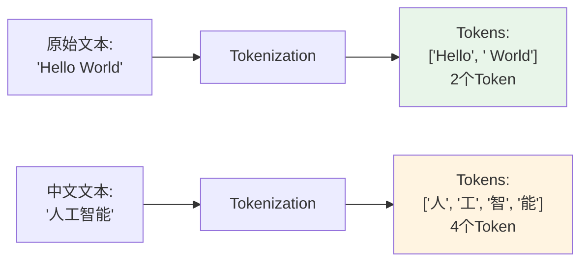
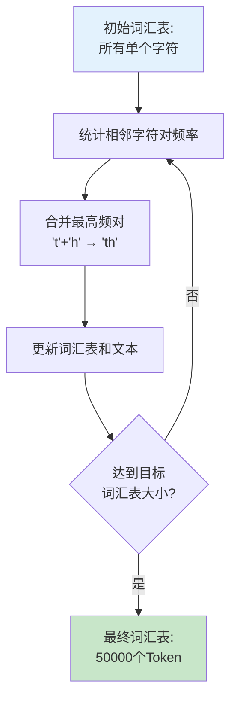
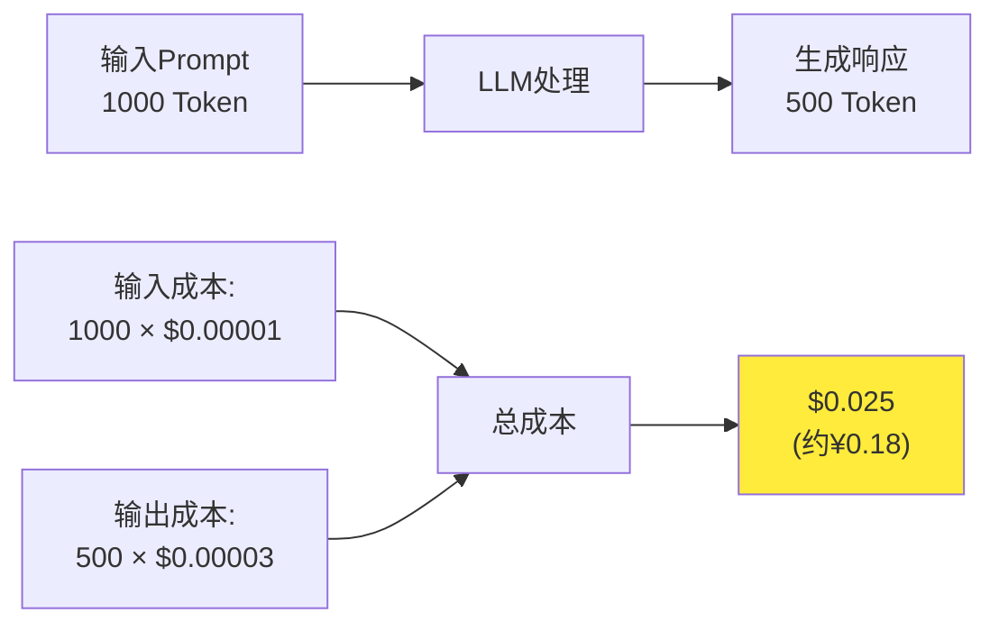
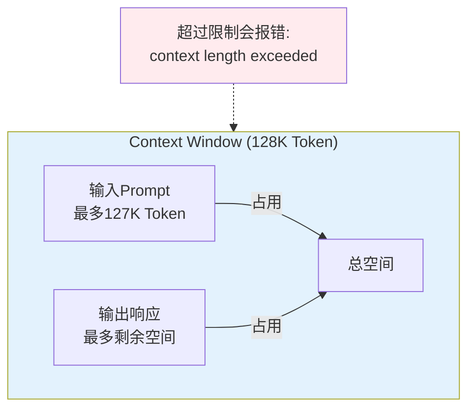
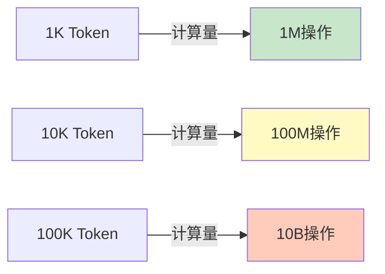

# Token与Context Window详解

## 核心概念

### 什么是Token?

**Token**是LLM处理文本的基本单位,可以理解为"词元"。它既不是字符,也不是完整的单词,而是介于两者之间的片段。



**关键特点**:
- **英文**: 一个Token约等于0.75个单词(4个字符)
- **中文**: 一个汉字通常是1个Token
- **代码**: 变量名、运算符都可能成为独立Token
- **特殊符号**: emoji、数学公式会占用多个Token

### Tokenization方法

LLM使用**子词分词(Subword Tokenization)**算法,主流方法包括:

#### 1. BPE (Byte Pair Encoding)

**核心思想**: 从字符级别开始,迭代合并出现频率最高的字符对。



**示例过程**:
```
原始文本: "lower newer"

第1步: 统计字符对频率
- 'l','o': 1次
- 'o','w': 1次
- 'w','e': 2次  ← 最高频
- 'e','r': 2次  ← 最高频

第2步: 合并'er'
词汇表添加: 'er'
文本变为: "low er new er"

第3步: 继续合并...
最终: ['low', 'er', 'new', 'er']
```

**实际应用**:
- GPT系列使用BPE,词汇表大小50257
- Llama使用SentencePiece(BPE变种),词汇表32000

#### 2. WordPiece

**特点**: 优先保留常见完整单词,罕见词拆分为子词。

```
常见词: "hello" → 保持完整
罕见词: "unbelievable" → "un" + "believe" + "able"
```

**应用**: BERT、T5使用WordPiece

#### 3. Unigram LM

**特点**: 基于概率模型选择最优分词方式。

**应用**: XLM-R、ALBERT

### Token vs 字符对比

| 文本 | 字符数 | Token数(GPT-4) | 说明 |
|------|--------|----------------|------|
| `Hello` | 5 | 1 | 常见英文单词 |
| `你好` | 2 | 2 | 每个汉字1个Token |
| `🎉🎊` | 2 | 4 | Emoji占用多个Token |
| `def calculate_sum():` | 20 | 6 | 代码被智能分割 |
| `antidisestablishmentarianism` | 28 | 5 | 长单词拆分为子词 |

**经验法则**:
- 英文: 1 Token ≈ 4字符 ≈ 0.75单词
- 中文: 1 Token ≈ 1汉字
- 混合文本: 按实际调用Tokenizer计数

## 为什么重要

### 1. 成本计算

**所有LLM API都按Token收费**,理解Token直接影响成本控制:



**GPT-4o-mini价格**(2026年):
- 输入: $0.00001 / Token (每百万Token $10)
- 输出: $0.00003 / Token (每百万Token $30)

**实际案例**:
```java
// 假设开发一个客服机器人,每天处理1000次对话
// 平均每次: 输入500 Token, 输出300 Token

每日成本 = 1000 × (500 × $0.00001 + 300 × $0.00003)
        = 1000 × ($0.005 + $0.009)
        = $14/天
        
每月成本 = $14 × 30 = $420/月 (约¥3000)

优化策略:
- 压缩Prompt: 减少到300 Token → 节省$3/天
- 缓存常见回答: 命中率30% → 节省$4.2/天
- 切换模型: 使用GPT-3.5 → 成本降低80%
```

### 2. Context Window限制

**Context Window**是模型一次能处理的最大Token数,包括输入+输出。



**主流模型的Context Window**:

| 模型 | Context Window | 约等于 | 适用场景 |
|------|---------------|--------|----------|
| GPT-4o | 128K Token | 10万汉字 | 长文档分析、代码库理解 |
| Claude 3.5 Sonnet | 200K Token | 15万汉字 | 超长书籍、法律合同 |
| Llama 3.1 | 128K Token | 10万汉字 | 本地部署长文本任务 |
| GPT-3.5 Turbo | 16K Token | 1.2万汉字 | 日常对话、短文档 |
| 通义千问 Qwen | 32K Token | 2.4万汉字 | 中文长文本(可扩展) |

**超出限制的后果**:
- API返回错误: `context length exceeded`
- 需要截断文本,可能丢失关键信息
- 解决方案: 分块处理、摘要压缩、向量检索(RAG)

### 3. 性能影响

**Attention复杂度**: O(n²),其中n是Token数量



**实际影响**:
- Token数增加10倍 → 计算量增加100倍 → 延迟显著上升
- GPT-4处理100K Token可能需要10-30秒
- 优化策略: 只传递相关片段(通过RAG检索)

## Spring AI实战

### 1. Token计数工具

Spring AI本身不提供Token计数,但可以使用Tiktoken库:

```xml
<!-- pom.xml 添加依赖 -->
<dependency>
    <groupId>com.knuddels</groupId>
    <artifactId>jtokencoder</artifactId>
    <version>0.2.0</version>
</dependency>
```

```java
package com.learnplace.token;

import com.knuddels.jtokencoder.Encoder;
import com.knuddels.jtokencoder.Encoders;
import org.springframework.stereotype.Service;

@Service
public class TokenCounter {
    
    private final Encoder encoder;
    
    public TokenCounter() {
        // 使用GPT-4的Encoder
        this.encoder = Encoders.newDefaultEncoder();
    }
    
    /**
     * 计算文本的Token数量
     */
    public int countTokens(String text) {
        return encoder.encode(text).size();
    }
    
    /**
     * 估算成本
     */
    public CostEstimate estimateCost(String inputText, int estimatedOutputTokens) {
        int inputTokens = countTokens(inputText);
        
        // GPT-4o-mini价格(2026年)
        double inputCost = inputTokens * 0.00001;  // $ per token
        double outputCost = estimatedOutputTokens * 0.00003;
        
        return new CostEstimate(
            inputTokens,
            estimatedOutputTokens,
            inputCost,
            outputCost,
            inputCost + outputCost
        );
    }
    
    public record CostEstimate(
        int inputTokens,
        int outputTokens,
        double inputCost,
        double outputCost,
        double totalCost
    ) {}
}
```

**使用示例**:

```java
@RestController
@RequestMapping("/api/chat")
public class ChatController {
    
    private final ChatClient chatClient;
    private final TokenCounter tokenCounter;
    
    @PostMapping
    public ChatResponse chat(@RequestBody ChatRequest request) {
        // 1. 计算Token和成本
        TokenCounter.CostEstimate estimate = tokenCounter.estimateCost(
            request.getMessage(), 
            500  // 预估输出500 Token
        );
        
        log.info("Token统计: 输入={}, 预估输出={}, 成本=${}", 
            estimate.inputTokens(), 
            estimate.outputTokens(),
            estimate.totalCost()
        );
        
        // 2. 检查是否超出预算
        if (estimate.totalCost() > 0.1) {  // 单次超过$0.1警告
            log.warn("成本过高,考虑优化Prompt或切换模型");
        }
        
        // 3. 调用LLM
        String response = chatClient.prompt()
            .user(request.getMessage())
            .call()
            .content();
        
        // 4. 实际Token统计(部分API会返回实际用量)
        int actualOutputTokens = tokenCounter.countTokens(response);
        
        return new ChatResponse(response, estimate, actualOutputTokens);
    }
}
```

### 2. Context Window管理

当文本超过Context Window时,需要智能截断:

```java
@Service
public class ContextManager {
    
    private static final int MAX_CONTEXT_TOKENS = 120000;  // 留8K给输出
    private static final int RESERVE_TOKENS = 8000;
    
    private final TokenCounter tokenCounter;
    
    public ContextManager(TokenCounter tokenCounter) {
        this.tokenCounter = tokenCounter;
    }
    
    /**
     * 智能截断策略: 保留System Prompt和用户最新消息,压缩历史对话
     */
    public String manageContext(List<ChatMessage> messages) {
        // 1. 分离不同部分
        String systemPrompt = messages.stream()
            .filter(m -> m.role() == Role.SYSTEM)
            .map(ChatMessage::content)
            .findFirst()
            .orElse("");
        
        List<ChatMessage> history = messages.stream()
            .filter(m -> m.role() != Role.SYSTEM)
            .toList();
        
        ChatMessage latestMessage = history.get(history.size() - 1);
        List<ChatMessage> olderMessages = history.subList(0, history.size() - 1);
        
        // 2. 计算各部分Token
        int systemTokens = tokenCounter.countTokens(systemPrompt);
        int latestTokens = tokenCounter.countTokens(latestMessage.content());
        int availableForHistory = MAX_CONTEXT_TOKENS - RESERVE_TOKENS 
                                - systemTokens - latestTokens;
        
        // 3. 如果历史消息太多,进行压缩
        if (availableForHistory <= 0) {
            throw new IllegalStateException("System Prompt或当前消息过长");
        }
        
        String compressedHistory = compressHistory(olderMessages, availableForHistory);
        
        // 4. 组装最终Context
        return buildContext(systemPrompt, compressedHistory, latestMessage.content());
    }
    
    /**
     * 压缩历史对话: 保留最近N条,其余摘要
     */
    private String compressHistory(List<ChatMessage> messages, int maxTokens) {
        StringBuilder result = new StringBuilder();
        int usedTokens = 0;
        
        // 从后往前遍历,优先保留近期对话
        for (int i = messages.size() - 1; i >= 0; i--) {
            ChatMessage msg = messages.get(i);
            String msgText = "%s: %s\n".formatted(msg.role(), msg.content());
            int msgTokens = tokenCounter.countTokens(msgText);
            
            if (usedTokens + msgTokens <= maxTokens) {
                result.insert(0, msgText);
                usedTokens += msgTokens;
            } else {
                // 超出限制,停止添加
                break;
            }
        }
        
        // 如果有被截断的消息,添加提示
        if (messages.size() * 2 > result.toString().split("\n").length) {
            result.insert(0, "[早期对话已省略,仅保留最近内容]\n\n");
        }
        
        return result.toString();
    }
    
    private String buildContext(String system, String history, String latest) {
        return """
            %s
            
            === 对话历史 ===
            %s
            
            === 最新问题 ===
            %s
            """.formatted(system, history, latest);
    }
}
```

### 3. 流式响应与Token实时统计

```java
@Service
public class StreamingChatService {
    
    private final ChatClient chatClient;
    private final TokenCounter tokenCounter;
    
    public Flux<ChatChunk> streamChat(String userMessage) {
        AtomicInteger tokenCount = new AtomicInteger(0);
        StringBuilder fullResponse = new StringBuilder();
        
        return chatClient.prompt()
            .user(userMessage)
            .stream()
            .content()
            .map(chunk -> {
                tokenCount.addAndGet(tokenCounter.countTokens(chunk));
                fullResponse.append(chunk);
                
                return new ChatChunk(
                    chunk,
                    tokenCount.get(),
                    false  // isComplete
                );
            })
            .concatWithValues(new ChatChunk(
                "",
                tokenCount.get(),
                true  // isComplete
            ))
            .doOnComplete(() -> {
                log.info("流式响应完成,总Token: {}", tokenCount.get());
            });
    }
    
    public record ChatChunk(
        String content,
        int accumulatedTokens,
        boolean isComplete
    ) {}
}
```

**前端消费流式响应**:

```javascript
// Vue组件示例
const responseChunks = ref([]);
const totalTokens = ref(0);

async function streamChat(message) {
  const response = await fetch('/api/chat/stream', {
    method: 'POST',
    headers: { 'Content-Type': 'application/json' },
    body: JSON.stringify({ message })
  });
  
  const reader = response.body.getReader();
  const decoder = new TextDecoder();
  
  while (true) {
    const { done, value } = await reader.read();
    if (done) break;
    
    const chunk = JSON.parse(decoder.decode(value));
    responseChunks.value.push(chunk.content);
    totalTokens.value = chunk.accumulatedTokens;
    
    // 实时更新UI
    if (chunk.isComplete) {
      console.log(`完成! 总Token: ${totalTokens.value}`);
    }
  }
}
```

## LangChain4j实现

LangChain4j提供了内置的Token计数功能:

```java
import dev.langchain4j.model.Tokenizer;
import dev.langchain4j.model.openai.OpenAiTokenizer;

// 创建Tokenizer
Tokenizer tokenizer = new OpenAiTokenizer("gpt-4");

// 计数
int tokenCount = tokenizer.estimateTokenCountInText("Hello World");
System.out.println("Token数: " + tokenCount);  // 输出: 2

// 检查是否超出限制
int maxTokens = 8192;
if (tokenizer.estimateTokenCountInText(longText) > maxTokens) {
    // 需要截断
    String truncated = truncateToMaxTokens(longText, maxTokens, tokenizer);
}
```

## 常见误区

### ❌ 误区1: Token就是单词
**真相**: Token是子词单元,一个单词可能是多个Token,多个单词也可能是一个Token。

**示例**:
```
"unbelievable" → ['un', 'believe', 'able']  (3个Token)
"New York" → ['New', ' York']  (2个Token,注意空格)
"😊" → ['<0xF0>', '<0x9F>', '<0x98>', '<0x8A>']  (4个Token)
```

### ❌ 误区2: Context Window越大越好
**真相**: 大Context带来高成本和慢速度,应该按需使用。

**最佳实践**:
```
短对话(< 2K Token): 使用GPT-3.5或GPT-4o-mini
中等文档(2K-20K): 使用GPT-4o
长文档(20K-100K): 使用Claude 3.5或GPT-4o,配合RAG检索
超长文本(> 100K): 必须使用RAG,不要一次性传入
```

### ❌ 误区3: 中文字符不占Token
**真相**: 每个汉字通常占用1个Token,中文文本的Token数≈字符数。

**验证**:
```java
String chinese = "人工智能技术正在改变世界";
int tokens = tokenCounter.countTokens(chinese);
System.out.println(tokens);  // 输出: 13 (13个汉字 = 13个Token)
```

### ❌ 误区4: Token计数可以粗略估算
**真相**: 不同模型的Tokenization算法不同,必须使用对应模型的Tokenizer。

**错误示例**:
```java
// ❌ 错误: 用GPT-3的Tokenizer估算GPT-4
int gpt3Tokens = gpt3Tokenizer.count(text);  // 可能偏差10-20%

// ✅ 正确: 使用对应模型的Tokenizer
int gpt4Tokens = gpt4Tokenizer.count(text);
```

## 相关资源

### 🛠️ 在线工具
- [OpenAI Tokenizer](https://platform.openai.com/tokenizer) - 官方在线计数工具
- [Tiktoken Web](https://tiktokenizer.vercel.app/) - 可视化Tokenization过程
- [Hugging Face Tokenizers](https://huggingface.co/tokenizers) - 多种模型的Tokenizer

### 📚 技术文档
- [Tiktoken GitHub](https://github.com/openai/tiktoken) - OpenAI开源的Token计数库
- [SentencePiece](https://github.com/google/sentencepiece) - Google的子词分词库
- [Tokenization Guide](https://huggingface.co/docs/transformers/tokenization_summary) - Hugging Face分词指南

### 🎥 视频教程
- [Understanding Tokenization](https://www.youtube.com/watch?v=zduSFxRajkE) - YouTube详细讲解BPE算法
- [How GPT Tokenizes Text](https://www.youtube.com/watch?v=1zLpwxVdJQY) - 可视化演示

### 📖 深入研究
- [Byte Pair Encoding论文](https://www.microsoft.com/en-us/research/publication/neural-machine-translation-of-rare-words-with-subword-units/) - Sennrich et al., 2015
- [SentencePiece论文](https://arxiv.org/abs/1808.06226) - Kudo & Richardson, 2018

## 练习题

<ClientOnly>
  <QuizWidget category-id="llm-theory" />
</ClientOnly>

---

> 💡 **下一步**: 学习 [LLM API调用实战](/guide/llm-basics/llm-api-calling),掌握OpenAI、Claude、国产模型的API使用方法!
