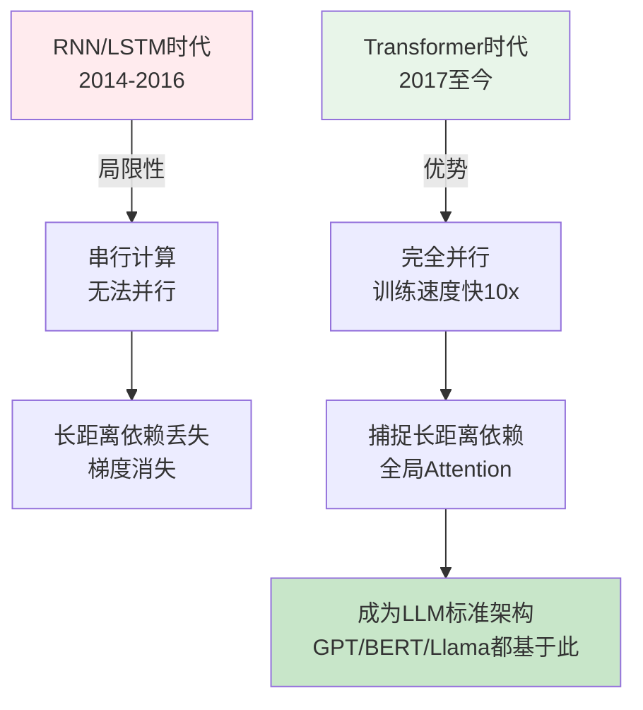
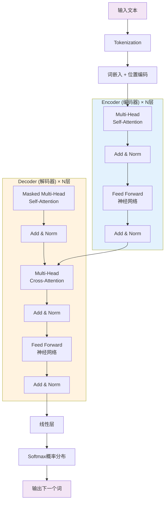
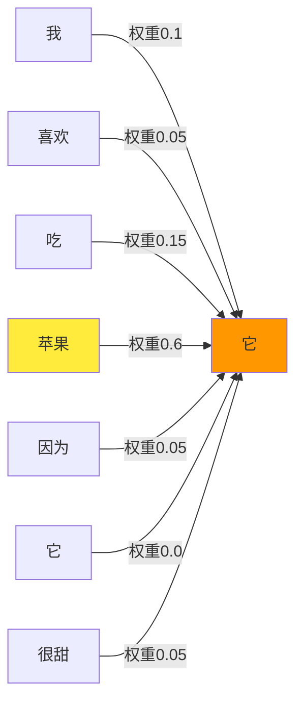
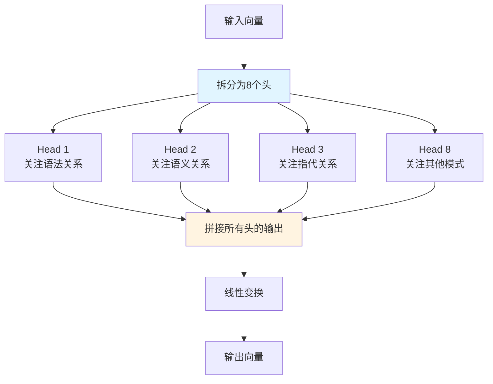
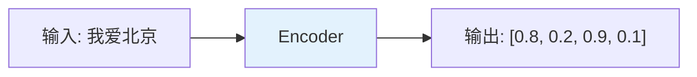
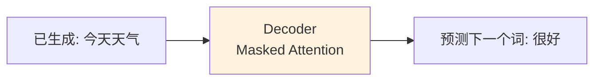
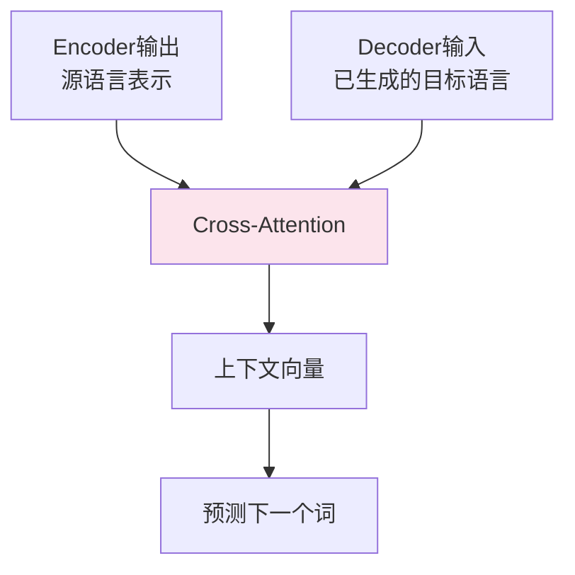

# Transformer架构详解

## 核心概念

**Transformer**是2017年Google提出的深度学习架构,彻底改变了自然语言处理(NLP)领域。它的核心创新是**Self-Attention机制**,让模型能够并行处理序列中的所有位置,而不是像RNN那样逐个处理。

> 💡 **关键突破**: Transformer抛弃了传统的循环结构(RNN/LSTM),完全基于Attention机制,训练速度提升10倍以上,效果也更好。

### 为什么Transformer如此重要?



**对比传统RNN**:

| 特性 | RNN/LSTM | Transformer |
|------|----------|-------------|
| **计算方式** | 串行(第t步依赖t-1步) | 并行(所有位置同时计算) |
| **训练速度** | 慢(无法利用GPU并行) | 快(充分利用GPU) |
| **长距离依赖** | 弱(信息随距离衰减) | 强(任意位置直接相连) |
| **可扩展性** | 差(难以扩展到超长序列) | 好(支持数千Token上下文) |

## Transformer整体架构

Transformer采用**Encoder-Decoder**(编码器-解码器)结构:



**工作流程**:
1. **输入端**: 文本 → Token化 → 词嵌入(Embedding) + 位置编码(Positional Encoding)
2. **Encoder**: 理解输入文本的语义,生成上下文表示
3. **Decoder**: 基于Encoder的输出,逐词生成目标文本
4. **输出端**: 概率分布 → 采样生成下一个Token

> 📝 **注意**: GPT系列只使用Decoder(称为Decoder-only架构),BERT只使用Encoder。现代LLM大多采用Decoder-only设计,因为更适合自回归生成任务。

## Attention机制直观解释

**Attention(注意力)**是Transformer的灵魂,它让模型能够"关注"输入中最重要的部分。

### Self-Attention工作原理

想象你在阅读一句话: "我喜欢吃苹果,因为它很甜"

当模型处理"它"这个词时,需要知道"它"指的是什么。Self-Attention让"它"能够关注到前面的"苹果",从而理解指代关系。



**计算过程**(简化版,不涉及数学公式):

1. **Query-Key-Value (Q-K-V)**: 每个词生成三个向量
   - Query(查询): "我想找什么信息?"
   - Key(键): "我能提供什么信息?"
   - Value(值): "我的实际内容是什么?"

2. **相似度计算**: Query与所有Key计算相似度,得到注意力权重
   - "它"的Query与"苹果"的Key相似度高 → 权重0.6
   - "它"的Query与"喜欢"的Key相似度低 → 权重0.05

3. **加权求和**: 用权重对所有Value加权求和,得到最终表示
   - "它"的新表示 = 0.6×苹果的内容 + 0.15×吃的内容 + ...

### Multi-Head Attention(多头注意力)

单个Attention只能捕捉一种关系,Multi-Head让模型从多个角度理解文本:



**类比理解**: 
- 单头Attention像一个专家,只能从一个角度看问题
- 多头Attention像一个专家团队,每个人从不同角度分析,最后综合意见

**典型配置**: GPT-3使用96个头,Llama 3使用32个头。

## Encoder vs Decoder

### Encoder(编码器)

**特点**:
- 可以看到**完整的输入序列**(双向Attention)
- 目标: 理解输入,生成上下文表示
- 应用: BERT(用于分类、命名实体识别等理解任务)



**示例**: 情感分析
- 输入: "这部电影太棒了!"
- Encoder理解整句话的语义
- 输出: 正面情感概率0.95

### Decoder(解码器)

**特点**:
- 只能看到**当前位置之前的序列**(Masked单向Attention)
- 目标: 逐词生成输出
- 应用: GPT系列(用于文本生成、对话等生成任务)



**示例**: 文本续写
- 已生成: "今天天气"
- Decoder只能看到"今天天气",看不到后面的词
- 预测下一个词: "很好"(概率0.6)、"不错"(概率0.3)...

### Cross-Attention(交叉注意力)

在Encoder-Decoder架构中,Decoder通过Cross-Attention关注Encoder的输出:



**应用场景**: 机器翻译
- Encoder编码中文: "你好世界"
- Decoder生成英文时,通过Cross-Attention关注对应的中文词
- 生成"Hello"时关注"你好",生成"World"时关注"世界"

## Positional Encoding(位置编码)

**问题**: Transformer没有循环结构,如何知道词的顺序?

**解决方案**: 给每个Token添加位置信息

```mermaid
graph LR
    Token[词向量<br/>[0.2, 0.5, -0.3]] --> Add[+]
    PosEnc[位置编码<br/>[0.1, -0.2, 0.4]] --> Add
    Add --> Result[最终表示<br/>[0.3, 0.3, 0.1]]
    
    style PosEnc fill:#e8f5e9
```

**实现方式**:
- 使用正弦/余弦函数生成唯一的位置向量
- 位置1: [sin(1), cos(1), sin(2), cos(2)...]
- 位置2: [sin(2), cos(2), sin(4), cos(4)...]
- 模型可以学习到相对位置关系(如"位置3比位置1靠后2个位置")

## Spring AI实战

虽然Spring AI不直接暴露Transformer底层细节,但理解架构有助于优化Prompt和调试问题。

### 1. 观察Attention的影响

通过精心设计的Prompt,你可以间接体验Attention机制的作用:

```java
package com.learnplace.transformer;

import org.springframework.ai.chat.client.ChatClient;
import org.springframework.boot.CommandLineRunner;
import org.springframework.context.annotation.Bean;
import org.springframework.stereotype.Component;

@Component
public class AttentionDemo {
    
    private final ChatClient chatClient;
    
    public AttentionDemo(ChatClient.Builder builder) {
        this.chatClient = builder.build();
    }
    
    @Bean
    CommandLineRunner demonstrateAttention() {
        return args -> {
            // 测试1: 指代消解(Attention捕捉长距离依赖)
            String prompt1 = """
                文本: "张三告诉李四他明天要去北京开会,因为他有一个重要的客户会议。"
                
                问题: "他"指的是谁?为什么?
                
                请逐步分析:
                1. 找出文中所有的人称代词
                2. 分析每个代词可能的指代对象
                3. 根据上下文确定最合理的指代
                """;
            
            System.out.println("=== 指代消解测试 ===");
            String response1 = chatClient.prompt()
                .user(prompt1)
                .call()
                .content();
            System.out.println(response1);
            // 模型应该能正确识别"他"指的是张三,因为后面提到"他的客户会议"
            
            // 测试2: 长距离依赖(Attention跨越多个句子)
            String prompt2 = """
                文章摘要任务:
                
                第一段: 人工智能(AI)是计算机科学的一个重要分支,旨在创建能够执行通常需要人类智能的任务的系统。
                第二段: AI的历史可以追溯到1950年代,当时Alan Turing提出了"机器能否思考"的问题。
                第三段: 近年来,深度学习和大语言模型的突破推动了AI的快速发展。
                第四段: 然而,AI也带来了伦理挑战,如隐私保护、算法偏见和就业影响。
                
                请总结这篇文章的核心观点,特别关注AI的发展历程和当前挑战。
                """;
            
            System.out.println("\n=== 长距离依赖测试 ===");
            String response2 = chatClient.prompt()
                .user(prompt2)
                .call()
                .content();
            System.out.println(response2);
            // 模型需要同时关注第一段(定义)、第二段(历史)、第四段(挑战)
        };
    }
}
```

### 2. 理解Context Window限制

Transformer的Attention复杂度是O(n²),所以上下文长度有限制:

```java
@Bean
CommandLineRunner contextWindowDemo(ChatClient.Builder builder) {
    return args -> {
        ChatClient chatClient = builder.build();
        
        // 构建一个超长文本(超过模型上下文窗口)
        StringBuilder longText = new StringBuilder();
        for (int i = 0; i < 1000; i++) {
            longText.append("这是第").append(i).append("句话。");
        }
        
        String prompt = "请总结以下内容:\n\n" + longText.toString();
        
        try {
            String response = chatClient.prompt()
                .user(prompt)
                .call()
                .content();
            System.out.println(response);
        } catch (Exception e) {
            System.err.println("错误: " + e.getMessage());
            // 可能报错: context length exceeded
            // 解决方案: 分块处理或使用支持更长上下文的模型
        }
    };
}
```

**常见模型的Context Window**:
- GPT-4o: 128K Token(~10万汉字)
- Claude 3.5: 200K Token
- Llama 3.1: 128K Token
- 通义千问: 32K Token(可扩展到128K)

### 3. Temperature参数与生成策略

Temperature控制采样的随机性,本质上是调整概率分布:

```java
@Bean
CommandLineRunner temperatureDemo(ChatClient.Builder builder) {
    return args -> {
        ChatClient lowTempClient = builder.build();
        ChatClient highTempClient = builder.defaultOptions(options -> 
            options.temperature(1.5)  // 高温度,更创造性
        ).build();
        
        String prompt = "写一个关于AI的短故事开头";
        
        System.out.println("=== Temperature=0.7 (平衡) ===");
        String response1 = lowTempClient.prompt()
            .user(prompt)
            .call()
            .content();
        System.out.println(response1);
        
        System.out.println("\n=== Temperature=1.5 (创造性) ===");
        String response2 = highTempClient.prompt()
            .user(prompt)
            .call()
            .content();
        System.out.println(response2);
        
        // 多次运行会发现:
        // - 低温度: 输出稳定,每次差不多
        // - 高温度: 输出多样,更有创意但可能偏离主题
    };
}
```

## 常见误区

### ❌ 误区1: Attention就是记忆
**真相**: Attention是动态计算的关系权重,不是静态的记忆存储。

**解释**: 
- 每次输入不同,Attention权重都会重新计算
- 模型没有"记住"特定事实,而是学会了语言模式
- 这就是为什么LLM会产生幻觉(编造事实)

### ❌ 误区2: 层数越多效果越好
**真相**: 层数增加带来边际效益递减,且训练难度指数增长。

**实际配置**:
- GPT-3: 96层
- Llama 3 8B: 32层
- Llama 3 70B: 80层
- 大多数场景: 12-24层已经足够

### ❌ 误区3: Transformer只能处理文本
**真相**: Transformer是通用架构,已扩展到图像(ViT)、音频(AudioLM)、视频等领域。

**多模态模型**:
- GPT-4V: 文本+图像
- Claude 3: 文本+图像+PDF
- LLaVA: 开源多模态模型

### ❌ 误区4: 需要理解数学才能使用LLM
**真相**: 应用开发者只需理解概念层面,不需要推导公式。

**学习建议**:
- 初级: 理解Attention、Encoder-Decoder的概念
- 中级: 了解Tokenization、Embedding、Positional Encoding
- 高级: 研究Fine-tuning、RLHF、MoE(Mixture of Experts)

## 相关资源

### 📚 可视化教程(强烈推荐)
- [The Illustrated Transformer](https://jalammar.github.io/illustrated-transformer/) - Jay Alammar的经典图解,被引用10万次+
- [Transformer from Scratch](https://youtu.be/wjZofJX0v4M) - YouTube动画讲解,15分钟看懂核心机制

### 🎥 视频课程
- [李宏毅机器学习-Transformer](https://www.bilibili.com/video/BV1J94y1f7kJ) - B站播放量50万+,中文讲解清晰
- [Stanford CS224N-NLP with Deep Learning](https://www.youtube.com/playlist?list=PLoROMvodv4rOSH4v6133s9LFPRHjEmbmJ) - 第7讲详细讲解Transformer

### 📖 技术博客
- [Attention Is All You Need论文解读](https://lilianweng.github.io/posts/2018-06-24-attention/) - Lilian Weng(OpenAI研究员)的深度解析
- [Transformers Explained Visually](https://poloclub.github.io/transformers-explained/) - 交互式可视化工具

### 🛠️ 实践工具
- [Hugging Face Transformers库](https://huggingface.co/docs/transformers/) - Python实现,可查看源码理解细节
- [NanoGPT](https://github.com/karpathy/nanoGPT) - Andrej Karpathy的最小化GPT实现,适合学习

## 练习题

<ClientOnly>
  <QuizWidget category-id="llm-theory" />
</ClientOnly>

---

> 💡 **下一步**: 继续学习 [Token与Embedding](/guide/llm-basics/token-and-context),理解文本如何转换为模型可处理的数字表示!
