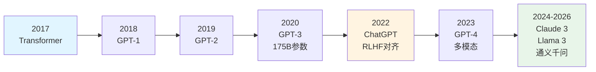
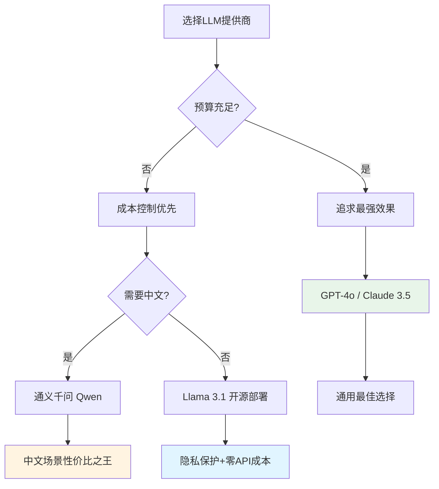

# 什么是大语言模型 (LLM)

## 核心概念

**大语言模型(Large Language Model, LLM)**是一种基于深度学习的人工智能系统,能够理解、生成和处理人类语言。它通过在海量文本数据上训练,学习语言的统计规律和语义关系,从而具备对话、翻译、总结、代码生成等多种能力。

### LLM的进化历程



**关键里程碑**:
- **2017年**: Google提出Transformer架构,"Attention Is All You Need"论文颠覆NLP领域
- **2018-2020年**: OpenAI发布GPT系列,参数量从1.17亿增长到1750亿
- **2022年**: ChatGPT引爆AI革命,引入RLHF(人类反馈强化学习)实现自然对话
- **2023-2026年**: 开源模型崛起(Llama系列),多模态能力(GPT-4V),长上下文窗口(128K+)

### LLM如何工作?

简单来说,LLM是一个**下一个词预测器(next-token predictor)**:

1. **输入**: 用户提供的文本(prompt)
2. **处理**: 模型基于训练学到的语言规律,计算每个可能下一个词的概率分布
3. **输出**: 采样生成概率最高的词,重复此过程直到完成回答

> 💡 **类比理解**: 就像你读完一句话后,能猜到下一句大概会说什么。LLM通过阅读互联网上万亿级别的文本,学会了这种"猜词"能力,而且猜得非常准。

## 为什么重要

对于Java后端开发者而言,理解LLM是转型AI应用开发的第一步:

### 1. 技术范式转变
传统软件开发是**确定性编程**(if-else逻辑),而AI应用是**概率性编程**(prompt引导模型生成)。你需要理解:
- 模型输出的不确定性(温度参数影响)
- Token计费模式(输入+输出都收费)
- Context Window限制(一次能处理的文本长度)

### 2. 应用场景爆发
LLM正在重塑各行各业:
- **智能客服**: 7×24小时自动应答,降低人工成本
- **代码助手**: GitHub Copilot提升开发效率30%+
- **数据分析**: 自然语言查询数据库(SQL生成)
- **内容创作**: 营销文案、报告生成、多语言翻译

### 3. 职业竞争力
掌握LLM应用开发的Java工程师薪资溢价可达**30-50%**,市场需求旺盛。

## 主流LLM对比

| 模型 | 开发商 | 参数量 | 特点 | 适用场景 | API价格(每百万Token) |
|------|--------|--------|------|----------|---------------------|
| **GPT-4o** | OpenAI | ~未知 | 最强综合能力,多模态 | 通用任务、复杂推理 | $2.50输入/$10输出 |
| **Claude 3.5 Sonnet** | Anthropic | ~未知 | 长文本理解优秀,安全性高 | 文档分析、代码审查 | $3输入/$15输出 |
| **Llama 3.1 405B** | Meta | 4050亿 | 开源可商用,本地部署 | 隐私敏感场景 | 免费(自建) |
| **通义千问 Qwen 2.5** | 阿里云 | 720亿 | 中文能力强,性价比高 | 中文应用、企业级场景 | ¥0.4输入/¥1.2输出 |
| **GLM-4** | 智谱AI | ~未知 | 国产领先,支持Function Calling | 国内合规场景 | ¥1输入/¥5输出 |

### 选型建议



**决策因素**:
- **效果优先**: GPT-4o、Claude 3.5 Sonnet(适合对准确率要求高的场景)
- **成本优先**: Llama 3.1本地部署、通义千问(适合大规模调用)
- **合规要求**: 国内业务选择通义千问、GLM-4(数据不出境)
- **隐私保护**: 敏感数据使用Ollama本地部署Llama/Mistral

## Spring AI实战

Spring AI提供了统一的API抽象,让你轻松切换不同的LLM提供商。

### 1. 项目依赖配置

```xml
<!-- pom.xml -->
<dependencies>
    <!-- Spring AI核心 -->
    <dependency>
        <groupId>org.springframework.ai</groupId>
        <artifactId>spring-ai-starter-model-openai</artifactId>
        <version>1.0.0-M4</version>
    </dependency>
    
    <!-- 或使用其他Provider -->
    <!-- spring-ai-starter-model-anthropic (Claude) -->
    <!-- spring-ai-starter-model-ollama (本地模型) -->
</dependencies>
```

### 2. 配置文件

```yaml
# application.yml
spring:
  ai:
    openai:
      api-key: ${OPENAI_API_KEY}  # 从环境变量读取,不要硬编码
      chat:
        options:
          model: gpt-4o-mini      # 推荐使用mini版本,性价比高
          temperature: 0.7         # 创造性参数(0-1,越高越随机)
```

### 3. 第一个Spring AI应用

```java
package com.learnplace.demo;

import org.springframework.ai.chat.client.ChatClient;
import org.springframework.boot.CommandLineRunner;
import org.springframework.boot.SpringApplication;
import org.springframework.boot.autoconfigure.SpringBootApplication;
import org.springframework.context.annotation.Bean;

@SpringBootApplication
public class LlmDemoApplication {

    public static void main(String[] args) {
        SpringApplication.run(LlmDemoApplication.class, args);
    }

    @Bean
    CommandLineRunner demo(ChatClient.Builder chatClientBuilder) {
        return args -> {
            // 构建ChatClient
            ChatClient chatClient = chatClientBuilder.build();
            
            // 简单对话
            String response = chatClient.prompt()
                .user("用一句话解释什么是大语言模型")
                .call()
                .content();
            
            System.out.println("AI回答: " + response);
            
            // 流式响应(实时显示生成的文字)
            chatClient.prompt()
                .user("列举3个LLM的应用场景")
                .stream()
                .content()
                .doOnNext(chunk -> System.out.print(chunk))
                .blockLast();
        };
    }
}
```

**运行结果**:
```
AI回答: 大语言模型是一种基于深度学习的人工智能系统,通过在海量文本数据上训练,能够理解、生成和处理人类语言,具备对话、翻译、总结等多种能力。

LLM的应用场景包括:
1. 智能客服:自动回答用户问题,提供7×24小时服务
2. 代码助手:帮助程序员生成、审查和优化代码
3. 内容创作:撰写文章、营销文案、多语言翻译等
```

### 4. 多轮对话(带历史记忆)

```java
@Bean
CommandLineRunner multiTurnDemo(ChatClient.Builder chatClientBuilder) {
    return args -> {
        ChatClient chatClient = chatClientBuilder.build();
        
        // Spring AI自动管理对话历史
        String response1 = chatClient.prompt()
            .user("我叫张三,是一名Java开发工程师")
            .call()
            .content();
        
        System.out.println("第一轮: " + response1);
        
        // 第二轮对话,模型记得第一轮的信息
        String response2 = chatClient.prompt()
            .user("我刚才说了我叫什么名字?")
            .call()
            .content();
        
        System.out.println("第二轮: " + response2);
        // 输出: 您刚才说您叫张三
    };
}
```

### 5. 异常处理与重试

```java
import org.springframework.retry.annotation.Backoff;
import org.springframework.retry.annotation.Retryable;
import reactor.core.publisher.Flux;

@Service
public class ChatService {
    
    private final ChatClient chatClient;
    
    public ChatService(ChatClient.Builder builder) {
        this.chatClient = builder.build();
    }
    
    @Retryable(
        retryFor = {RuntimeException.class},
        maxAttempts = 3,
        backoff = @Backoff(delay = 1000, multiplier = 2)
    )
    public String chatWithRetry(String userMessage) {
        try {
            return chatClient.prompt()
                .user(userMessage)
                .call()
                .content();
        } catch (Exception e) {
            log.error("LLM调用失败: {}", e.getMessage());
            throw new RuntimeException("AI服务暂时不可用,请稍后重试", e);
        }
    }
    
    // 流式响应的异常处理
    public Flux<String> streamChat(String userMessage) {
        return chatClient.prompt()
            .user(userMessage)
            .stream()
            .content()
            .onErrorResume(error -> {
                log.error("流式响应失败", error);
                return Flux.just("抱歉,服务出现错误,请稍后重试");
            });
    }
}
```

## LangChain4j实现对比

如果你更熟悉LangChain生态,LangChain4j提供了类似的Java实现:

```java
import dev.langchain4j.model.openai.OpenAiChatModel;
import dev.langchain4j.service.AiServices;

// 1. 创建模型
OpenAiChatModel model = OpenAiChatModel.builder()
    .apiKey(System.getenv("OPENAI_API_KEY"))
    .modelName("gpt-4o-mini")
    .temperature(0.7)
    .build();

// 2. 定义AI服务接口
interface Assistant {
    String chat(String userMessage);
}

// 3. 创建代理服务
Assistant assistant = AiServices.create(Assistant.class, model);

// 4. 调用
String response = assistant.chat("什么是大语言模型?");
System.out.println(response);
```

**对比总结**:

| 特性 | Spring AI | LangChain4j |
|------|-----------|-------------|
| **生态集成** | Spring全家桶无缝集成 | 独立框架,灵活性强 |
| **学习曲线** | 低(Spring开发者友好) | 中(需学习新API) |
| **Provider支持** | OpenAI/Azure/Ollama等 | 更广泛(50+提供商) |
| **RAG支持** | RetrievalAugmentationAdvisor | 内置VectorStore、Embedding |
| **社区活跃度** | Spring官方维护,增长快 | LangChain生态,成熟稳定 |

> 💡 **建议**: 如果你的项目已经是Spring Boot技术栈,**优先选择Spring AI**;如果需要更多高级Agent功能或特殊Provider支持,考虑LangChain4j。

## 常见误区

### ❌ 误区1: LLM什么都懂,不会出错
**真相**: LLM会产生**幻觉(hallucination)**,编造看似合理但完全错误的信息。

**解决方案**:
- 对关键信息进行事实核查
- 使用RAG提供权威知识源
- 设置置信度阈值,低置信度时拒绝回答

### ❌ 误区2: 模型越大越好
**真相**: 小模型(如GPT-4o-mini、Llama 3.1 8B)在大多数任务上已经足够好,且速度快、成本低。

**选型原则**:
- 简单任务(分类、提取): 使用mini/small模型
- 复杂推理(数学、代码): 使用large模型
- 极致效果: 使用最大模型(GPT-4o、Claude 3.5 Opus)

### ❌ 误区3: Prompt随便写就行
**真相**: Prompt质量直接影响输出质量,好的Prompt能让效果提升30-50%。

**改进示例**:
```
❌ 差Prompt: "介绍一下Java"
✅ 好Prompt: "你是一位资深Java技术专家,请用通俗易懂的语言向初学者介绍Java的核心特点,包括:跨平台性、面向对象、内存管理等,控制在200字以内。"
```

### ❌ 误区4: 可以完全替代传统开发
**真相**: LLM擅长创意性、模糊性任务,但在精确计算、事务一致性等方面不如传统代码。

**最佳实践**: **人机协作** - LLM负责创意和草稿,人类负责审核和优化。

## 相关资源

### 📚 官方文档
- [OpenAI Platform](https://platform.openai.com/docs) - API参考、最佳实践
- [Anthropic Claude Docs](https://docs.anthropic.com/) - Claude模型使用指南
- [Meta Llama](https://llama.meta.com/) - 开源模型下载和使用
- [Spring AI Reference](https://docs.spring.io/spring-ai/reference/) - Spring AI完整文档

### 🎥 视频教程
- [李宏毅机器学习-Transformer详解](https://www.bilibili.com/video/BV1J94y1f7kJ) - B站播放量50万+,深入浅出
- [吴恩达-ChatGPT Prompt Engineering](https://www.deeplearning.ai/short-courses/chatgpt-prompt-engineering-for-developers/) - 免费1.5小时课程
- [The Illustrated Transformer](https://jalammar.github.io/illustrated-transformer/) - 可视化图解,强烈推荐

### 📖 经典论文
- [Attention Is All You Need](https://arxiv.org/abs/1706.03762) - Transformer原始论文
- [Language Models are Few-Shot Learners](https://arxiv.org/abs/2005.14165) - GPT-3论文

### 🛠️ 实用工具
- [OpenAI Tokenizer](https://platform.openai.com/tokenizer) - 在线Token计数
- [Hugging Face Models](https://huggingface.co/models) - 开源模型库
- [Ollama](https://ollama.com/) - 本地运行LLM的简易工具

## 练习题

<ClientOnly>
  <QuizWidget category-id="llm-theory" />
</ClientOnly>

---

> 💡 **下一步**: 深入学习 [Transformer架构详解](/guide/llm-basics/transformer-architecture),理解LLM的核心技术原理!
