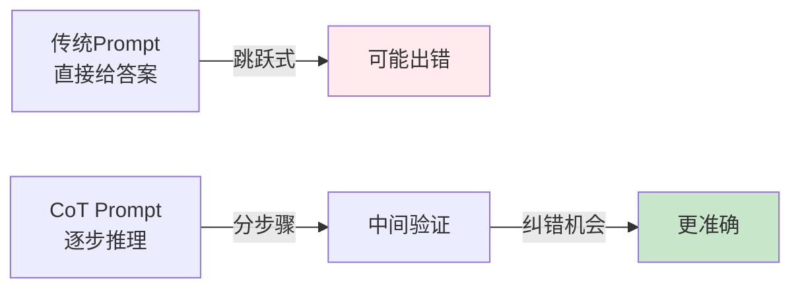
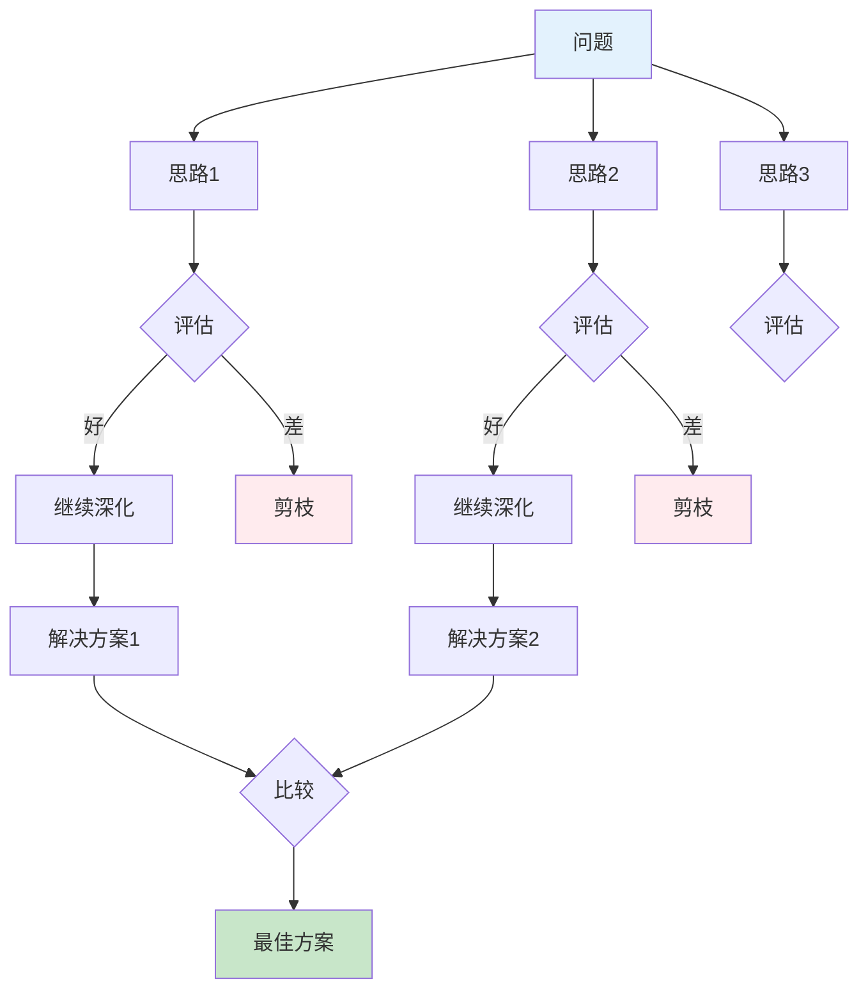

# Chain-of-Thought思维链

## 核心概念

**Chain-of-Thought (CoT, 思维链)**是一种Prompt技术,通过引导模型逐步展示推理过程,显著提升其在复杂任务(数学、逻辑、常识推理)上的表现。

### 核心思想



**对比示例**:

```
❌ 传统方式:
问: "小明有5个苹果,吃了2个,又买了3个,现在有几个?"
答: 6个  ← 没有展示过程,无法检查错误

✅ CoT方式:
问: "小明有5个苹果,吃了2个,又买了3个,现在有几个? 让我们一步步思考。"
答: 
1. 初始有5个苹果
2. 吃了2个: 5 - 2 = 3个
3. 又买了3个: 3 + 3 = 6个
4. 最终答案: 6个  ← 每步可验证
```

### 神奇短语: "Let's think step by step"

研究发现,仅仅加上这句话(**"让我们一步步思考"**),就能让模型在GSM8K(小学数学数据集)上的准确率从**18%提升到57%**!

**原理**:
- 激活模型的推理能力
- 强制分解复杂问题
- 提供中间检查点
- 减少跳跃性错误

## Spring AI实战

### 1. 数学推理

```java
@Service
public class MathSolver {
    
    private final ChatClient chatClient;
    
    public String solveMathProblem(String problem) {
        String prompt = """
            请解决以下数学问题。
            
            问题: %s
            
            请按照以下步骤思考:
            1. 理解问题: 题目要求什么?已知条件有哪些?
            2. 制定计划: 需要用到哪些公式或方法?
            3. 执行计算: 逐步推导,展示每一步的计算过程
            4. 验证结果: 答案是否合理?单位是否正确?
            
            最后以"最终答案: X"的格式给出结论。
            """.formatted(problem);
        
        return chatClient.prompt()
            .user(prompt)
            .call()
            .content();
    }
}

// 测试
String result = mathSolver.solveMathProblem(
    "一个长方形长10米,宽6米,如果长和宽各增加2米,面积增加多少平方米?"
);

// 输出:
// 1. 理解问题: 求面积增加量
// 2. 原面积: 10 × 6 = 60平方米
// 3. 新长: 10 + 2 = 12米, 新宽: 6 + 2 = 8米
// 4. 新面积: 12 × 8 = 96平方米
// 5. 面积增加: 96 - 60 = 36平方米
// 最终答案: 36平方米
```

### 2. 逻辑推理

```java
@Service
public class LogicSolver {
    
    public String solveLogicPuzzle(String puzzle) {
        String prompt = """
            请解决以下逻辑谜题。
            
            谜题: %s
            
            让我们一步步思考:
            1. 列出所有已知条件
            2. 分析条件之间的关系
            3. 排除不可能的情况
            4. 得出结论
            
            请详细说明推理过程。
            """.formatted(puzzle);
        
        return chatClient.prompt()
            .user(prompt)
            .call()
            .content();
    }
}

// 测试: 经典逻辑题
String puzzle = """
    有三个人:Alice、Bob、Charlie。
    - Alice说:"Bob在撒谎"
    - Bob说:"Charlie在撒谎"  
    - Charlie说:"Alice和Bob都在撒谎"
    
    已知只有一个人说真话,谁说的是真话?
    """;

String result = logicSolver.solveLogicPuzzle(puzzle);
// 模型会逐步分析每种情况,最终得出正确答案
```

### 3. 代码调试

```java
@Service
public class CodeDebugger {
    
    public String debugCode(String buggyCode, String errorMessage) {
        String prompt = """
            请找出以下Java代码中的bug。
            
            代码:
            ```java
            %s
            ```
            
            错误信息: %s
            
            让我们逐步分析:
            1. 理解代码意图: 这段代码想实现什么功能?
            2. 逐行检查: 每一行的逻辑是否正确?
            3. 边界情况: 是否有未处理的特殊情况?
            4. 定位bug: 具体哪一行有问题?为什么?
            5. 修复方案: 如何修改?
            
            请给出详细的分析和修复后的代码。
            """.formatted(buggyCode, errorMessage);
        
        return chatClient.prompt()
            .user(prompt)
            .call()
            .content();
    }
}
```

## Tree-of-Thought (ToT)

**Tree-of-Thought**是CoT的进阶版,让模型探索多条推理路径,类似人类的"头脑风暴"。



**Spring AI实现**:

```java
@Service
public class TreeOfThoughtSolver {
    
    private final ChatClient chatClient;
    
    /**
     * ToT: 生成多个思路,评估后选择最佳
     */
    public String solveWithToT(String problem) {
        // 第1步: 生成多个思路
        List<String> thoughts = generateThoughts(problem, 3);
        
        // 第2步: 评估每个思路
        Map<String, Double> evaluations = new HashMap<>();
        for (String thought : thoughts) {
            double score = evaluateThought(problem, thought);
            evaluations.put(thought, score);
        }
        
        // 第3步: 选择最佳思路并深化
        String bestThought = evaluations.entrySet().stream()
            .max(Map.Entry.comparingByValue())
            .get()
            .getKey();
        
        // 第4步: 基于最佳思路生成最终答案
        return deepenSolution(problem, bestThought);
    }
    
    private List<String> generateThoughts(String problem, int count) {
        String prompt = """
            问题: %s
            
            请提出%d种不同的解决思路。
            每种思路用编号列出,简要说明核心方法。
            """.formatted(problem, count);
        
        String response = chatClient.prompt()
            .user(prompt)
            .call()
            .content();
        
        // 解析响应,提取各个思路
        return parseThoughts(response);
    }
    
    private double evaluateThought(String problem, String thought) {
        String prompt = """
            问题: %s
            
            解决思路: %s
            
            请评估这个思路的质量(0-10分):
            - 可行性: 是否能实现?
            - 效率: 是否高效?
            - 完整性: 是否覆盖所有情况?
            
            只输出分数数字。
            """.formatted(problem, thought);
        
        String scoreStr = chatClient.prompt()
            .user(prompt)
            .call()
            .content()
            .trim();
        
        return Double.parseDouble(scoreStr) / 10.0;
    }
}
```

## Self-Consistency自一致性

**Self-Consistency**: 让模型多次独立推理,取出现频率最高的答案。

```java
@Service
public class SelfConsistencySolver {
    
    /**
     * 多次采样,投票决定最终答案
     */
    public String solveWithSelfConsistency(String problem, int numSamples) {
        Map<String, Integer> answerCounts = new HashMap<>();
        
        for (int i = 0; i < numSamples; i++) {
            // 每次使用不同的temperature,获得多样化推理
            String answer = solveWithTemperature(problem, 0.7 + i * 0.1);
            
            // 提取最终答案
            String finalAnswer = extractFinalAnswer(answer);
            
            answerCounts.merge(finalAnswer, 1, Integer::sum);
        }
        
        // 投票: 选择出现次数最多的答案
        String bestAnswer = answerCounts.entrySet().stream()
            .max(Map.Entry.comparingByValue())
            .get()
            .getKey();
        
        log.info("答案分布: {}", answerCounts);
        
        return bestAnswer;
    }
    
    private String solveWithTemperature(String problem, double temperature) {
        ChatClient client = ChatClient.builder()
            .defaultOptions(options -> options.temperature(temperature))
            .build();
        
        String prompt = """
            问题: %s
            
            让我们一步步思考,展示完整的推理过程。
            """.formatted(problem);
        
        return client.prompt()
            .user(prompt)
            .call()
            .content();
    }
}
```

**效果**: 在GSM8K数据集上,Self-Consistency可将准确率从**57%提升到74%**。

## 常见误区

### ❌ 误区1: 所有任务都需要CoT
**真相**: 简单任务(事实查询、文本分类)不需要CoT,反而浪费Token。

**适用场景**:
- ✅ 数学计算、逻辑推理
- ✅ 代码生成、调试
- ✅ 复杂决策、规划
- ❌ 简单问答、翻译

### ❌ 误区2: CoT步骤越多越好
**真相**: 过多的步骤会增加噪声,5-7步通常足够。

### ❌ 误区3: 忽略验证步骤
**真相**: 验证环节能发现推理错误,至关重要。

```
✅ 包含验证:
"... 计算结果是36。验证: 12×8=96, 96-60=36 ✓"

❌ 缺少验证:
"... 所以答案是36。"
```

## 相关资源

### 📚 研究论文
- [Chain-of-Thought Prompting](https://arxiv.org/abs/2201.11903) - CoT原始论文
- [Tree of Thoughts](https://arxiv.org/abs/2305.10601) - ToT论文
- [Self-Consistency](https://arxiv.org/abs/2203.11171) - 自一致性论文

### 🛠️ 工具
- [LangChain CoT](https://python.langchain.com/docs/modules/chains/additional/llm_checker) - LangChain的CoT实现
- [Auto-CoT](https://github.com/amazon-science/auto-cot) - 自动生成CoT示例

## 练习题

<ClientOnly>
  <QuizWidget category-id="prompt-eng" />
</ClientOnly>

---

> 💡 **下一步**: 学习 [Prompt安全防护](/guide/prompt-eng/prompt-security),了解如何防御Prompt注入攻击!
