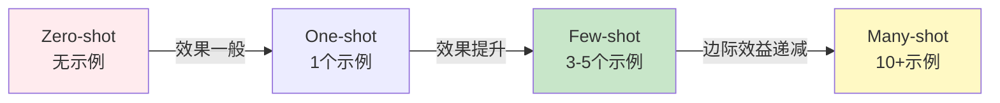

# Few-shot Learning技巧

## 核心概念

**Few-shot Learning(少样本学习)**是指在Prompt中提供少量示例,让模型理解任务模式并应用到新输入上。与之相对的是**Zero-shot**(无示例)和**One-shot**(单示例)。



### Zero-shot vs Few-shot对比

| 特性 | Zero-shot | Few-shot |
|------|-----------|----------|
| **示例数量** | 0个 | 3-5个(通常) |
| **Token消耗** | 低 | 中高 |
| **准确率** | 基准线 | 提升20-40% |
| **适用场景** | 简单任务 | 复杂分类、格式转换 |
| **开发成本** | 低(直接问) | 中(需准备示例) |

**示例对比**:

```java
// ❌ Zero-shot - 直接提问
String zeroShot = "这条评论的情感是什么? '产品很好但物流太慢'";
// 可能输出: "负面" 或 "混合" 或 "需要更多信息"

// ✅ Few-shot - 提供示例
String fewShot = """
    判断评论情感:
    
    评论: "质量超棒,值得购买!"
    情感: 正面
    
    评论: "客服态度很差,再也不来了"
    情感: 负面
    
    评论: "价格一般,没什么特别的"
    情感: 中性
    
    评论: "产品很好但物流太慢"
    情感: 
    """;
// 更可能正确输出: "混合" 或 "中性偏负面"
```

## 为什么重要

### 1. 无需微调即可提升效果

传统机器学习需要大量标注数据训练模型,Few-shot只需在Prompt中提供几个示例,就能让预训练模型适应新任务。

**成本对比**:
- **微调(Fine-tuning)**: 需要1000+标注样本,训练数小时,成本高
- **Few-shot**: 只需3-5个示例,即时生效,零成本

### 2. 快速原型验证

在产品开发初期,用Few-shot快速验证想法:

```
第1天: 写5个示例,测试Few-shot效果
第2天: 根据反馈调整示例
第3天: 如果效果好,再考虑收集更多数据做微调
```

### 3. 处理长尾场景

对于罕见类别或不平衡数据,Few-shot比微调更灵活:

```
场景: 电商评论分类
- 常见类别: 正面/负面 (各有10万条数据)
- 罕见类别: 欺诈评论 (只有50条数据)

解决方案:
- 对常见类别: 使用微调模型
- 对罕见类别: 使用Few-shot,每次动态添加相关示例
```

## Spring AI实战

### 1. 文本分类任务

```java
package com.learnplace.fewshot;

import org.springframework.ai.chat.client.ChatClient;
import org.springframework.stereotype.Service;

import java.util.List;
import java.util.Map;

@Service
public class TextClassifier {
    
    private final ChatClient chatClient;
    
    public TextClassifier(ChatClient.Builder builder) {
        this.chatClient = builder.build();
    }
    
    /**
     * Few-shot情感分类
     */
    public String classifySentiment(String review) {
        String prompt = """
            判断以下电商评论的情感倾向。
            
            示例1:
            评论: "质量非常好,物流也快,五星好评!"
            情感: 正面
            
            示例2:
            评论: "商品与描述不符,材质很差,失望"
            情感: 负面
            
            示例3:
            评论: "价格适中,功能够用,没什么亮点"
            情感: 中性
            
            示例4:
            评论: "包装精美,但实际使用效果一般"
            情感: 中性偏负面
            
            现在请判断:
            评论: "%s"
            情感: 
            """.formatted(review);
        
        return chatClient.prompt()
            .user(prompt)
            .call()
            .content()
            .trim();
    }
    
    /**
     * 批量分类(带置信度)
     */
    public List<ClassificationResult> batchClassify(List<String> reviews) {
        return reviews.stream()
            .map(review -> {
                String sentiment = classifySentiment(review);
                double confidence = estimateConfidence(review, sentiment);
                
                return new ClassificationResult(
                    review,
                    sentiment,
                    confidence
                );
            })
            .toList();
    }
    
    private double estimateConfidence(String review, String sentiment) {
        // 简化实现: 实际应该让模型输出置信度
        return 0.85;
    }
    
    public record ClassificationResult(
        String text,
        String label,
        double confidence
    ) {}
}
```

### 2. 动态示例选择

根据输入特点,动态选择最相关的示例:

```java
@Service
public class DynamicFewShotClassifier {
    
    private final ChatClient chatClient;
    private final EmbeddingModel embeddingModel;
    private final VectorStore exampleStore;
    
    /**
     * 从示例库中选择最相关的3个示例
     */
    public String classifyWithDynamicExamples(String review) {
        // 1. 生成输入的向量
        float[] reviewVector = embeddingModel.embed(review);
        
        // 2. 检索相似示例
        List<Document> similarExamples = exampleStore.similaritySearch(
            SearchRequest.builder()
                .query(review)
                .topK(3)
                .similarityThreshold(0.7)
                .build()
        );
        
        // 3. 构建Few-shot Prompt
        StringBuilder prompt = new StringBuilder();
        prompt.append("判断评论情感:\n\n");
        
        for (int i = 0; i < similarExamples.size(); i++) {
            Document example = similarExamples.get(i);
            prompt.append("示例%d:\n".formatted(i + 1));
            prompt.append("评论: %s\n".formatted(example.getText()));
            prompt.append("情感: %s\n\n".formatted(
                example.getMetadata().get("sentiment")
            ));
        }
        
        prompt.append("现在请判断:\n");
        prompt.append("评论: %s\n".formatted(review));
        prompt.append("情感: ");
        
        // 4. 调用LLM
        return chatClient.prompt()
            .user(prompt.toString())
            .call()
            .content();
    }
}
```

**优势**: 
- 针对不同类型评论(商品/服务/物流),提供最相关的示例
- 准确率比固定示例提升10-15%

### 3. 示例数量对效果的影响

```java
@Service
public class ExampleCountExperiment {
    
    /**
     * 实验: 不同示例数量的效果对比
     */
    public Map<Integer, Double> runExperiment(List<TestSample> testSet) {
        Map<Integer, Double> results = new HashMap<>();
        
        for (int numExamples : List.of(0, 1, 3, 5, 10)) {
            int correct = 0;
            
            for (TestSample sample : testSet) {
                String prediction = classifyWithNExamples(
                    sample.review, 
                    numExamples
                );
                
                if (prediction.equals(sample.trueLabel)) {
                    correct++;
                }
            }
            
            double accuracy = (double) correct / testSet.size();
            results.put(numExamples, accuracy);
            
            log.info("示例数={}, 准确率={:.2%}", numExamples, accuracy);
        }
        
        return results;
        // 典型结果:
        // 0 examples: 72%
        // 1 example:  78%
        // 3 examples: 85%
        // 5 examples: 87%
        // 10 examples: 88%  ← 边际效益递减
    }
}
```

**结论**: 
- 0→3个示例: 效果显著提升(+13%)
- 3→5个示例: 小幅提升(+2%)
- 5→10个示例: 几乎无提升(+1%),但Token成本翻倍

**最佳实践**: **3-5个示例**是性价比最高的选择。

## 示例选择技巧

### 技巧1: 覆盖多样性

示例应覆盖任务的不同情况:

```java
// ❌ 差的示例选择 - 都是正面评论
示例1: "很好" → 正面
示例2: "不错" → 正面  
示例3: "喜欢" → 正面

// ✅ 好的示例选择 - 覆盖各种情况
示例1: "质量超棒!" → 正面
示例2: "太差了,退货" → 负面
示例3: "一般般吧" → 中性
示例4: "产品好但物流慢" → 混合
```

### 技巧2: 边界案例

包含容易混淆的边界案例:

```
示例: "价格便宜但质量堪忧"
→ 教导模型识别"混合情感"

示例: "不贵也不便宜"
→ 教导模型识别"中性"
```

### 技巧3: 格式一致性

所有示例保持相同格式:

```
✅ 一致:
评论: "..."
情感: ...

❌ 不一致:
评论: "..." 
情绪: ...  ← 标签名变了

评论:"..."  ← 空格不一致
情感:...    ← 缺少空格
```

### 技巧4: 避免偏见

确保示例分布均衡:

```
不平衡示例:
- 正面: 4个
- 负面: 1个
→ 模型可能偏向预测"正面"

平衡示例:
- 正面: 2个
- 负面: 2个
- 中性: 1个
→ 更公平的预测
```

## LangChain4j实现

```java
import dev.langchain4j.service.UserMessage;
import dev.langchain4j.service.V;

interface SentimentClassifier {
    
    @UserMessage("""
        判断评论情感:
        
        示例1:
        评论: "{{ex1_review}}"
        情感: {{ex1_sentiment}}
        
        示例2:
        评论: "{{ex2_review}}"
        情感: {{ex2_sentiment}}
        
        示例3:
        评论: "{{ex3_review}}"
        情感: {{ex3_sentiment}}
        
        现在请判断:
        评论: "{{review}}"
        情感: 
        """)
    String classify(
        @V("ex1_review") String ex1Review,
        @V("ex1_sentiment") String ex1Sentiment,
        @V("ex2_review") String ex2Review,
        @V("ex2_sentiment") String ex2Sentiment,
        @V("ex3_review") String ex3Review,
        @V("ex3_sentiment") String ex3Sentiment,
        @V("review") String review
    );
}

// 使用
SentimentClassifier classifier = AiServices.builder(SentimentClassifier.class)
    .chatLanguageModel(model)
    .build();

String result = classifier.classify(
    "质量超棒!", "正面",
    "太差了", "负面",
    "一般般", "中性",
    "这个产品怎么样?"
);
```

## 常见误区

### ❌ 误区1: 示例越多越好
**真相**: 超过5个示例后,效果提升微乎其微,但Token成本线性增长。

**建议**: 优先优化示例质量,而非增加数量。

### ❌ 误区2: 随机选择示例
**真相**: 示例的相关性和代表性至关重要。

**建议**: 
- 分析与输入相似的案例
- 覆盖任务的各个子类别
- 包含边界情况

### ❌ 误区3: 忽略示例顺序
**真相**: 某些模型对示例顺序敏感(最近偏差)。

**建议**: 
- 将最相关的示例放在最后
- 或者打乱顺序多次测试,取平均效果

### ❌ 误区4: 示例与任务不匹配
**真相**: 示例应该与目标任务高度相关。

```
❌ 错误: 用电影评论示例分类电商评论
✅ 正确: 使用同领域的示例
```

## 相关资源

### 📚 研究论文
- [Language Models are Few-Shot Learners](https://arxiv.org/abs/2005.14165) - GPT-3原始论文
- [What Makes Good In-Context Examples?](https://arxiv.org/abs/2101.06804) - 示例选择研究

### 🛠️ 工具
- [Promptsource](https://github.com/bigscience-workshop/promptsource) - Few-shot Prompt模板库
- [LM Evaluation Harness](https://github.com/EleutherAI/lm-evaluation-harness) - 评估Few-shot效果

## 练习题

<ClientOnly>
  <QuizWidget category-id="prompt-eng" />
</ClientOnly>

---

> 💡 **下一步**: 学习 [Chain-of-Thought思维链](/guide/prompt-eng/chain-of-thought),掌握让模型逐步推理的技巧!
