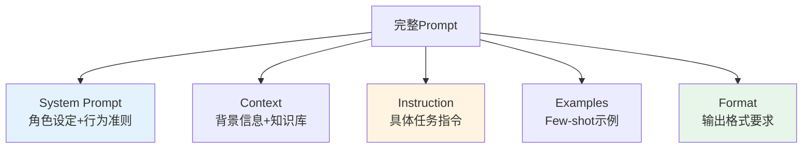

# Prompt设计原则

## 核心概念

**Prompt(提示词)**是你与LLM对话的输入文本,它的质量直接决定输出效果。好的Prompt能让模型表现提升30-50%,差的Prompt则会导致无关或错误回答。

### Prompt的组成结构



**示例**:
```
System: 你是一位资深Java技术专家,擅长用通俗易懂的语言解释复杂概念。

Context: 用户是一名有3年经验的Java后端开发者,正在学习Spring AI框架。

Instruction: 请解释什么是Function Calling,以及它在Agent系统中的作用。

Examples: 
无(Zero-shot)

Format: 请用Markdown格式回答,包含:
1. 核心概念(100字以内)
2. 实际应用场景(列举3个)
3. Spring AI代码示例
```

## 为什么重要

### 1. 效果差异巨大

对比两个Prompt的效果:

```java
// ❌ 差Prompt
String badPrompt = "介绍一下Java";

// ✅ 好Prompt
String goodPrompt = """
    你是一位拥有10年经验的Java架构师。
    
    请向一名初学者介绍Java的核心特点,包括:
    1. 跨平台性("Write Once, Run Anywhere")
    2. 面向对象特性(封装、继承、多态)
    3. 内存管理(垃圾回收机制)
    
    要求:
    - 使用通俗易懂的语言,避免专业术语
    - 每个特点配一个生活化类比
    - 控制在300字以内
    """;

// 效果对比:
// badPrompt → 可能返回维基百科式的冗长定义
// goodPrompt → 返回结构化、易懂、符合预期的回答
```

### 2. 成本优化

清晰的Prompt可以减少:
- **重试次数**: 第一次就得到满意答案
- **Token消耗**: 避免冗长无关的输出
- **后处理成本**: 输出格式规范,无需额外解析

### 3. 安全性保障

良好的Prompt设计可以防止:
- **Prompt注入攻击**: 用户恶意输入覆盖指令
- **敏感信息泄露**: 明确禁止输出某些内容
- **不当内容生成**: 设置安全边界

## Prompt设计六大原则

### 原则1: 清晰具体的指令

**错误示范**:
```
❌ "写点关于AI的东西"
❌ "帮我分析一下"
❌ "这个怎么样?"
```

**正确示范**:
```
✅ "写一篇500字的科普文章,向高中生解释什么是人工智能,包括:
   - AI的定义
   - 3个日常应用场景
   - 未来发展趋势
   语气要生动有趣,避免专业术语。"

✅ "分析以下Java代码的性能瓶颈,并提出3条优化建议:
   [代码片段]
   重点关注:时间复杂度、内存分配、并发处理。"

✅ "评估这个营销文案的效果,从以下维度打分(1-10分):
   - 吸引力
   - 清晰度
   - 行动号召力
   并给出改进建议。"
```

**关键技巧**:
- 使用**动作动词**: "解释"、"分析"、"总结"、"对比"
- 指定**目标受众**: "向初学者"、"给专业人士"
- 明确**输出长度**: "100字以内"、"3个要点"
- 定义**评估标准**: "从准确性、完整性、可读性三个维度"

### 原则2: 使用分隔符区分不同部分

**问题**: 当Prompt包含多种内容时,模型可能混淆指令和数据。

**解决方案**: 使用分隔符清晰标记各部分。

```java
@Service
public class PromptBuilder {
    
    private final ChatClient chatClient;
    
    /**
     * 使用分隔符构建安全的Prompt
     */
    public String analyzeDocument(String documentContent) {
        String prompt = """
            你是一个文档分析助手。
            
            请分析以下文档,提取关键信息:
            
            === 文档开始 ===
            %s
            === 文档结束 ===
            
            输出格式:
            1. 文档主题: ...
            2. 关键观点: (最多5条)
            3. 情感倾向: 正面/中性/负面
            """.formatted(documentContent);
        
        return chatClient.prompt()
            .user(prompt)
            .call()
            .content();
    }
}
```

**常用分隔符**:
```
=== 标题 ===          (推荐,视觉清晰)
"""三引号"""          (适合多行文本)
--- 横线 ---          (简洁)
<<< 尖括号 >>>        (醒目)
```

**对比效果**:
```
❌ 模糊:
分析这篇文章人工智能发展很快应用广泛...

✅ 清晰:
分析以下文章:
=== 文章开始 ===
人工智能发展很快,应用广泛...
=== 文章结束 ===
```

### 原则3: 指定输出格式

**好处**:
- 便于程序解析(JSON、XML)
- 提升可读性(Markdown、表格)
- 保持一致性(模板化输出)

```java
/**
 * 要求JSON格式输出
 */
public String extractEntities(String text) {
    String prompt = """
        从以下文本中提取人名、地名、组织名。
        
        文本: %s
        
        请以JSON格式输出,结构如下:
        {
          "persons": ["张三", "李四"],
          "locations": ["北京", "上海"],
          "organizations": ["阿里巴巴"]
        }
        
        只输出JSON,不要其他内容。
        """.formatted(text);
    
    String response = chatClient.prompt()
        .user(prompt)
        .call()
        .content();
    
    // 直接解析JSON
    return parseJson(response);
}

/**
 * 要求Markdown表格
 */
public String compareProducts(List<String> products) {
    String prompt = """
        对比以下产品的优缺点:
        %s
        
        请以Markdown表格形式输出:
        | 产品 | 优点 | 缺点 | 适用场景 |
        |------|------|------|----------|
        | ...  | ...  | ...  | ...      |
        """.formatted(String.join(", ", products));
    
    return chatClient.prompt()
        .user(prompt)
        .call()
        .content();
}
```

**常见输出格式**:
- **JSON**: 程序解析,结构化数据
- **Markdown**: 人类可读,支持富文本
- **CSV**: 表格数据,便于导入Excel
- **XML**: 传统系统兼容
- **纯文本列表**: 简单场景

### 原则4: 提供思维链(Chain-of-Thought)

对于复杂推理任务,引导模型逐步思考:

```java
/**
 * 数学推理题
 */
public String solveMathProblem(String problem) {
    String prompt = """
        请解决以下数学问题。
        
        问题: %s
        
        请按照以下步骤思考:
        1. 理解问题: 题目要求什么?已知条件有哪些?
        2. 制定计划: 需要用到哪些公式或方法?
        3. 执行计算: 逐步推导,展示每一步
        4. 验证结果: 答案是否合理?有无遗漏?
        
        最后给出最终答案。
        """.formatted(problem);
    
    return chatClient.prompt()
        .user(prompt)
        .call()
        .content();
}
```

**效果对比**:
```
❌ 直接问: "鸡兔同笼,头35个,脚94只,问鸡兔各多少?"
   → 可能直接猜答案,容易出错

✅ CoT引导: "请逐步推理..."
   → 模型会列出方程组,逐步求解,准确率大幅提升
```

**神奇短语**: `"Let's think step by step"` (让我们一步步思考)

研究表明,加上这句话,模型在数学、逻辑推理任务上的准确率可提升**20-40%**。

### 原则5: 提供示例(Few-shot Learning)

通过示例让模型理解任务模式:

```java
/**
 * 情感分类任务 - Few-shot示例
 */
public String classifySentiment(String review) {
    String prompt = """
        判断以下评论的情感倾向。
        
        示例1:
        评论: "这部电影太棒了!剧情精彩,演员表现出色。"
        情感: 正面
        
        示例2:
        评论: "服务态度很差,等了半小时没人理。"
        情感: 负面
        
        示例3:
        评论: "商品质量一般,价格还算合理。"
        情感: 中性
        
        现在请判断:
        评论: "%s"
        情感: 
        """.formatted(review);
    
    return chatClient.prompt()
        .user(prompt)
        .call()
        .content();
}
```

**示例选择技巧**:
- **多样性**: 覆盖不同情况(正面/负面/中性)
- **代表性**: 选择典型例子
- **一致性**: 所有示例格式统一
- **数量**: 通常3-5个足够,太多会增加Token成本

### 原则6: 赋予角色(Persona)

给模型设定明确的角色,提升专业性:

```java
/**
 * 不同角色的Prompt
 */
public String getAdvice(String question, String role) {
    String systemPrompt = switch (role) {
        case "doctor" -> """
            你是一位经验丰富的内科医生。
            - 用专业但易懂的语言回答
            - 强调就医建议,不替代诊断
            - 引用权威医学指南
            """;
        
        case "lawyer" -> """
            你是一位执业10年的律师,专长合同法。
            - 基于中国法律条文分析
            - 指出潜在法律风险
            - 提供实务建议
            - 声明:仅供参考,不构成法律意见
            """;
        
        case "teacher" -> """
            你是一位耐心细致的初中数学老师。
            - 用生活化例子解释抽象概念
            - 鼓励学生思考,不直接给答案
            - 检查学生是否真正理解
            """;
        
        default -> "你是一位知识渊博的助手。";
    };
    
    return chatClient.prompt()
        .system(systemPrompt)
        .user(question)
        .call()
        .content();
}
```

**效果**: 角色设定能让模型调整:
- **语言风格**: 专业vs通俗
- **知识深度**: 入门vs进阶
- **回答角度**: 理论vs实践
- **安全边界**: 医疗/法律免责声明

## Spring AI实战: 完整的客服Prompt

结合以上原则,设计一个电商客服机器人的Prompt:

```java
@Configuration
public class CustomerServiceConfig {
    
    @Bean
    public ChatClient customerServiceChatClient(ChatClient.Builder builder) {
        return builder.build();
    }
}

@Service
public class CustomerServiceBot {
    
    private final ChatClient chatClient;
    
    public CustomerServiceBot(ChatClient chatClient) {
        this.chatClient = chatClient;
    }
    
    /**
     * 处理客户咨询
     */
    public String handleInquiry(CustomerInquiry inquiry) {
        // 1. 构建System Prompt(角色+规则)
        String systemPrompt = """
            你是"优购商城"的智能客服助手小优。
            
            【角色定位】
            - 热情友好,耐心细致
            - 专业准确,不随意承诺
            - 遇到无法解决的问题,及时转人工
            
            【服务范围】
            - 订单查询(状态、物流、退款)
            - 商品咨询(规格、库存、价格)
            - 售后服务(退换货、投诉建议)
            
            【禁止行为】
            - 不得透露内部系统信息
            - 不得承诺超出政策的服务
            - 不得与其他品牌对比贬低
            
            【输出规范】
            - 使用亲切的语气,适当使用emoji 😊
            - 关键信息加粗显示
            - 复杂流程用编号列表
            - 每次回答控制在200字以内
            """;
        
        // 2. 构建Context(订单信息)
        String context = "";
        if (inquiry.getOrderId() != null) {
            Order order = orderService.getOrder(inquiry.getOrderId());
            context = """
                === 用户订单信息 ===
                订单号: %s
                商品: %s
                金额: ¥%s
                状态: %s
                下单时间: %s
                === 订单信息结束 ===
                """.formatted(
                    order.getId(),
                    order.getProductName(),
                    order.getAmount(),
                    order.getStatus(),
                    order.getCreateTime()
                );
        }
        
        // 3. 构建Instruction(具体任务)
        String instruction = """
            用户问题: %s
            
            请根据上述信息回答问题。
            如果订单信息与问题无关,可以忽略。
            如果需要更多信息,请礼貌询问。
            """.formatted(inquiry.getQuestion());
        
        // 4. 组装完整Prompt
        String fullPrompt = systemPrompt + "\n\n" + context + "\n\n" + instruction;
        
        // 5. 调用LLM
        try {
            String response = chatClient.prompt()
                .system(systemPrompt)
                .user(fullPrompt)
                .call()
                .content();
            
            // 6. 记录日志
            log.info("客服响应: orderId={}, question={}, response={}", 
                inquiry.getOrderId(), inquiry.getQuestion(), response);
            
            return response;
            
        } catch (Exception e) {
            log.error("客服服务异常", e);
            return "抱歉,系统暂时繁忙,请稍后重试或联系人工客服。";
        }
    }
}

// 数据类
public record CustomerInquiry(
    String orderId,
    String question,
    String customerId
) {}
```

**测试用例**:

```java
@Test
void testOrderStatusInquiry() {
    CustomerInquiry inquiry = new CustomerInquiry(
        "ORD20260620001",
        "我的订单什么时候能到?",
        "CUST001"
    );
    
    String response = customerServiceBot.handleInquiry(inquiry);
    
    System.out.println(response);
    // 预期输出:
    // 您好!😊 我帮您查询了一下订单ORD20260620001的状态:
    // 
    // 📦 **当前状态**: 已发货
    // 🚚 **物流公司**: 顺丰快递
    // 🔢 **运单号**: SF1234567890
    // ⏰ **预计送达**: 明天下午
    // 
    // 您可以通过运单号在顺丰官网实时追踪物流信息哦~
    // 如有其他问题,随时告诉我!
}
```

## LangChain4j实现

LangChain4j提供了Prompt Template功能:

```java
import dev.langchain4j.service.SystemMessage;
import dev.langchain4j.service.UserMessage;
import dev.langchain4j.service.V;

interface CustomerServiceAssistant {
    
    @SystemMessage("""
        你是"优购商城"的智能客服助手小优。
        热情友好,专业准确。
        """)
    @UserMessage("""
        用户问题: {{question}}
        
        订单信息:
        {{orderInfo}}
        
        请回答问题,控制在200字以内。
        """)
    String respond(@V("question") String question, 
                   @V("orderInfo") String orderInfo);
}

// 使用
CustomerServiceAssistant assistant = AiServices.builder(CustomerServiceAssistant.class)
    .chatLanguageModel(model)
    .build();

String response = assistant.respond(
    "我的订单什么时候能到?",
    "订单号: ORD001, 状态: 已发货"
);
```

## 常见误区

### ❌ 误区1: Prompt越长越好
**真相**: 冗长的Prompt会浪费Token,且可能引入噪声。

**原则**: **简洁而完整**,删除无关信息。

```
❌ 冗长: "你好,我想请你帮我一个忙,我有一个问题想问你,这个问题是关于..."
✅ 简洁: "请解释什么是微服务架构"
```

### ❌ 误区2: 一次就能写出完美Prompt
**真相**: Prompt需要迭代优化,通过A/B测试找到最佳版本。

**优化流程**:
1. 写初版Prompt
2. 测试10-20个案例
3. 分析失败案例
4. 调整Prompt
5. 重复2-4步

### ❌ 误区3: 所有任务都需要复杂Prompt
**真相**: 简单任务(如翻译、摘要)只需简短指令。

```
简单任务: "将以下文本翻译成英文: ..."
复杂任务: 需要System Prompt + Context + Examples + Format
```

### ❌ 误区4: 忽略Temperature参数
**真相**: Temperature影响输出的创造性,需要根据任务调整。

```java
// 事实性问题: 低温度(0-0.3)
.options(options -> options.temperature(0.2))

// 创意写作: 高温度(0.7-1.0)
.options(options -> options.temperature(0.8))

// 代码生成: 中等温度(0.5-0.7)
.options(options -> options.temperature(0.6))
```

## 相关资源

### 📚 官方指南
- [OpenAI Prompt Engineering](https://platform.openai.com/docs/guides/prompt-engineering) - 官方最佳实践
- [Anthropic Prompt Library](https://docs.anthropic.com/claude/docs/prompt-library) - Claude精选Prompt模板
- [Prompt Design Guide](https://learnprompting.org/) - 交互式学习平台

### 🎥 视频教程
- [吴恩达-Prompt Engineering](https://www.deeplearning.ai/short-courses/chatgpt-prompt-engineering-for-developers/) - 免费1.5小时,强烈推荐
- [Prompt Engineering for Developers](https://www.youtube.com/watch?v=dOxUroR57xs) - DeepLearning.AI官方视频

### 🛠️ 实用工具
- [Prompt Perfect](https://promptperfect.jina.ai/) - AI辅助优化Prompt
- [FlowGPT](https://flowgpt.com/) - Prompt分享社区
- [OpenAI Playground](https://platform.openai.com/playground) - 在线测试Prompt

## 练习题

<ClientOnly>
  <QuizWidget category-id="prompt-eng" />
</ClientOnly>

---

> 💡 **下一步**: 深入学习 [Few-shot Learning技巧](/guide/prompt-eng/few-shot-learning),掌握通过示例提升模型表现的方法!
