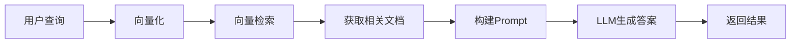

# RAG架构原理

## 什么是RAG?

RAG(Retrieval-Augmented Generation,检索增强生成)是一种结合信息检索和文本生成的技术架构,能够显著提升大语言模型在特定领域问答的准确性。

## 核心组件

### 1. 文档加载器(Document Loader)
负责从各种数据源( PDF、Word、网页等)加载文档内容。

### 2. 文本分块器(Text Splitter)
将长文档切分为合适大小的文本块,便于向量化和检索。

### 3. 嵌入模型(Embedding Model)
将文本转换为向量表示,捕捉语义信息。

### 4. 向量数据库(Vector Database)
存储和检索文本向量,支持相似度搜索。

### 5. 检索器(Retriever)
根据用户查询,从向量数据库中检索最相关的文本块。

### 6. 生成器(Generator)
结合检索到的上下文和用户查询,生成最终答案。

## 工作流程



## 代码示例

```java
@Service
public class RagService {
    
    @Autowired
    private VectorStore vectorStore;
    
    @Autowired
    private ChatClient chatClient;
    
    public String query(String question) {
        // 1. 检索相关文档
        List<Document> documents = vectorStore
            .similaritySearch(question);
        
        // 2. 构建增强Prompt
        String context = documents.stream()
            .map(Document::getContent)
            .collect(Collectors.joining("\n\n"));
        
        String prompt = String.format("""
            基于以下上下文回答问题:
            
            %s
            
            问题: %s
            
            答案:
            """, context, question);
        
        // 3. 生成答案
        return chatClient.prompt(prompt)
            .call()
            .content();
    }
}
```

## 相关资源

- [RAG技术深度解析](https://www.pinecone.io/learn/retrieval-augmented-generation/)
- [高级RAG技术](https://codelabs.developers.google.cn/codelabs/production-ready-ai-with-gc/8-advanced-rag-methods/advanced-rag-methods)

## 练习题

<ClientOnly>
  <QuizWidget category-id="rag" />
</ClientOnly>
