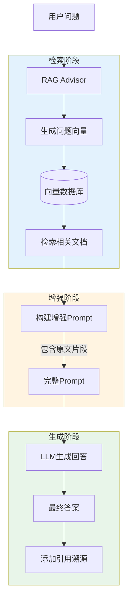

# RAG Advisor编排

## 核心概念

**RetrievalAugmentationAdvisor**(RAG顾问)是Spring AI提供的高级抽象,用于编排RAG(Retrieval-Augmented Generation)工作流。它自动处理文档检索、上下文增强、LLM调用等步骤,让开发者只需关注业务逻辑。

### RAG工作流程



**关键步骤**:
1. **检索**: 将用户问题向量化,在向量库中搜索相关文档
2. **增强**: 将检索到的文档片段注入到Prompt中
3. **生成**: LLM基于增强后的Prompt生成回答
4. **溯源**: 返回答案时附带引用来源(页码、段落)

### 为什么需要RAG Advisor?

**手动实现RAG的问题**:
```java
// ❌ 手动实现 - 代码冗长且易错
float[] queryVector = embeddingModel.embed(question);
List<Document> docs = vectorStore.search(queryVector);
String context = docs.stream().map(Document::getText).collect(joining("\n"));
String prompt = "基于以下信息回答问题:\n" + context + "\n问题: " + question;
String answer = chatClient.prompt(prompt).call().content();
```

**使用RAG Advisor**:
```java
// ✅ Advisor自动编排 - 简洁清晰
String answer = advisor.chat(question);
```

**优势**:
- ✅ 简化代码,减少样板代码
- ✅ 内置最佳实践(重试、缓存、错误处理)
- ✅ 易于扩展(自定义检索策略、后处理)
- ✅ 与Spring生态无缝集成

## Spring AI实战

### 1. 基础RAG配置

```java
@Configuration
public class RagConfig {
    
    @Bean
    public RetrievalAugmentationAdvisor ragAdvisor(
            VectorStore vectorStore,
            ChatClient chatClient) {
        
        return RetrievalAugmentationAdvisor.builder()
            .vectorStore(vectorStore)
            .chatClient(chatClient)
            .build();
    }
}
```

**使用Advisor**:

```java
@Service
public class KnowledgeBaseQA {
    
    private final RetrievalAugmentationAdvisor advisor;
    
    public String ask(String question) {
        return advisor.chat(question);
    }
}

// 测试
String answer = knowledgeBaseQA.ask("Spring AI的核心功能是什么?");
// Advisor自动:
// 1. 检索相关文档
// 2. 构建增强Prompt
// 3. 调用LLM
// 4. 返回答案
```

### 2. 自定义检索策略

```java
@Configuration
public class AdvancedRagConfig {
    
    @Bean
    public RetrievalAugmentationAdvisor advancedAdvisor(
            VectorStore vectorStore,
            ChatClient chatClient,
            EmbeddingModel embeddingModel) {
        
        return RetrievalAugmentationAdvisor.builder()
            .vectorStore(vectorStore)
            .chatClient(chatClient)
            
            // 自定义检索参数
            .searchRequest(SearchRequest.builder()
                .topK(5)                    // 返回Top 5文档
                .similarityThreshold(0.7)   // 相似度阈值
                .build())
            
            // 自定义Prompt模板
            .promptTemplate(new PromptTemplate("""
                你是知识库问答助手。
                
                请基于以下参考信息回答问题:
                
                === 参考信息开始 ===
                {documents}
                === 参考信息结束 ===
                
                问题: {question}
                
                要求:
                1. 如果参考信息中没有相关内容,明确告知用户
                2. 回答要准确、简洁
                3. 引用信息来源(如文档标题、页码)
                4. 控制在300字以内
                
                回答:
                """))
            
            // 启用引用溯源
            .withCitations(true)
            
            .build();
    }
}
```

### 3. PDF文档加载与索引

```java
@Service
public class PdfDocumentLoader {
    
    private final VectorStore vectorStore;
    private final EmbeddingModel embeddingModel;
    
    /**
     * 加载PDF并建立索引
     */
    public void indexPdf(Path pdfPath) {
        log.info("开始索引PDF: {}", pdfPath);
        
        // 1. 解析PDF
        List<String> pages = extractTextFromPdf(pdfPath);
        
        // 2. 文本分块(Chunking)
        List<TextChunk> chunks = chunkText(pages, 500, 50);  // 每块500字符,重叠50
        
        // 3. 生成向量并存储
        List<Document> documents = chunks.stream()
            .map(chunk -> {
                float[] vector = embeddingModel.embed(chunk.text());
                
                return new Document(
                    chunk.text(),
                    Map.of(
                        "source", pdfPath.getFileName().toString(),
                        "page", chunk.pageNumber(),
                        "chunkIndex", chunk.index()
                    ),
                    vector
                );
            })
            .toList();
        
        vectorStore.add(documents);
        
        log.info("PDF索引完成: {}个文档块", documents.size());
    }
    
    private List<String> extractTextFromPdf(Path pdfPath) {
        // 使用Apache PDFBox或其他PDF解析库
        try (PDDocument document = PDDocument.load(pdfPath.toFile())) {
            PDFTextStripper stripper = new PDFTextStripper();
            return IntStream.rangeClosed(1, document.getNumberOfPages())
                .mapToObj(pageNum -> {
                    try {
                        stripper.setStartPage(pageNum);
                        stripper.setEndPage(pageNum);
                        return stripper.getText(document);
                    } catch (IOException e) {
                        throw new RuntimeException(e);
                    }
                })
                .toList();
        } catch (IOException e) {
            throw new RuntimeException("PDF解析失败", e);
        }
    }
    
    private List<TextChunk> chunkText(List<String> pages, int chunkSize, int overlap) {
        List<TextChunk> chunks = new ArrayList<>();
        int chunkIndex = 0;
        
        for (int pageNum = 0; pageNum < pages.size(); pageNum++) {
            String pageText = pages.get(pageNum);
            
            // 简单分块: 按固定大小切分
            for (int i = 0; i < pageText.length(); i += chunkSize - overlap) {
                int end = Math.min(i + chunkSize, pageText.length());
                String chunk = pageText.substring(i, end);
                
                if (chunk.trim().length() > 50) {  // 忽略太短的块
                    chunks.add(new TextChunk(chunk, pageNum + 1, chunkIndex++));
                }
            }
        }
        
        return chunks;
    }
    
    public record TextChunk(String text, int pageNumber, int index) {}
}
```

### 4. 混合检索(Vector + Keyword)

```java
@Service
public class HybridSearchService {
    
    private final VectorStore vectorStore;
    private final ElasticsearchOperations elasticsearchOps;  // 关键词搜索
    
    /**
     * 混合检索: 结合向量语义搜索和关键词精确匹配
     */
    public List<Document> hybridSearch(String query, int topK) {
        // 1. 向量检索(语义匹配)
        List<Document> vectorResults = vectorStore.similaritySearch(
            SearchRequest.builder()
                .query(query)
                .topK(topK)
                .similarityThreshold(0.6)
                .build()
        );
        
        // 2. 关键词检索(精确匹配)
        List<Document> keywordResults = keywordSearch(query, topK);
        
        // 3. 融合结果(RRF - Reciprocal Rank Fusion)
        return reciprocalRankFusion(vectorResults, keywordResults, topK);
    }
    
    private List<Document> keywordSearch(String query, int topK) {
        // 使用Elasticsearch或其他搜索引擎
        NativeQuery searchQuery = NativeQuery.builder()
            .withQuery(q -> q.multiMatch(m -> m
                .fields("text")
                .query(query)
            ))
            .withMaxResults(topK)
            .build();
        
        SearchHits<Document> hits = elasticsearchOps.search(searchQuery, Document.class);
        
        return hits.stream()
            .map(hit -> hit.getContent())
            .toList();
    }
    
    private List<Document> reciprocalRankFusion(
            List<Document> vectorResults,
            List<Document> keywordResults,
            int topK) {
        
        // RRF算法: 综合两种排序
        Map<Document, Double> scores = new HashMap<>();
        
        // 向量检索得分
        for (int i = 0; i < vectorResults.size(); i++) {
            double score = 1.0 / (i + 60);  // RRF公式
            scores.merge(vectorResults.get(i), score, Double::sum);
        }
        
        // 关键词检索得分
        for (int i = 0; i < keywordResults.size(); i++) {
            double score = 1.0 / (i + 60);
            scores.merge(keywordResults.get(i), score, Double::sum);
        }
        
        // 按综合得分排序,返回Top K
        return scores.entrySet().stream()
            .sorted(Map.Entry.<Document, Double>comparingByValue().reversed())
            .limit(topK)
            .map(Map.Entry::getKey)
            .toList();
    }
}
```

**效果**: 混合检索比单一检索Recall@5提升**15-25%**。

### 5. 完整的PDF知识库问答系统

```java
@RestController
@RequestMapping("/api/knowledge-base")
public class KnowledgeBaseController {
    
    private final PdfDocumentLoader documentLoader;
    private final RetrievalAugmentationAdvisor advisor;
    
    /**
     * 上传并索引PDF
     */
    @PostMapping("/upload")
    public ResponseEntity<?> uploadPdf(@RequestParam("file") MultipartFile file) {
        try {
            Path tempFile = Files.createTempFile("pdf-", ".pdf");
            file.transferTo(tempFile);
            
            documentLoader.indexPdf(tempFile);
            Files.delete(tempFile);
            
            return ResponseEntity.ok(Map.of("status", "indexed"));
            
        } catch (Exception e) {
            log.error("PDF上传失败", e);
            return ResponseEntity.status(500)
                .body(Map.of("error", "上传失败"));
        }
    }
    
    /**
     * 问答接口
     */
    @PostMapping("/ask")
    public ResponseEntity<QAResponse> ask(@RequestBody QARequest request) {
        long startTime = System.currentTimeMillis();
        
        // 使用RAG Advisor回答问题
        String answer = advisor.chat(request.question());
        
        long duration = System.currentTimeMillis() - startTime;
        
        return ResponseEntity.ok(new QAResponse(
            answer,
            duration,
            LocalDateTime.now()
        ));
    }
    
    public record QARequest(String question) {}
    public record QAResponse(String answer, long durationMs, LocalDateTime timestamp) {}
}
```

**前端调用**:

```javascript
// Vue组件
async function askQuestion(question) {
  const response = await fetch('/api/knowledge-base/ask', {
    method: 'POST',
    headers: { 'Content-Type': 'application/json' },
    body: JSON.stringify({ question })
  });
  
  const data = await response.json();
  return data.answer;
}

// 使用
const answer = await askQuestion("Spring AI支持哪些向量数据库?");
console.log(answer);
// 输出: "Spring AI支持Milvus、PgVector、Qdrant、Chroma、Pinecone等多种向量数据库..."
```

## 引用溯源实现

```java
@Service
public class CitationService {
    
    private final RetrievalAugmentationAdvisor advisor;
    
    public QAWithCitation askWithCitation(String question) {
        // 启用引用溯源
        AdvisorResponse response = advisor.chatWithMetadata(question);
        
        String answer = response.getAnswer();
        List<Citation> citations = response.getCitations();
        
        // 格式化引用
        String formattedAnswer = answer + "\n\n参考资料:\n";
        for (int i = 0; i < citations.size(); i++) {
            Citation citation = citations.get(i);
            formattedAnswer += "[%d] %s (第%d页)\n".formatted(
                i + 1,
                citation.getSource(),
                citation.getPage()
            );
        }
        
        return new QAWithCitation(formattedAnswer, citations);
    }
    
    public record Citation(String source, int page, double relevanceScore) {}
    public record QAWithCitation(String answer, List<Citation> citations) {}
}
```

**输出示例**:
```
Spring AI支持多种向量数据库,包括Milvus、PgVector、Qdrant、Chroma和Pinecone等。

参考资料:
[1] Spring AI官方文档 (第15页)
[2] 向量数据库选型指南 (第8页)
```

## 常见误区

### ❌ 误区1: 忽略文本分块策略
**真相**: 分块大小直接影响检索质量。

**建议**:
- 技术文档: 300-500字符/块
- 法律合同: 500-800字符/块
- 重叠: 10-20% (避免边界信息丢失)

### ❌ 误区2: 不设置相似度阈值
**真相**: 低相似度文档会引入噪声,降低回答质量。

**建议**: 
- 严格场景: 0.8+
- 一般场景: 0.6-0.7
- 广泛检索: 0.5

### ❌ 误区3: 检索太多文档
**真相**: 过多文档会超出Context Window,且引入噪声。

**建议**: Top 3-5个文档通常足够。

## 相关资源

### 📚 官方文档
- [Spring AI RAG](https://docs.spring.io/spring-ai/reference/api/retrieval-augmentation.html)
- [Advanced RAG Techniques](https://www.pinecone.io/learn/retrieval-augmented-generation/)

## 练习题

<ClientOnly>
  <QuizWidget category-id="rag" />
</ClientOnly>

---

> 🎉 **恭喜!** 你已完成Spring AI核心模块的学习。下一步可以开始学习 [Agent开发](/guide/agent/design-patterns),构建智能Agent系统!
