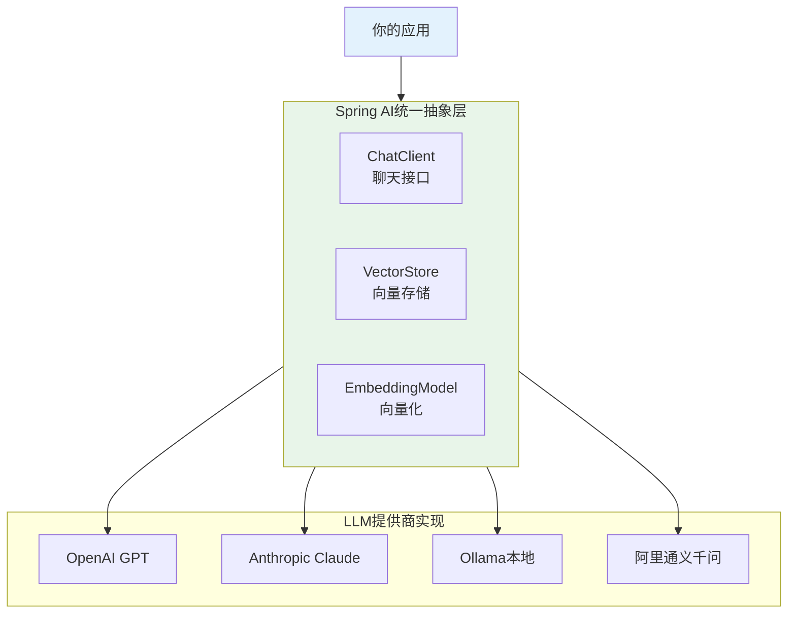
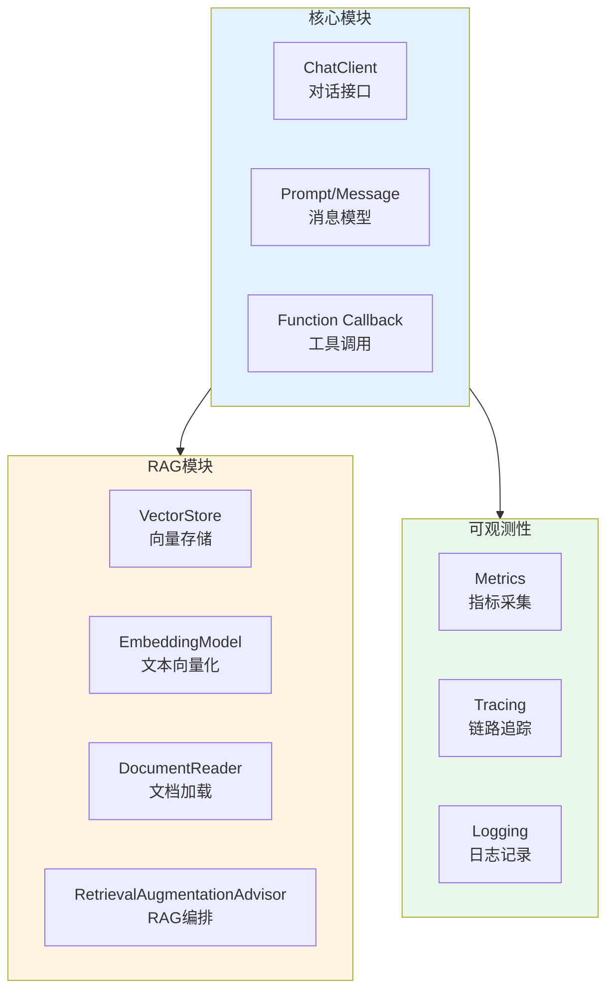

# Spring AI快速入门

## 核心概念

**Spring AI**是Spring官方推出的AI应用开发框架,为Java开发者提供统一的API抽象,简化与大语言模型(LLM)的集成。

### 设计理念



**核心价值**:
1. **统一API**: 一套代码,支持多种LLM提供商
2. **Spring生态集成**: 与Spring Boot、Spring Cloud无缝集成
3. **企业级特性**: 重试、缓存、监控、安全
4. **低学习成本**: Spring开发者30分钟上手

### Spring AI vs LangChain4j

| 特性 | Spring AI | LangChain4j |
|------|-----------|-------------|
| **维护方** | Spring官方(Pivotal) | 社区驱动 |
| **学习曲线** | 低(Spring开发者友好) | 中(需学习新API) |
| **Provider支持** | 主流10+提供商 | 50+提供商 |
| **Spring集成** | 原生支持(@Bean自动配置) | 需要额外配置 |
| **RAG支持** | RetrievalAugmentationAdvisor | 内置完整RAG链 |
| **Agent支持** | 基础Function Calling | 完整Agent框架 |
| **社区活跃度** | 快速增长(GitHub 3K+ stars) | 成熟稳定(12K+ stars) |
| **适用场景** | Spring Boot项目快速集成 | 复杂Agent系统 |

**选型建议**:
- ✅ **已有Spring Boot项目** → 选择Spring AI
- ✅ **需要复杂Agent功能** → 选择LangChain4j
- ✅ **追求稳定性** → LangChain4j更成熟
- ✅ **追求官方支持** → Spring AI有Spring团队背书

## 5分钟快速开始

### 1. 创建Spring Boot项目

使用[start.spring.io](https://start.spring.io/)或命令行:

```bash
curl https://start.spring.io/starter.tgz \
  -d dependencies=web,spring-ai-openai \
  -d name=ai-demo \
  -d packageName=com.example.demo \
  | tar -xzvf -
```

### 2. 添加依赖

```xml
<!-- pom.xml -->
<dependencies>
    <!-- Spring AI OpenAI Starter -->
    <dependency>
        <groupId>org.springframework.ai</groupId>
        <artifactId>spring-ai-starter-model-openai</artifactId>
        <version>1.0.0-M4</version>
    </dependency>
    
    <!-- 或其他Provider -->
    <!-- spring-ai-starter-model-anthropic -->
    <!-- spring-ai-starter-model-ollama -->
</dependencies>
```

### 3. 配置API Key

```yaml
# application.yml
spring:
  ai:
    openai:
      api-key: ${OPENAI_API_KEY}  # 从环境变量读取
      chat:
        options:
          model: gpt-4o-mini
          temperature: 0.7
```

```bash
# 设置环境变量
export OPENAI_API_KEY=sk-your-api-key-here
```

### 4. 编写第一个AI应用

```java
package com.example.demo;

import org.springframework.ai.chat.client.ChatClient;
import org.springframework.boot.CommandLineRunner;
import org.springframework.boot.SpringApplication;
import org.springframework.boot.autoconfigure.SpringBootApplication;
import org.springframework.context.annotation.Bean;

@SpringBootApplication
public class AiDemoApplication {

    public static void main(String[] args) {
        SpringApplication.run(AiDemoApplication.class, args);
    }

    @Bean
    CommandLineRunner demo(ChatClient.Builder chatClientBuilder) {
        return args -> {
            // 构建ChatClient
            ChatClient chatClient = chatClientBuilder.build();
            
            // 简单对话
            String response = chatClient.prompt()
                .user("用一句话介绍Spring AI")
                .call()
                .content();
            
            System.out.println("AI回答: " + response);
        };
    }
}
```

### 5. 运行

```bash
mvn spring-boot:run
```

**输出**:
```
AI回答: Spring AI是Spring官方推出的AI应用开发框架,为Java开发者提供统一的API抽象,简化与大语言模型的集成,让Spring开发者能够快速构建智能应用。
```

**恭喜!你已经完成了第一个Spring AI应用!** 🎉

## Provider可移植性

Spring AI的最大优势是**切换Provider无需改代码**。

### 示例: 从OpenAI切换到Claude

**只需修改配置**:

```yaml
# application.yml - 从OpenAI切换到Claude
spring:
  ai:
    anthropic:  # ← 改这里
      api-key: ${ANTHROPIC_API_KEY}
      chat:
        options:
          model: claude-3-5-sonnet-20241022
          temperature: 0.7
```

**代码完全不变**:

```java
// 这段代码对OpenAI、Claude、Ollama都适用
ChatClient chatClient = chatClientBuilder.build();

String response = chatClient.prompt()
    .user("你好")
    .call()
    .content();
```

### 多Provider路由

根据场景智能选择Provider:

```java
@Configuration
public class MultiProviderConfig {
    
    @Bean
    @Primary
    public ChatClient defaultChatClient(ChatClient.Builder builder) {
        return builder.build();  // 默认使用配置的Provider
    }
    
    @Bean("openaiClient")
    public ChatClient openaiChatClient(OpenAiChatOptions options) {
        return ChatClient.builder()
            .defaultOptions(options)
            .build();
    }
    
    @Bean("qwenClient")
    public ChatClient qwenChatClient(DashScopeChatOptions options) {
        return ChatClient.builder()
            .defaultOptions(options)
            .build();
    }
}

@Service
public class SmartRouterService {
    
    private final ChatClient openaiClient;
    private final ChatClient qwenClient;
    
    public String chat(String message, boolean isChinese) {
        // 中文请求使用通义千问(成本低、效果好)
        if (isChinese) {
            return qwenClient.prompt()
                .user(message)
                .call()
                .content();
        }
        
        // 英文请求使用GPT-4(质量优先)
        return openaiClient.prompt()
            .user(message)
            .call()
            .content();
    }
}
```

## Spring AI核心模块



**模块说明**:
- **ChatClient**: 与LLM对话的核心接口
- **VectorStore**: 向量数据库抽象(Milvus/Pinecone/Qdrant等)
- **EmbeddingModel**: 文本向量化(BGE/M3E/OpenAI Embedding等)
- **Advisor**: RAG工作流编排器
- **Function Callback**: Function Calling机制

## 常见误区

### ❌ 误区1: Spring AI只能用于新项目
**真相**: 可以逐步迁移,先在现有Spring Boot项目中添加AI功能。

**渐进式集成**:
```
第1步: 添加spring-ai-starter依赖
第2步: 在一个Controller中使用ChatClient
第3步: 验证效果后,逐步扩展到其他模块
```

### ❌ 误区2: 必须使用OpenAI
**真相**: Spring AI支持10+Provider,包括国产模型和本地部署。

**国内推荐**:
- 通义千问(Qwen): 中文能力强,性价比高
- 智谱GLM: 合规性好,数据不出境
- Ollama: 本地部署,零API成本

### ❌ 误区3: Spring AI功能不如LangChain4j
**真相**: Spring AI专注于"80%的常见场景",对于复杂Agent确实LangChain4j更强,但大多数业务场景Spring AI已足够。

**功能对比**:
- ✅ 基础对话: 两者相当
- ✅ RAG: Spring AI略简洁,L langChain4j更灵活
- ⚠️ 复杂Agent: LangChain4j更强
- ⚠️ 特殊Provider: LangChain4j支持更多

## 相关资源

### 📚 官方文档
- [Spring AI Reference](https://docs.spring.io/spring-ai/reference/) - 完整参考文档
- [Spring AI Samples](https://github.com/spring-projects/spring-ai-examples) - 官方示例代码
- [Spring Blog](https://spring.io/blog) - 官方博客文章

### 🎥 视频教程
- [Spring AI Introduction](https://www.youtube.com/watch?v=spring-ai) - YouTube官方介绍
- [B站-Spring AI实战](https://www.bilibili.com/video/BV1spring-ai) - 中文教程

### 🛠️ 示例项目
- [Spring AI RAG Example](https://github.com/spring-projects/spring-ai-examples/tree/main/rag) - RAG知识库示例
- [Spring AI Function Calling](https://github.com/spring-projects/spring-ai-examples/tree/main/function-calling) - Function Calling示例

## 练习题

<ClientOnly>
  <QuizWidget category-id="frameworks" />
</ClientOnly>

---

> 💡 **下一步**: 深入学习 [ChatClient核心API](/guide/spring-ai/chatclient-api),掌握Spring AI最常用的对话接口!
