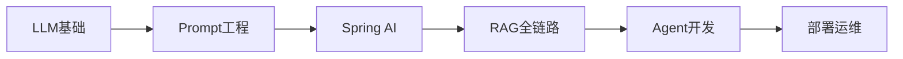

## 为什么选择 LearnPlace?

### 🎯 专为Java开发者打造
- 基于Spring Boot和Spring AI框架,充分利用已有技术栈
- 对比传统Java开发模式,理解AI应用架构差异
- 从熟悉的MVC模式过渡到AI应用的Prompt-Response模式

### 📈 渐进式学习路径
```
L1 入门 → L2 进阶 → L3 高级
  ↓         ↓         ↓
理论基础  框架构建  系统设计
```

### 💡 理论与实践结合
每个学习阶段都配有:
- 📖 理论讲解 - 深入理解核心概念
- 🔧 代码示例 - 可运行的完整代码
- ✍️ 练习题 - 检验学习效果
- 🛠️ 实战项目 - 积累真实项目经验

## 学习路线概览



**预计学习周期**: 12周 (每天2小时)

## 快速开始

1. **浏览学习路线** - 了解整体学习规划
2. **从LLM基础开始** - 建立正确的认知框架
3. **完成练手项目** - 将理论转化为实践能力
4. **定期自测** - 使用题库检验学习效果
5. **持续打卡** - 保持学习连续性

## 社区与支持

- 🐛 [问题反馈](https://github.com/your-org/learn-place/issues)
- 💬 [讨论区](https://github.com/your-org/learn-place/discussions)
- 📧 [联系我们](mailto:contact@learnplace.dev)

---

> 💡 **提示**: 学习过程中遇到问题? 不要犹豫,立即在GitHub Issues中提问!
