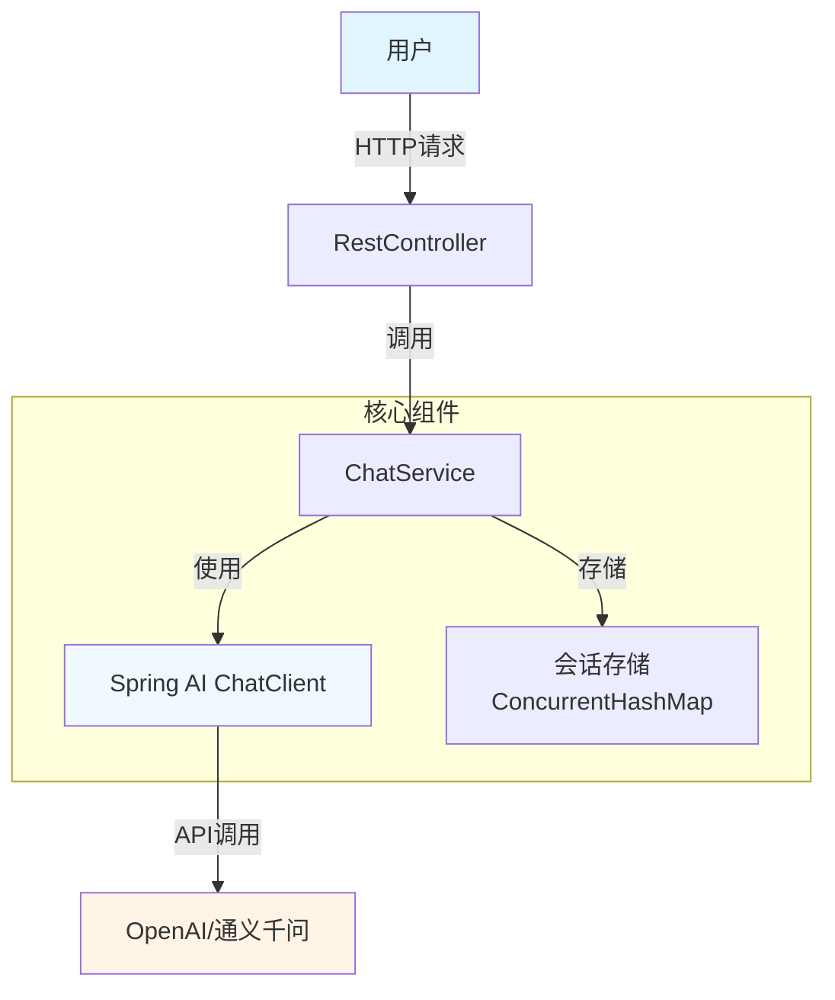

# 项目1: 智能问答机器人 (L1入门)

## 📋 项目概述

### 业务场景
构建一个基础的智能问答机器人,用户通过Web界面或API与机器人进行对话。这是AI应用开发的"Hello World"项目,帮助你快速上手Spring AI框架和LLM API调用。

### 学习目标
- ✅ 掌握Spring AI的核心API(ChatClient)
- ✅ 理解LLM API调用的基本流程
- ✅ 学会处理流式响应(Streaming Response)
- ✅ 实现简单的多轮对话记忆管理
- ✅ 掌握异常处理和超时控制

### 技术栈
- **后端框架**: Spring Boot 3.2+
- **AI框架**: Spring AI 1.0+
- **LLM提供商**: OpenAI GPT-3.5/4 或 通义千问/文心一言
- **构建工具**: Maven 3.8+
- **JDK版本**: Java 17+

---

## 🏗️ 技术架构



**架构说明**:
1. **Controller层**: 接收用户请求,参数校验
2. **Service层**: 业务逻辑处理,会话管理
3. **ChatClient**: Spring AI提供的统一聊天客户端
4. **SessionStore**: 内存存储对话历史(生产环境建议用Redis)

---

## 📝 实施步骤

### Step 1: 项目初始化

创建Spring Boot项目并添加依赖:

```xml
<!-- pom.xml -->
<dependencies>
    <!-- Spring Boot Starter Web -->
    <dependency>
        <groupId>org.springframework.boot</groupId>
        <artifactId>spring-boot-starter-web</artifactId>
    </dependency>
    
    <!-- Spring AI OpenAI -->
    <dependency>
        <groupId>org.springframework.ai</groupId>
        <artifactId>spring-ai-openai-spring-boot-starter</artifactId>
        <version>1.0.0-M4</version>
    </dependency>
    
    <!-- Lombok (可选) -->
    <dependency>
        <groupId>org.projectlombok</groupId>
        <artifactId>lombok</artifactId>
        <optional>true</optional>
    </dependency>
</dependencies>
```

### Step 2: 配置文件

```yaml
# application.yml
server:
  port: 8080

spring:
  ai:
    openai:
      api-key: ${OPENAI_API_KEY}  # 从环境变量读取
      chat:
        options:
          model: gpt-3.5-turbo
          temperature: 0.7
          max-tokens: 1000
```

**国内模型配置示例**(通义千问):
```yaml
spring:
  ai:
    openai:
      base-url: https://dashscope.aliyuncs.com/compatible-mode/v1
      api-key: ${DASHSCOPE_API_KEY}
      chat:
        options:
          model: qwen-plus
```

### Step 3: 核心代码实现

#### 3.1 定义DTO

```java
package com.learnplace.qabot.dto;

import lombok.Data;
import java.util.List;

@Data
public class ChatRequest {
    private String message;      // 用户消息
    private String sessionId;    // 会话ID(可选,用于多轮对话)
}

@Data
public class ChatResponse {
    private String reply;        // AI回复
    private String sessionId;    // 会话ID
    private long responseTime;   // 响应时间(ms)
}

@Data
public class Message {
    private String role;         // user/assistant/system
    private String content;
    private long timestamp;
}
```

#### 3.2 会话管理服务

```java
package com.learnplace.qabot.service;

import com.learnplace.qabot.dto.Message;
import org.springframework.stereotype.Service;

import java.util.*;
import java.util.concurrent.ConcurrentHashMap;

@Service
public class SessionManager {
    
    // 存储每个会话的消息历史 key: sessionId, value: 消息列表
    private final Map<String, List<Message>> sessions = new ConcurrentHashMap<>();
    
    // 最大历史消息数(避免上下文过长)
    private static final int MAX_HISTORY_SIZE = 10;
    
    /**
     * 获取或创建会话
     */
    public String getOrCreateSession(String sessionId) {
        if (sessionId == null || sessionId.isEmpty()) {
            sessionId = UUID.randomUUID().toString();
        }
        sessions.putIfAbsent(sessionId, new ArrayList<>());
        return sessionId;
    }
    
    /**
     * 添加用户消息
     */
    public void addUserMessage(String sessionId, String content) {
        List<Message> messages = sessions.get(sessionId);
        if (messages != null) {
            messages.add(new Message("user", content, System.currentTimeMillis()));
            trimHistory(messages);
        }
    }
    
    /**
     * 添加AI回复
     */
    public void addAssistantMessage(String sessionId, String content) {
        List<Message> messages = sessions.get(sessionId);
        if (messages != null) {
            messages.add(new Message("assistant", content, System.currentTimeMillis()));
            trimHistory(messages);
        }
    }
    
    /**
     * 获取会话历史(包含System Prompt)
     */
    public List<Message> getSessionHistory(String sessionId) {
        List<Message> messages = sessions.get(sessionId);
        if (messages == null || messages.isEmpty()) {
            return Collections.emptyList();
        }
        
        // 返回最近N条消息
        int start = Math.max(0, messages.size() - MAX_HISTORY_SIZE);
        return messages.subList(start, messages.size());
    }
    
    /**
     * 修剪历史记录,保留最近N条
     */
    private void trimHistory(List<Message> messages) {
        if (messages.size() > MAX_HISTORY_SIZE * 2) {
            int removeCount = messages.size() - MAX_HISTORY_SIZE;
            messages.subList(0, removeCount).clear();
        }
    }
    
    /**
     * 清除会话
     */
    public void clearSession(String sessionId) {
        sessions.remove(sessionId);
    }
}
```

#### 3.3 聊天服务(核心)

```java
package com.learnplace.qabot.service;

import com.learnplace.qabot.dto.ChatRequest;
import com.learnplace.qabot.dto.ChatResponse;
import com.learnplace.qabot.dto.Message;
import lombok.RequiredArgsConstructor;
import lombok.extern.slf4j.Slf4j;
import org.springframework.ai.chat.client.ChatClient;
import org.springframework.ai.chat.messages.SystemMessage;
import org.springframework.ai.chat.messages.UserMessage;
import org.springframework.ai.chat.model.ChatResponse;
import org.springframework.stereotype.Service;
import reactor.core.publisher.Flux;

import java.util.List;
import java.util.stream.Collectors;

@Slf4j
@Service
@RequiredArgsConstructor
public class ChatService {
    
    private final ChatClient chatClient;
    private final SessionManager sessionManager;
    
    // System Prompt - 定义AI的角色和行为
    private static final String SYSTEM_PROMPT = """
        你是一个专业的智能问答助手,名叫LearnBot。
        
        你的特点:
        1. 回答准确、简洁、友好
        2. 如果不确定,诚实地告知用户
        3. 支持中文和英文交流
        4. 不提供违法、暴力、歧视性内容
        
        请根据用户的问题提供有帮助的回答。
        """;
    
    /**
     * 单轮对话(无记忆)
     */
    public ChatResponse chat(ChatRequest request) {
        long startTime = System.currentTimeMillis();
        
        try {
            // 调用LLM
            String reply = chatClient.prompt()
                .system(SYSTEM_PROMPT)
                .user(request.getMessage())
                .call()
                .content();
            
            long responseTime = System.currentTimeMillis() - startTime;
            
            ChatResponse response = new ChatResponse();
            response.setReply(reply);
            response.setSessionId(null);
            response.setResponseTime(responseTime);
            
            log.info("单轮对话完成,耗时: {}ms", responseTime);
            return response;
            
        } catch (Exception e) {
            log.error("聊天失败", e);
            throw new RuntimeException("聊天服务暂时不可用,请稍后重试", e);
        }
    }
    
    /**
     * 多轮对话(带记忆)
     */
    public ChatResponse chatWithMemory(ChatRequest request) {
        long startTime = System.currentTimeMillis();
        
        // 获取或创建会话
        String sessionId = sessionManager.getOrCreateSession(request.getSessionId());
        
        try {
            // 添加用户消息到历史
            sessionManager.addUserMessage(sessionId, request.getMessage());
            
            // 获取会话历史
            List<Message> history = sessionManager.getSessionHistory(sessionId);
            
            // 构建消息列表
            List<org.springframework.ai.chat.messages.Message> messages = 
                history.stream()
                    .map(msg -> {
                        if ("user".equals(msg.getRole())) {
                            return new UserMessage(msg.getContent());
                        } else {
                            return new org.springframework.ai.chat.messages.AssistantMessage(msg.getContent());
                        }
                    })
                    .collect(Collectors.toList());
            
            // 调用LLM(传入完整历史)
            String reply = chatClient.prompt()
                .system(SYSTEM_PROMPT)
                .messages(messages)
                .call()
                .content();
            
            // 保存AI回复
            sessionManager.addAssistantMessage(sessionId, reply);
            
            long responseTime = System.currentTimeMillis() - startTime;
            
            ChatResponse response = new ChatResponse();
            response.setReply(reply);
            response.setSessionId(sessionId);
            response.setResponseTime(responseTime);
            
            log.info("多轮对话完成,会话: {}, 耗时: {}ms", sessionId, responseTime);
            return response;
            
        } catch (Exception e) {
            log.error("多轮对话失败,会话: {}", sessionId, e);
            throw new RuntimeException("聊天服务暂时不可用,请稍后重试", e);
        }
    }
    
    /**
     * 流式响应(实时输出)
     */
    public Flux<String> streamChat(ChatRequest request) {
        String sessionId = sessionManager.getOrCreateSession(request.getSessionId());
        sessionManager.addUserMessage(sessionId, request.getMessage());
        
        List<Message> history = sessionManager.getSessionHistory(sessionId);
        List<org.springframework.ai.chat.messages.Message> messages = 
            history.stream()
                .map(msg -> {
                    if ("user".equals(msg.getRole())) {
                        return new UserMessage(msg.getContent());
                    } else {
                        return new org.springframework.ai.chat.messages.AssistantMessage(msg.getContent());
                    }
                })
                .collect(Collectors.toList());
        
        StringBuilder fullReply = new StringBuilder();
        
        return chatClient.prompt()
            .system(SYSTEM_PROMPT)
            .messages(messages)
            .stream()
            .content()
            .doOnNext(chunk -> fullReply.append(chunk))
            .doOnComplete(() -> {
                sessionManager.addAssistantMessage(sessionId, fullReply.toString());
                log.info("流式对话完成,会话: {}", sessionId);
            });
    }
    
    /**
     * 清除会话
     */
    public void clearSession(String sessionId) {
        sessionManager.clearSession(sessionId);
        log.info("会话已清除: {}", sessionId);
    }
}
```

#### 3.4 REST控制器

```java
package com.learnplace.qabot.controller;

import com.learnplace.qabot.dto.ChatRequest;
import com.learnplace.qabot.dto.ChatResponse;
import com.learnplace.qabot.service.ChatService;
import lombok.RequiredArgsConstructor;
import org.springframework.http.MediaType;
import org.springframework.web.bind.annotation.*;
import reactor.core.publisher.Flux;

@RestController
@RequestMapping("/api/chat")
@RequiredArgsConstructor
@CrossOrigin(origins = "*")  // 允许跨域
public class ChatController {
    
    private final ChatService chatService;
    
    /**
     * 单轮对话
     */
    @PostMapping("/simple")
    public ChatResponse simpleChat(@RequestBody ChatRequest request) {
        return chatService.chat(request);
    }
    
    /**
     * 多轮对话(推荐)
     */
    @PostMapping("/memory")
    public ChatResponse memoryChat(@RequestBody ChatRequest request) {
        return chatService.chatWithMemory(request);
    }
    
    /**
     * 流式响应(Server-Sent Events)
     */
    @PostMapping(value = "/stream", produces = MediaType.TEXT_EVENT_STREAM_VALUE)
    public Flux<String> streamChat(@RequestBody ChatRequest request) {
        return chatService.streamChat(request);
    }
    
    /**
     * 清除会话
     */
    @DeleteMapping("/session/{sessionId}")
    public void clearSession(@PathVariable String sessionId) {
        chatService.clearSession(sessionId);
    }
}
```

### Step 4: 前端页面(可选)

创建简单的HTML测试页面 `src/main/resources/static/index.html`:

```html
<!DOCTYPE html>
<html lang="zh-CN">
<head>
    <meta charset="UTF-8">
    <meta name="viewport" content="width=device-width, initial-scale=1.0">
    <title>智能问答机器人</title>
    <style>
        body { font-family: Arial, sans-serif; max-width: 800px; margin: 0 auto; padding: 20px; }
        .chat-container { border: 1px solid #ddd; border-radius: 8px; padding: 20px; height: 500px; overflow-y: auto; }
        .message { margin: 10px 0; padding: 10px; border-radius: 5px; }
        .user { background-color: #e3f2fd; text-align: right; }
        .assistant { background-color: #f5f5f5; text-align: left; }
        .input-area { display: flex; margin-top: 20px; gap: 10px; }
        input { flex: 1; padding: 10px; border: 1px solid #ddd; border-radius: 5px; }
        button { padding: 10px 20px; background-color: #2196F3; color: white; border: none; border-radius: 5px; cursor: pointer; }
        button:hover { background-color: #1976D2; }
        .streaming { color: #999; font-style: italic; }
    </style>
</head>
<body>
    <h1>🤖 智能问答机器人</h1>
    <div class="chat-container" id="chatContainer"></div>
    <div class="input-area">
        <input type="text" id="messageInput" placeholder="输入消息..." onkeypress="handleKeyPress(event)">
        <button onclick="sendMessage()">发送</button>
        <button onclick="clearChat()">清空</button>
    </div>
    
    <script>
        let sessionId = null;
        
        async function sendMessage() {
            const input = document.getElementById('messageInput');
            const message = input.value.trim();
            if (!message) return;
            
            // 显示用户消息
            addMessage(message, 'user');
            input.value = '';
            
            // 显示加载中
            const loadingId = addMessage('思考中...', 'assistant', true);
            
            try {
                const response = await fetch('/api/chat/memory', {
                    method: 'POST',
                    headers: { 'Content-Type': 'application/json' },
                    body: JSON.stringify({ message, sessionId })
                });
                
                const data = await response.json();
                sessionId = data.sessionId;
                
                // 移除加载提示,显示真实回复
                removeMessage(loadingId);
                addMessage(data.reply, 'assistant');
                
            } catch (error) {
                removeMessage(loadingId);
                addMessage('❌ 请求失败: ' + error.message, 'assistant');
            }
        }
        
        function addMessage(text, role, isLoading = false) {
            const container = document.getElementById('chatContainer');
            const div = document.createElement('div');
            div.className = `message ${role}`;
            if (isLoading) div.classList.add('streaming');
            div.textContent = text;
            div.id = 'msg-' + Date.now();
            container.appendChild(div);
            container.scrollTop = container.scrollHeight;
            return div.id;
        }
        
        function removeMessage(id) {
            const elem = document.getElementById(id);
            if (elem) elem.remove();
        }
        
        function clearChat() {
            document.getElementById('chatContainer').innerHTML = '';
            sessionId = null;
        }
        
        function handleKeyPress(event) {
            if (event.key === 'Enter') sendMessage();
        }
    </script>
</body>
</html>
```

### Step 5: 启动应用

```bash
# 设置API密钥
export OPENAI_API_KEY=sk-your-api-key-here

# 启动应用
mvn spring-boot:run
```

访问 `http://localhost:8080` 即可使用聊天机器人!

---

## ✅ 验收标准

### 功能验收
- [ ] **单轮对话**: 发送消息后3秒内收到回复
- [ ] **多轮对话**: 能记住上下文,连续对话10轮以上不丢失记忆
- [ ] **流式响应**: 首字延迟<1秒,打字机效果流畅
- [ ] **异常处理**: API超时/失败时给出友好提示
- [ ] **会话管理**: 可以清除会话历史

### 性能指标
- ⚡ 单轮对话平均响应时间: **< 3秒**
- ⚡ 流式首字延迟: **< 1秒**
- ⚡ 支持并发用户数: **≥ 50**
- ⚡ 内存占用: **< 500MB**(100个活跃会话)

### 代码质量
- 📝 代码注释覆盖率 > 80%
- 🧪 单元测试覆盖率 > 70%
- 🔍 无明显的性能瓶颈(N+1查询、内存泄漏等)

---

## ❓ 常见问题

### Q1: OpenAI API无法访问怎么办?
**解决方案**:
1. 使用国内大模型替代(通义千问、文心一言、智谱GLM)
2. 配置代理服务器
3. 使用Ollama本地部署开源模型(Llama 3、Qwen)

**通义千问配置示例**:
```yaml
spring:
  ai:
    openai:
      base-url: https://dashscope.aliyuncs.com/compatible-mode/v1
      api-key: ${DASHSCOPE_API_KEY}
      chat:
        options:
          model: qwen-plus
```

### Q2: 多轮对话上下文太长导致报错?
**原因**: LLM有token限制(GPT-3.5是4096 tokens)

**解决方案**:
1. 限制历史消息数量(如只保留最近10条)
2. 使用摘要压缩技术(定期总结对话历史)
3. 切换支持更长上下文的模型(GPT-4支持128K)

### Q3: 如何优化响应速度?
**优化方案**:
1. 启用流式响应,提升用户体验
2. 使用更快的模型(gpt-3.5-turbo比gpt-4快3-5倍)
3. 添加语义缓存(相同问题直接返回缓存结果)
4. 降低temperature参数(减少采样时间)

### Q4: 生产环境如何存储会话?
**推荐方案**:
- **小规模**: Redis(支持TTL自动过期)
- **大规模**: PostgreSQL/MongoDB(持久化存储)
- **超大规模**: 分片Redis集群 + 冷热数据分离

**Redis示例**:
```java
@Autowired
private StringRedisTemplate redisTemplate;

public void saveSession(String sessionId, List<Message> messages) {
    String key = "chat:session:" + sessionId;
    redisTemplate.opsForValue().set(key, JSON.toJSONString(messages), 30, TimeUnit.MINUTES);
}
```

---

## 🔗 延伸阅读

### 官方文档
- [Spring AI官方文档](https://docs.spring.io/spring-ai/reference/)
- [OpenAI API文档](https://platform.openai.com/docs)
- [通义千问API文档](https://help.aliyun.com/zh/dashscope/developer-reference/api-details)

### 进阶学习
- [Prompt Engineering指南](/guide/prompt-eng/principles) - 提升回答质量
- [RAG架构详解](/guide/rag/architecture) - 让机器人拥有知识库
- [Agent设计模式](/guide/agent/design-patterns) - 构建更智能的AI应用

### 相关项目
- [项目2: RAG知识库](/projects/project-2-rag-kb) - 为机器人添加企业知识
- [项目3: 代码助手Agent](/projects/project-3-code-agent) -  specialized领域的Agent

---

> 💡 **下一步**: 完成本项目后,建议继续学习[项目2: RAG知识库](/projects/project-2-rag-kb),为你的问答机器人添加专业知识!
