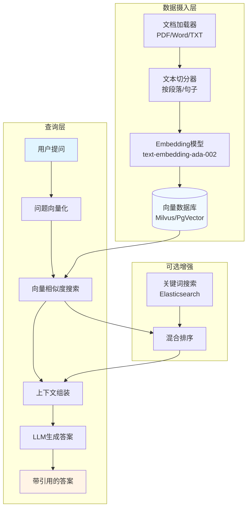

# 项目2: 企业知识库RAG系统 (L2进阶)

## 📋 项目概述

### 业务场景
企业积累了大量PDF、Word格式的文档(产品手册、技术文档、FAQ等),员工需要快速查找相关信息。传统关键词搜索效果差,无法理解语义。通过RAG(Retrieval-Augmented Generation)技术,构建智能知识库问答系统,实现"问即所得"。

### 学习目标
- ✅ 理解RAG架构的核心原理和工作流程
- ✅ 掌握文档加载和文本切分策略
- ✅ 学会使用向量数据库(Milvus/PgVector)
- ✅ 实现混合检索(向量+关键词)
- ✅ 掌握引用溯源和答案生成
- ✅ 了解RAG评估指标和优化方法

### 技术栈
- **后端框架**: Spring Boot 3.2+
- **AI框架**: Spring AI 1.0+
- **向量数据库**: Milvus 2.4+ 或 PostgreSQL + pgvector
- **文档解析**: Apache PDFBox / Apache POI
- **搜索引擎**: Elasticsearch 8.x(可选,用于混合检索)
- **JDK版本**: Java 17+

---

## 🏗️ 技术架构



**RAG工作流程**:
1. **索引阶段**: 文档 → 切分 → 向量化 → 存储到向量数据库
2. **检索阶段**: 用户问题 → 向量化 → 相似度搜索 → 召回相关片段
3. **生成阶段**: 问题 + 检索结果 → LLM → 生成带引用的答案

---

## 📝 实施步骤

### Step 1: 项目初始化

```xml
<!-- pom.xml -->
<dependencies>
    <!-- Spring Boot Starter Web -->
    <dependency>
        <groupId>org.springframework.boot</groupId>
        <artifactId>spring-boot-starter-web</artifactId>
    </dependency>
    
    <!-- Spring AI OpenAI -->
    <dependency>
        <groupId>org.springframework.ai</groupId>
        <artifactId>spring-ai-openai-spring-boot-starter</artifactId>
        <version>1.0.0-M4</version>
    </dependency>
    
    <!-- Spring AI Vector Store - Milvus -->
    <dependency>
        <groupId>org.springframework.ai</groupId>
        <artifactId>spring-ai-milvus-store-spring-boot-starter</artifactId>
        <version>1.0.0-M4</version>
    </dependency>
    
    <!-- 或者使用 PgVector -->
    <!--
    <dependency>
        <groupId>org.springframework.ai</groupId>
        <artifactId>spring-ai-pgvector-store-spring-boot-starter</artifactId>
        <version>1.0.0-M4</version>
    </dependency>
    -->
    
    <!-- PDF解析 -->
    <dependency>
        <groupId>org.apache.pdfbox</groupId>
        <artifactId>pdfbox</artifactId>
        <version>3.0.1</version>
    </dependency>
    
    <!-- Word解析 -->
    <dependency>
        <groupId>org.apache.poi</groupId>
        <artifactId>poi-ooxml</artifactId>
        <version>5.2.5</version>
    </dependency>
    
    <!-- Lombok -->
    <dependency>
        <groupId>org.projectlombok</groupId>
        <artifactId>lombok</artifactId>
        <optional>true</optional>
    </dependency>
</dependencies>
```

### Step 2: 配置文件

```yaml
# application.yml
server:
  port: 8080

spring:
  ai:
    openai:
      api-key: ${OPENAI_API_KEY}
      chat:
        options:
          model: gpt-3.5-turbo
          temperature: 0.3  # RAG场景降低temperature提高准确性
      embedding:
        options:
          model: text-embedding-ada-002
    
    milvus:
      client:
        host: localhost
        port: 19530
      database: learnplace
      collection-name: knowledge_base
      embedding-dimension: 1536  # Ada-002的向量维度
      index-type: HNSW
      metric-type: COSINE
```

**Docker Compose启动Milvus**:
```yaml
# docker-compose.yml
version: '3.8'
services:
  milvus:
    image: milvusdb/milvus:v2.4.0
    container_name: milvus
    ports:
      - "19530:19530"
      - "9091:9091"
    environment:
      ETCD_USE_EMBED: "true"
    volumes:
      - ./milvus-data:/var/lib/milvus
```

### Step 3: 核心代码实现

#### 3.1 定义DTO

```java
package com.learnplace.rag.dto;

import lombok.Data;
import java.util.List;

@Data
public class DocumentUploadRequest {
    private String fileName;
    private byte[] fileContent;
    private String category;  // 文档分类: product/tech/faq
    private List<String> tags;
}

@Data
public class KnowledgeQueryRequest {
    private String question;
    private int topK = 5;              // 召回数量
    private double similarityThreshold = 0.7;  // 相似度阈值
    private boolean useHybridSearch = false;   // 是否使用混合检索
}

@Data
public class KnowledgeQueryResponse {
    private String answer;
    private List<DocumentChunk> sources;  // 引用来源
    private long retrievalTime;    // 检索耗时(ms)
    private long generationTime;   // 生成耗时(ms)
}

@Data
public class DocumentChunk {
    private String chunkId;
    private String content;
    private String sourceFile;
    private int pageNumber;
    private double similarityScore;
}
```

#### 3.2 文档加载服务

```java
package com.learnplace.rag.service;

import lombok.extern.slf4j.Slf4j;
import org.apache.pdfbox.pdmodel.PDDocument;
import org.apache.pdfbox.text.PDFTextStripper;
import org.apache.poi.xwpf.usermodel.XWPFDocument;
import org.apache.poi.xwpf.usermodel.XWPFParagraph;
import org.springframework.stereotype.Service;

import java.io.ByteArrayInputStream;
import java.io.IOException;
import java.nio.charset.StandardCharsets;
import java.util.ArrayList;
import java.util.List;

@Slf4j
@Service
public class DocumentLoaderService {
    
    /**
     * 根据文件类型加载文档内容
     */
    public String loadDocument(byte[] fileContent, String fileName) {
        String lowerName = fileName.toLowerCase();
        
        try {
            if (lowerName.endsWith(".pdf")) {
                return loadPdf(fileContent);
            } else if (lowerName.endsWith(".docx") || lowerName.endsWith(".doc")) {
                return loadWord(fileContent);
            } else if (lowerName.endsWith(".txt")) {
                return new String(fileContent, StandardCharsets.UTF_8);
            } else {
                throw new IllegalArgumentException("不支持的文件格式: " + fileName);
            }
        } catch (IOException e) {
            log.error("文档加载失败: {}", fileName, e);
            throw new RuntimeException("文档解析失败: " + e.getMessage(), e);
        }
    }
    
    private String loadPdf(byte[] content) throws IOException {
        try (PDDocument document = PDDocument.load(content)) {
            PDFTextStripper stripper = new PDFTextStripper();
            return stripper.getText(document);
        }
    }
    
    private String loadWord(byte[] content) throws IOException {
        try (XWPFDocument document = new XWPFFocument(new ByteArrayInputStream(content))) {
            StringBuilder text = new StringBuilder();
            for (XWPFParagraph paragraph : document.getParagraphs()) {
                text.append(paragraph.getText()).append("\n");
            }
            return text.toString();
        }
    }
}
```

#### 3.3 文本切分服务

```java
package com.learnplace.rag.service;

import lombok.Data;
import org.springframework.stereotype.Service;

import java.util.ArrayList;
import java.util.List;

@Service
public class TextSplitterService {
    
    @Data
    public static class TextChunk {
        private String content;
        private int chunkIndex;
        private int startChar;
        private int endChar;
        private String metadata;  // JSON字符串,存储页码等信息
    }
    
    /**
     * 按段落切分(适合结构化文档)
     */
    public List<TextChunk> splitByParagraph(String text, int maxChunkSize, int overlap) {
        List<TextChunk> chunks = new ArrayList<>();
        String[] paragraphs = text.split("\n\n+");
        
        StringBuilder currentChunk = new StringBuilder();
        int chunkIndex = 0;
        int charPosition = 0;
        
        for (String paragraph : paragraphs) {
            if (currentChunk.length() + paragraph.length() > maxChunkSize && currentChunk.length() > 0) {
                // 保存当前chunk
                chunks.add(createChunk(currentChunk.toString(), chunkIndex++, charPosition));
                
                // 保留重叠部分
                if (overlap > 0 && currentChunk.length() > overlap) {
                    String overlapText = currentChunk.substring(currentChunk.length() - overlap);
                    currentChunk = new StringBuilder(overlapText);
                    charPosition += currentChunk.length() - overlap;
                } else {
                    currentChunk = new StringBuilder();
                }
            }
            
            currentChunk.append(paragraph).append("\n\n");
            charPosition += paragraph.length() + 2;
        }
        
        // 添加最后一个chunk
        if (currentChunk.length() > 0) {
            chunks.add(createChunk(currentChunk.toString(), chunkIndex, charPosition));
        }
        
        return chunks;
    }
    
    /**
     * 按固定大小切分(适合非结构化文本)
     */
    public List<TextChunk> splitBySize(String text, int chunkSize, int overlap) {
        List<TextChunk> chunks = new ArrayList<>();
        int start = 0;
        int chunkIndex = 0;
        
        while (start < text.length()) {
            int end = Math.min(start + chunkSize, text.length());
            
            // 尽量在句子边界切分
            if (end < text.length()) {
                int lastSentenceEnd = text.lastIndexOf(".", end);
                if (lastSentenceEnd > start + chunkSize / 2) {
                    end = lastSentenceEnd + 1;
                }
            }
            
            String chunk = text.substring(start, end).trim();
            if (!chunk.isEmpty()) {
                chunks.add(createChunk(chunk, chunkIndex++, start));
            }
            
            start = end - overlap;
        }
        
        return chunks;
    }
    
    private TextChunk createChunk(String content, int index, int startPos) {
        TextChunk chunk = new TextChunk();
        chunk.setContent(content);
        chunk.setChunkIndex(index);
        chunk.setStartChar(startPos);
        chunk.setEndChar(startPos + content.length());
        return chunk;
    }
}
```

#### 3.4 向量存储服务

```java
package com.learnplace.rag.service;

import com.learnplace.rag.dto.DocumentChunk;
import lombok.RequiredArgsConstructor;
import lombok.extern.slf4j.Slf4j;
import org.springframework.ai.document.Document;
import org.springframework.ai.embedding.EmbeddingModel;
import org.springframework.ai.vectorstore.SearchRequest;
import org.springframework.ai.vectorstore.VectorStore;
import org.springframework.stereotype.Service;

import java.util.*;
import java.util.stream.Collectors;

@Slf4j
@Service
@RequiredArgsConstructor
public class VectorStoreService {
    
    private final VectorStore vectorStore;
    private final EmbeddingModel embeddingModel;
    
    /**
     * 索引文档chunks
     */
    public void indexChunks(List<TextSplitterService.TextChunk> chunks, 
                           String sourceFile, 
                           String category,
                           List<String> tags) {
        List<Document> documents = new ArrayList<>();
        
        for (TextSplitterService.TextChunk chunk : chunks) {
            Map<String, Object> metadata = new HashMap<>();
            metadata.put("source_file", sourceFile);
            metadata.put("category", category);
            metadata.put("tags", tags);
            metadata.put("chunk_index", chunk.getChunkIndex());
            metadata.put("start_char", chunk.getStartChar());
            metadata.put("end_char", chunk.getEndChar());
            
            Document doc = new Document(
                chunk.getContent(),
                metadata
            );
            documents.add(doc);
        }
        
        // 批量添加到向量数据库
        vectorStore.add(documents);
        log.info("已索引 {} 个chunks, 来源: {}", documents.size(), sourceFile);
    }
    
    /**
     * 相似度搜索
     */
    public List<DocumentChunk> searchSimilar(String query, int topK, double threshold) {
        SearchRequest searchRequest = SearchRequest.builder()
            .query(query)
            .topK(topK)
            .similarityThreshold(threshold)
            .build();
        
        List<Document> results = vectorStore.similaritySearch(searchRequest);
        
        return results.stream()
            .map(doc -> {
                DocumentChunk chunk = new DocumentChunk();
                chunk.setChunkId(doc.getId());
                chunk.setContent(doc.getText());
                chunk.setSourceFile((String) doc.getMetadata().get("source_file"));
                chunk.setSimilarityScore(doc.getScore());
                
                // 提取页码(如果有)
                Integer pageNum = (Integer) doc.getMetadata().get("page_number");
                if (pageNum != null) {
                    chunk.setPageNumber(pageNum);
                }
                
                return chunk;
            })
            .collect(Collectors.toList());
    }
    
    /**
     * 删除文档的所有chunks
     */
    public void deleteBySourceFile(String sourceFile) {
        // Milvus支持按metadata过滤删除
        // 具体实现取决于使用的VectorStore实现
        log.info("删除文档chunks: {}", sourceFile);
    }
}
```

#### 3.5 RAG问答服务(核心)

```java
package com.learnplace.rag.service;

import com.learnplace.rag.dto.*;
import lombok.RequiredArgsConstructor;
import lombok.extern.slf4j.Slf4j;
import org.springframework.ai.chat.client.ChatClient;
import org.springframework.stereotype.Service;

import java.util.List;
import java.util.stream.Collectors;

@Slf4j
@Service
@RequiredArgsConstructor
public class RagQueryService {
    
    private final ChatClient chatClient;
    private final VectorStoreService vectorStoreService;
    private final DocumentLoaderService documentLoader;
    private final TextSplitterService textSplitter;
    
    // RAG System Prompt
    private static final String RAG_SYSTEM_PROMPT = """
        你是一个专业的企业知识库问答助手。
        
        请基于以下检索到的文档片段回答问题:
        
        {context}
        
        回答要求:
        1. 严格基于提供的文档内容回答,不要编造信息
        2. 如果文档中没有相关信息,明确告知用户"未找到相关信息"
        3. 引用具体来源,格式: [来源: 文件名, 页码X]
        4. 回答简洁清晰,条理分明
        5. 如果多个片段有冲突,指出差异并说明
        
        用户问题: {question}
        """;
    
    /**
     * RAG问答主流程
     */
    public KnowledgeQueryResponse query(KnowledgeQueryRequest request) {
        long startTime = System.currentTimeMillis();
        
        // 1. 向量检索
        long retrievalStart = System.currentTimeMillis();
        List<DocumentChunk> sources = vectorStoreService.searchSimilar(
            request.getQuestion(),
            request.getTopK(),
            request.getSimilarityThreshold()
        );
        long retrievalTime = System.currentTimeMillis() - retrievalStart;
        
        if (sources.isEmpty()) {
            KnowledgeQueryResponse response = new KnowledgeQueryResponse();
            response.setAnswer("抱歉,未在知识库中找到相关信息。您可以尝试换个问法,或联系人工客服。");
            response.setSources(sources);
            response.setRetrievalTime(retrievalTime);
            response.setGenerationTime(0);
            return response;
        }
        
        // 2. 构建上下文
        String context = buildContext(sources);
        
        // 3. LLM生成答案
        long generationStart = System.currentTimeMillis();
        String answer = generateAnswer(request.getQuestion(), context);
        long generationTime = System.currentTimeMillis() - generationStart;
        
        long totalTime = System.currentTimeMillis() - startTime;
        
        KnowledgeQueryResponse response = new KnowledgeQueryResponse();
        response.setAnswer(answer);
        response.setSources(sources);
        response.setRetrievalTime(retrievalTime);
        response.setGenerationTime(generationTime);
        
        log.info("RAG查询完成, 检索: {}ms, 生成: {}ms, 总计: {}ms", 
            retrievalTime, generationTime, totalTime);
        
        return response;
    }
    
    /**
     * 上传并索引文档
     */
    public void uploadAndIndex(DocumentUploadRequest request) {
        // 1. 加载文档
        String content = documentLoader.loadDocument(
            request.getFileContent(), 
            request.getFileName()
        );
        
        // 2. 文本切分
        List<TextSplitterService.TextChunk> chunks = textSplitter.splitByParagraph(
            content,
            1000,  // 每个chunk最大1000字符
            200    // 重叠200字符
        );
        
        // 3. 索引到向量数据库
        vectorStoreService.indexChunks(
            chunks,
            request.getFileName(),
            request.getCategory(),
            request.getTags()
        );
    }
    
    private String buildContext(List<DocumentChunk> sources) {
        StringBuilder context = new StringBuilder();
        for (int i = 0; i < sources.size(); i++) {
            DocumentChunk chunk = sources.get(i);
            context.append(String.format(
                "[片段 %d] [来源: %s, 相似度: %.2f]\n%s\n\n",
                i + 1,
                chunk.getSourceFile(),
                chunk.getSimilarityScore(),
                chunk.getContent()
            ));
        }
        return context.toString();
    }
    
    private String generateAnswer(String question, String context) {
        String prompt = RAG_SYSTEM_PROMPT
            .replace("{context}", context)
            .replace("{question}", question);
        
        return chatClient.prompt()
            .user(prompt)
            .call()
            .content();
    }
}
```

#### 3.6 REST控制器

```java
package com.learnplace.rag.controller;

import com.learnplace.rag.dto.*;
import com.learnplace.rag.service.RagQueryService;
import lombok.RequiredArgsConstructor;
import org.springframework.http.ResponseEntity;
import org.springframework.web.bind.annotation.*;
import org.springframework.web.multipart.MultipartFile;

@RestController
@RequestMapping("/api/knowledge")
@RequiredArgsConstructor
public class KnowledgeController {
    
    private final RagQueryService ragService;
    
    /**
     * 上传文档
     */
    @PostMapping("/upload")
    public ResponseEntity<Void> uploadDocument(
            @RequestParam("file") MultipartFile file,
            @RequestParam(value = "category", defaultValue = "general") String category,
            @RequestParam(value = "tags", required = false) String tags) {
        
        try {
            DocumentUploadRequest request = new DocumentUploadRequest();
            request.setFileName(file.getOriginalFilename());
            request.setFileContent(file.getBytes());
            request.setCategory(category);
            request.setTags(tags != null ? 
                java.util.Arrays.asList(tags.split(",")) : 
                java.util.Collections.emptyList());
            
            ragService.uploadAndIndex(request);
            return ResponseEntity.ok().build();
            
        } catch (Exception e) {
            return ResponseEntity.internalServerError().build();
        }
    }
    
    /**
     * 知识库问答
     */
    @PostMapping("/query")
    public ResponseEntity<KnowledgeQueryResponse> query(@RequestBody KnowledgeQueryRequest request) {
        KnowledgeQueryResponse response = ragService.query(request);
        return ResponseEntity.ok(response);
    }
}
```

---

## ✅ 验收标准

### 功能验收
- [ ] **文档上传**: 支持PDF/Word/TXT格式,上传后自动索引
- [ ] **语义检索**: 能理解同义词和 paraphrase(如"价格"和"费用")
- [ ] **引用溯源**: 答案必须标注来源文件和页码
- [ ] **拒答机制**: 知识库无相关信息时,明确告知而非编造
- [ ] **批量索引**: 支持一次性上传100+文档

### 性能指标
- ⚡ 文档索引速度: **≥ 10页/秒**
- ⚡ 检索响应时间: **< 500ms**(topK=5)
- ⚡ 端到端问答延迟: **< 3秒**
- ⚡ 检索准确率(Recall@5): **> 80%**
- ⚡ 答案准确率: **> 85%**(人工评估)

### 质量指标
- 📊 向量数据库索引完整性: 100%文档可检索
- 📊 文本切分合理性: 无截断句子,保持语义完整
- 📊 引用准确性: 90%以上的引用能追溯到原文

---

## ❓ 常见问题

### Q1: 如何选择文本切分策略?
**对比分析**:

| 策略 | 适用场景 | 优点 | 缺点 |
|------|---------|------|------|
| 按段落切分 | 结构化文档(PDF/Word) | 保持语义完整 | chunk大小不均 |
| 按固定大小 | 非结构化文本 | 大小可控 | 可能截断句子 |
| 递归切分 | 复杂文档 | 平衡大小和语义 | 实现复杂 |

**推荐**: 优先使用按段落切分,设置maxChunkSize=1000, overlap=200

### Q2: 如何提高检索准确率?
**优化方案**:
1. **调整Embedding模型**: 使用领域专用模型(如法律/医疗领域的fine-tuned模型)
2. **混合检索**: 向量搜索 + 关键词搜索(BM25),加权融合
3. **Query改写**: 将用户问题扩展为多个相关查询
4. **重排序(Rerank)**: 使用Cross-Encoder对召回结果重新排序
5. **元数据过滤**: 先按category/tags过滤,再向量搜索

### Q3: Milvus vs PgVector如何选择?
**对比**:

| 特性 | Milvus | PgVector |
|------|--------|----------|
| 性能 | 高(专为向量优化) | 中等 |
| 易用性 | 需单独部署 | PostgreSQL插件,易集成 |
| 规模 | 亿级向量 | 千万级向量 |
| 生态 | 丰富(支持多种索引) | 依赖PostgreSQL生态 |
| 适用场景 | 大规模生产环境 | 中小规模/已有PG |

**建议**: 
- 初创项目/小规模: PgVector(简化架构)
- 大规模/高性能需求: Milvus

### Q4: 如何处理长文档(>100页)?
**解决方案**:
1. **分层索引**: 先生成文档摘要,再索引详细chunks
2. **父文档检索**: 检索到chunk后,返回其所属的更大上下文
3. **窗口滑动**: 相邻chunks合并作为上下文
4. **Map-Reduce**: 分段总结,最后整合

---

## 🔗 延伸阅读

### 官方文档
- [Spring AI Vector Store](https://docs.spring.io/spring-ai/reference/api/vectordbs.html)
- [Milvus官方文档](https://milvus.io/docs)
- [PgVector GitHub](https://github.com/pgvector/pgvector)

### 进阶学习
- [高级RAG技术](/guide/rag/architecture) - 混合检索、重排序、Query改写
- [RAG评估指标](/guide/rag/evaluation) - Recall、Precision、Faithfulness
- [Agent设计模式](/guide/agent/design-patterns) - 结合Agent增强RAG

### 相关项目
- [项目1: 智能问答机器人](/projects/project-1-qa-bot) - RAG的前置基础
- [项目5: 智能客服系统](/projects/project-5-customer-service) - RAG的企业级应用

---

> 💡 **下一步**: 完成本项目后,可以学习[项目3: 代码助手Agent](/projects/project-3-code-agent),探索Function Calling和Tool Use!
