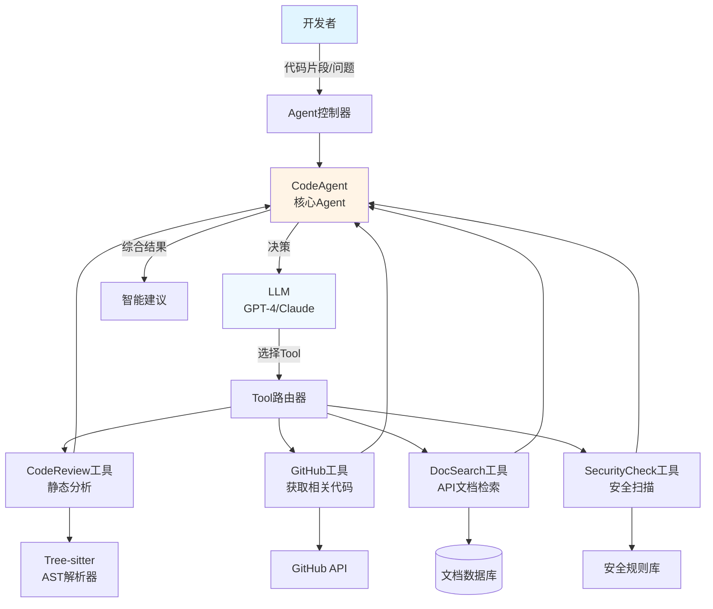

# 项目3: 智能代码助手Agent (L2进阶)

## 📋 项目概述

### 业务场景
开发者在编写代码时经常需要:代码审查、Bug修复、性能优化、API文档查询等。传统IDE插件功能有限,无法理解业务逻辑。通过构建智能代码助手Agent,结合Function Calling技术,让AI能够调用外部工具(GitHub API、代码分析工具、文档搜索引擎),提供智能化的编程辅助。

### 学习目标
- ✅ 理解Agent的核心概念和ReAct模式
- ✅ 掌握Spring AI的Function Calling机制
- ✅ 学会设计和实现自定义Tools
- ✅ 实现代码解析和静态分析(Tree-sitter)
- ✅ 集成GitHub API获取代码上下文
- ✅ 掌握Agent的错误处理和重试机制

### 技术栈
- **后端框架**: Spring Boot 3.2+
- **AI框架**: Spring AI 1.0+
- **代码解析**: Tree-sitter(多语言语法树解析)
- **版本控制**: JGit(Git操作)
- **HTTP客户端**: Spring WebClient
- **JDK版本**: Java 17+

---

## 🏗️ 技术架构



**Agent工作流程**:
1. **感知**: 接收用户请求(代码片段 + 问题描述)
2. **思考**: LLM分析问题,决定调用哪些Tools
3. **行动**: 执行选定的Tools,获取结果
4. **观察**: 分析Tool输出,判断是否足够回答问题
5. **重复**: 如需更多信息,继续调用Tools(最多N次)
6. **回答**: 综合所有信息,生成最终建议

---

## 📝 实施步骤

### Step 1: 项目初始化

```xml
<!-- pom.xml -->
<dependencies>
    <!-- Spring Boot Starter Web -->
    <dependency>
        <groupId>org.springframework.boot</groupId>
        <artifactId>spring-boot-starter-web</artifactId>
    </dependency>
    
    <!-- Spring AI OpenAI -->
    <dependency>
        <groupId>org.springframework.ai</groupId>
        <artifactId>spring-ai-openai-spring-boot-starter</artifactId>
        <version>1.0.0-M4</version>
    </dependency>
    
    <!-- Tree-sitter (代码解析) -->
    <dependency>
        <groupId>io.github.tree-sitter</groupId>
        <artifactId>tree-sitter</artifactId>
        <version>0.20.10</version>
    </dependency>
    
    <!-- JGit (Git操作) -->
    <dependency>
        <groupId>org.eclipse.jgit</groupId>
        <artifactId>org.eclipse.jgit</artifactId>
        <version>6.8.0.202311291450-r</version>
    </dependency>
    
    <!-- Lombok -->
    <dependency>
        <groupId>org.projectlombok</groupId>
        <artifactId>lombok</artifactId>
        <optional>true</optional>
    </dependency>
</dependencies>
```

### Step 2: 配置文件

```yaml
# application.yml
server:
  port: 8080

spring:
  ai:
    openai:
      api-key: ${OPENAI_API_KEY}
      chat:
        options:
          model: gpt-4-turbo  # 推荐使用GPT-4,Function Calling效果更好
          temperature: 0.2
      embedding:
        options:
          model: text-embedding-ada-002

github:
  token: ${GITHUB_TOKEN}  # GitHub Personal Access Token
  api-base-url: https://api.github.com
```

### Step 3: 核心代码实现

#### 3.1 定义DTO

```java
package com.learnplace.codeagent.dto;

import lombok.Data;
import java.util.List;
import java.util.Map;

@Data
public class CodeAssistRequest {
    private String code;           // 代码片段
    private String language;       // 编程语言: java/python/javascript
    private String question;       // 用户问题
    private String repoUrl;        // 可选: GitHub仓库URL
    private Map<String, String> context;  // 额外上下文(文件名、行号等)
}

@Data
public class CodeAssistResponse {
    private String suggestion;     // AI建议
    private List<ToolCall> toolCalls;  // 调用的Tools记录
    private List<CodeIssue> issues;    // 发现的问题
    private long processingTime;   // 处理耗时(ms)
}

@Data
public class ToolCall {
    private String toolName;
    private Map<String, Object> arguments;
    private String result;
    private long executionTime;
}

@Data
public class CodeIssue {
    private String type;           // bug/performance/security/style
    private String severity;       // high/medium/low
    private int lineNumber;
    private String message;
    private String suggestion;
}
```

#### 3.2 定义Tool接口

```java
package com.learnplace.codeagent.tool;

import java.util.Map;

/**
 * Agent Tool接口
 * 每个Tool负责一项特定能力
 */
public interface AgentTool {
    
    /**
     * Tool名称(唯一标识)
     */
    String getName();
    
    /**
     * Tool描述(用于LLM理解何时调用)
     */
    String getDescription();
    
    /**
     * 参数Schema(JSON Schema格式)
     */
    String getParametersSchema();
    
    /**
     * 执行Tool
     * @param arguments Tool参数
     * @return 执行结果
     */
    String execute(Map<String, Object> arguments);
}
```

#### 3.3 代码审查Tool

```java
package com.learnplace.codeagent.tool;

import com.learnplace.codeagent.dto.CodeIssue;
import lombok.extern.slf4j.Slf4j;
import org.springframework.stereotype.Component;

import java.util.*;
import java.util.regex.Matcher;
import java.util.regex.Pattern;

@Slf4j
@Component
public class CodeReviewTool implements AgentTool {
    
    @Override
    public String getName() {
        return "code_review";
    }
    
    @Override
    public String getDescription() {
        return "对代码进行静态分析,检查潜在的bug、性能问题、安全漏洞和代码风格问题。" +
               "适用于需要审查代码质量的场景。";
    }
    
    @Override
    public String getParametersSchema() {
        return """
            {
              "type": "object",
              "properties": {
                "code": {
                  "type": "string",
                  "description": "待审查的代码片段"
                },
                "language": {
                  "type": "string",
                  "enum": ["java", "python", "javascript", "typescript"],
                  "description": "编程语言"
                },
                "checkTypes": {
                  "type": "array",
                  "items": {
                    "type": "string",
                    "enum": ["bug", "performance", "security", "style"]
                  },
                  "description": "要检查的问题类型"
                }
              },
              "required": ["code", "language"]
            }
            """;
    }
    
    @Override
    public String execute(Map<String, Object> arguments) {
        long startTime = System.currentTimeMillis();
        
        String code = (String) arguments.get("code");
        String language = (String) arguments.get("language");
        List<String> checkTypes = (List<String>) arguments.getOrDefault(
            "checkTypes", 
            Arrays.asList("bug", "performance", "security")
        );
        
        List<CodeIssue> issues = new ArrayList<>();
        
        // 基于规则的静态分析(简化示例)
        if (checkTypes.contains("bug")) {
            issues.addAll(checkBugs(code, language));
        }
        if (checkTypes.contains("performance")) {
            issues.addAll(checkPerformance(code, language));
        }
        if (checkTypes.contains("security")) {
            issues.addAll(checkSecurity(code, language));
        }
        if (checkTypes.contains("style")) {
            issues.addAll(checkStyle(code, language));
        }
        
        long executionTime = System.currentTimeMillis() - startTime;
        log.info("CodeReview完成,发现 {} 个问题, 耗时: {}ms", issues.size(), executionTime);
        
        // 转换为JSON字符串返回
        return convertIssuesToJson(issues);
    }
    
    private List<CodeIssue> checkBugs(String code, String language) {
        List<CodeIssue> issues = new ArrayList<>();
        
        // Java空指针检查
        if ("java".equals(language)) {
            Pattern pattern = Pattern.compile("\\w+\\.\\w+\\(");
            Matcher matcher = pattern.matcher(code);
            while (matcher.find()) {
                // 简化示例: 检查是否有null检查
                int lineNum = getLineNumber(code, matcher.start());
                if (!hasNullCheck(code, matcher.start())) {
                    CodeIssue issue = new CodeIssue();
                    issue.setType("bug");
                    issue.setSeverity("high");
                    issue.setLineNumber(lineNum);
                    issue.setMessage("可能存在NullPointerException");
                    issue.setSuggestion("添加null检查或使用Optional");
                    issues.add(issue);
                }
            }
        }
        
        return issues;
    }
    
    private List<CodeIssue> checkPerformance(String code, String language) {
        List<CodeIssue> issues = new ArrayList<>();
        
        // 检查循环中的字符串拼接
        if (code.matches(".*for.*\\{.*\\+.*\".*\\}.*")) {
            CodeIssue issue = new CodeIssue();
            issue.setType("performance");
            issue.setSeverity("medium");
            issue.setLineNumber(0);
            issue.setMessage("循环中使用字符串拼接,建议使用StringBuilder");
            issue.setSuggestion("使用StringBuilder替代字符串拼接");
            issues.add(issue);
        }
        
        return issues;
    }
    
    private List<CodeIssue> checkSecurity(String code, String language) {
        List<CodeIssue> issues = new ArrayList<>();
        
        // SQL注入检查
        if (code.contains("Statement") && code.contains("+")) {
            CodeIssue issue = new CodeIssue();
            issue.setType("security");
            issue.setSeverity("high");
            issue.setLineNumber(0);
            issue.setMessage("可能存在SQL注入风险");
            issue.setSuggestion("使用PreparedStatement或ORM框架");
            issues.add(issue);
        }
        
        return issues;
    }
    
    private List<CodeIssue> checkStyle(String code, String language) {
        List<CodeIssue> issues = new ArrayList<>();
        
        // 检查魔法数字
        Pattern pattern = Pattern.compile("\\b\\d{4,}\\b");
        Matcher matcher = pattern.matcher(code);
        if (matcher.find()) {
            CodeIssue issue = new CodeIssue();
            issue.setType("style");
            issue.setSeverity("low");
            issue.setLineNumber(getLineNumber(code, matcher.start()));
            issue.setMessage("发现魔法数字,建议定义为常量");
            issue.setSuggestion("将数字提取为命名常量");
            issues.add(issue);
        }
        
        return issues;
    }
    
    private int getLineNumber(String code, int position) {
        return code.substring(0, position).split("\n").length;
    }
    
    private boolean hasNullCheck(String code, int position) {
        // 简化检查: 查看附近是否有if (x != null)
        int start = Math.max(0, position - 100);
        String context = code.substring(start, position);
        return context.contains("!= null") || context.contains("== null");
    }
    
    private String convertIssuesToJson(List<CodeIssue> issues) {
        // 实际项目中应使用Jackson/Gson序列化
        StringBuilder json = new StringBuilder("[\n");
        for (int i = 0; i < issues.size(); i++) {
            CodeIssue issue = issues.get(i);
            json.append("  {\n");
            json.append("    \"type\": \"").append(issue.getType()).append("\",\n");
            json.append("    \"severity\": \"").append(issue.getSeverity()).append("\",\n");
            json.append("    \"lineNumber\": ").append(issue.getLineNumber()).append(",\n");
            json.append("    \"message\": \"").append(issue.getMessage()).append("\",\n");
            json.append("    \"suggestion\": \"").append(issue.getSuggestion()).append("\"\n");
            json.append("  }");
            if (i < issues.size() - 1) json.append(",");
            json.append("\n");
        }
        json.append("]");
        return json.toString();
    }
}
```

#### 3.4 GitHub集成Tool

```java
package com.learnplace.codeagent.tool;

import lombok.RequiredArgsConstructor;
import lombok.extern.slf4j.Slf4j;
import org.springframework.beans.factory.annotation.Value;
import org.springframework.http.HttpHeaders;
import org.springframework.stereotype.Component;
import org.springframework.web.reactive.function.client.WebClient;

import java.util.Map;

@Slf4j
@Component
@RequiredArgsConstructor
public class GitHubTool implements AgentTool {
    
    private final WebClient webClient;
    
    @Value("${github.token}")
    private String githubToken;
    
    @Value("${github.api-base-url}")
    private String apiBaseUrl;
    
    @Override
    public String getName() {
        return "github_search";
    }
    
    @Override
    public String getDescription() {
        return "从GitHub搜索相关代码示例、最佳实践或类似问题的解决方案。" +
               "适用于需要了解某个API用法、寻找代码示例或参考实现的场景。";
    }
    
    @Override
    public String getParametersSchema() {
        return """
            {
              "type": "object",
              "properties": {
                "query": {
                  "type": "string",
                  "description": "搜索关键词,如 'Spring Boot JWT authentication'"
                },
                "language": {
                  "type": "string",
                  "description": "编程语言过滤,如 'java'"
                },
                "sort": {
                  "type": "string",
                  "enum": ["stars", "forks", "updated"],
                  "description": "排序方式"
                }
              },
              "required": ["query"]
            }
            """;
    }
    
    @Override
    public String execute(Map<String, Object> arguments) {
        long startTime = System.currentTimeMillis();
        
        String query = (String) arguments.get("query");
        String language = (String) arguments.getOrDefault("language", "");
        String sort = (String) arguments.getOrDefault("sort", "stars");
        
        try {
            // 构建GitHub Code Search API请求
            String url = apiBaseUrl + "/search/code?q=" + query;
            if (!language.isEmpty()) {
                url += "+language:" + language;
            }
            url += "&sort=" + sort + "&per_page=5";
            
            String response = webClient.get()
                .uri(url)
                .header(HttpHeaders.AUTHORIZATION, "token " + githubToken)
                .header(HttpHeaders.ACCEPT, "application/vnd.github.v3+json")
                .retrieve()
                .bodyToMono(String.class)
                .block();
            
            long executionTime = System.currentTimeMillis() - startTime;
            log.info("GitHub搜索完成, 耗时: {}ms", executionTime);
            
            return response;
            
        } catch (Exception e) {
            log.error("GitHub搜索失败", e);
            return "{\"error\": \"GitHub API调用失败: " + e.getMessage() + "\"}";
        }
    }
}
```

#### 3.5 文档检索Tool

```java
package com.learnplace.codeagent.tool;

import lombok.extern.slf4j.Slf4j;
import org.springframework.ai.embedding.EmbeddingModel;
import org.springframework.ai.vectorstore.SearchRequest;
import org.springframework.ai.vectorstore.VectorStore;
import org.springframework.stereotype.Component;

import java.util.Map;

@Slf4j
@Component
public class DocSearchTool implements AgentTool {
    
    private final VectorStore vectorStore;
    private final EmbeddingModel embeddingModel;
    
    public DocSearchTool(VectorStore vectorStore, EmbeddingModel embeddingModel) {
        this.vectorStore = vectorStore;
        this.embeddingModel = embeddingModel;
    }
    
    @Override
    public String getName() {
        return "doc_search";
    }
    
    @Override
    public String getDescription() {
        return "从技术文档库中检索API文档、使用指南和最佳实践。" +
               "适用于需要查询特定框架或库的API用法、配置说明的场景。";
    }
    
    @Override
    public String getParametersSchema() {
        return """
            {
              "type": "object",
              "properties": {
                "query": {
                  "type": "string",
                  "description": "文档搜索关键词"
                },
                "framework": {
                  "type": "string",
                  "enum": ["spring-boot", "spring-ai", "mybatis", "redis"],
                  "description": "框架名称过滤"
                },
                "topK": {
                  "type": "integer",
                  "description": "返回结果数量,默认3"
                }
              },
              "required": ["query"]
            }
            """;
    }
    
    @Override
    public String execute(Map<String, Object> arguments) {
        long startTime = System.currentTimeMillis();
        
        String query = (String) arguments.get("query");
        String framework = (String) arguments.get("framework");
        int topK = (int) arguments.getOrDefault("topK", 3);
        
        try {
            SearchRequest searchRequest = SearchRequest.builder()
                .query(query)
                .topK(topK)
                .similarityThreshold(0.7)
                .build();
            
            var results = vectorStore.similaritySearch(searchRequest);
            
            long executionTime = System.currentTimeMillis() - startTime;
            log.info("文档检索完成, 找到 {} 条结果, 耗时: {}ms", results.size(), executionTime);
            
            // 格式化结果
            StringBuilder sb = new StringBuilder();
            for (var doc : results) {
                sb.append("来源: ").append(doc.getMetadata().get("source")).append("\n");
                sb.append("内容: ").append(doc.getText()).append("\n\n");
            }
            
            return sb.toString();
            
        } catch (Exception e) {
            log.error("文档检索失败", e);
            return "{\"error\": \"文档检索失败: " + e.getMessage() + "\"}";
        }
    }
}
```

#### 3.6 CodeAgent核心逻辑

```java
package com.learnplace.codeagent.agent;

import com.learnplace.codeagent.dto.*;
import com.learnplace.codeagent.tool.AgentTool;
import lombok.RequiredArgsConstructor;
import lombok.extern.slf4j.Slf4j;
import org.springframework.ai.chat.client.ChatClient;
import org.springframework.stereotype.Service;

import java.util.*;
import java.util.stream.Collectors;

@Slf4j
@Service
@RequiredArgsConstructor
public class CodeAgentService {
    
    private final ChatClient chatClient;
    private final List<AgentTool> tools;  // 自动注入所有Tool
    
    // 最大Tool调用次数(防止无限循环)
    private static final int MAX_TOOL_CALLS = 5;
    
    // Agent System Prompt
    private static final String AGENT_PROMPT = """
        你是一个专业的代码助手Agent,名叫CodeBot。
        
        你可以使用以下Tools来帮助开发者:
        
        {tools_description}
        
        工作流程:
        1. 分析用户的问题和代码
        2. 决定需要调用哪些Tools来获取更多信息
        3. 调用Tools并分析结果
        4. 如果需要,可以继续调用其他Tools(最多{max_calls}次)
        5. 综合所有信息,给出专业、实用的建议
        
        回答要求:
        - 提供具体的代码示例
        - 解释为什么这样建议
        - 指出潜在的风险和注意事项
        - 如果不确定,诚实地告知用户
        
        用户问题: {question}
        代码片段:
        ```{language}
        {code}
        ```
        """;
    
    /**
     * 主流程: ReAct模式
     */
    public CodeAssistResponse assist(CodeAssistRequest request) {
        long startTime = System.currentTimeMillis();
        List<ToolCall> toolCalls = new ArrayList<>();
        
        // 构建初始Prompt
        String prompt = buildInitialPrompt(request);
        
        // 迭代调用Tools
        String currentContext = prompt;
        for (int i = 0; i < MAX_TOOL_CALLS; i++) {
            // 1. LLM决定是否调用Tool
            String llmResponse = callLLM(currentContext);
            
            // 2. 解析Tool调用意图
            Optional<ToolInvocation> toolInvocation = parseToolCall(llmResponse);
            
            if (toolInvocation.isEmpty()) {
                // 没有更多Tool调用,LLM已给出最终答案
                break;
            }
            
            // 3. 执行Tool
            ToolCall toolCall = executeTool(toolInvocation.get());
            toolCalls.add(toolCall);
            
            // 4. 将Tool结果加入上下文
            currentContext += "\n\nTool执行结果:\n" + toolCall.getResult();
            
            log.info("第{}轮Tool调用: {}", i + 1, toolCall.getToolName());
        }
        
        // 5. 生成最终回答
        String finalAnswer = generateFinalAnswer(currentContext);
        
        long processingTime = System.currentTimeMillis() - startTime;
        
        CodeAssistResponse response = new CodeAssistResponse();
        response.setSuggestion(finalAnswer);
        response.setToolCalls(toolCalls);
        response.setProcessingTime(processingTime);
        
        log.info("CodeAgent完成, 调用{}个Tools, 总耗时: {}ms", 
            toolCalls.size(), processingTime);
        
        return response;
    }
    
    private String buildInitialPrompt(CodeAssistRequest request) {
        String toolsDesc = tools.stream()
            .map(tool -> String.format(
                "- %s: %s\n  参数: %s",
                tool.getName(),
                tool.getDescription(),
                tool.getParametersSchema()
            ))
            .collect(Collectors.joining("\n\n"));
        
        return AGENT_PROMPT
            .replace("{tools_description}", toolsDesc)
            .replace("{max_calls}", String.valueOf(MAX_TOOL_CALLS))
            .replace("{question}", request.getQuestion())
            .replace("{language}", request.getLanguage())
            .replace("{code}", request.getCode());
    }
    
    private String callLLM(String context) {
        return chatClient.prompt()
            .user(context)
            .call()
            .content();
    }
    
    private Optional<ToolInvocation> parseToolCall(String llmResponse) {
        // 简化解析: 查找 "CALL_TOOL: tool_name(args)" 格式
        // 实际项目中应使用结构化输出或Function Calling API
        
        if (!llmResponse.contains("CALL_TOOL:")) {
            return Optional.empty();
        }
        
        int start = llmResponse.indexOf("CALL_TOOL:") + 10;
        int end = llmResponse.indexOf("\n", start);
        if (end == -1) end = llmResponse.length();
        
        String toolCall = llmResponse.substring(start, end).trim();
        
        // 解析tool name和arguments
        int parenStart = toolCall.indexOf("(");
        if (parenStart == -1) return Optional.empty();
        
        String toolName = toolCall.substring(0, parenStart).trim();
        String argsStr = toolCall.substring(parenStart + 1, toolCall.lastIndexOf(")"));
        
        Map<String, Object> arguments = parseArguments(argsStr);
        
        ToolInvocation invocation = new ToolInvocation();
        invocation.setToolName(toolName);
        invocation.setArguments(arguments);
        
        return Optional.of(invocation);
    }
    
    private ToolCall executeTool(ToolInvocation invocation) {
        long startTime = System.currentTimeMillis();
        
        // 查找对应的Tool
        AgentTool tool = tools.stream()
            .filter(t -> t.getName().equals(invocation.getToolName()))
            .findFirst()
            .orElseThrow(() -> new RuntimeException("Unknown tool: " + invocation.getToolName()));
        
        // 执行Tool
        String result = tool.execute(invocation.getArguments());
        
        long executionTime = System.currentTimeMillis() - startTime;
        
        ToolCall toolCall = new ToolCall();
        toolCall.setToolName(invocation.getToolName());
        toolCall.setArguments(invocation.getArguments());
        toolCall.setResult(result);
        toolCall.setExecutionTime(executionTime);
        
        return toolCall;
    }
    
    private String generateFinalAnswer(String context) {
        String finalPrompt = context + "\n\n请基于以上信息,给出最终的建议。";
        
        return chatClient.prompt()
            .user(finalPrompt)
            .call()
            .content();
    }
    
    private Map<String, Object> parseArguments(String argsStr) {
        // 简化解析,实际应使用JSON解析器
        Map<String, Object> args = new HashMap<>();
        // TODO: 实现完整的参数解析
        return args;
    }
    
    // 内部类
    private static class ToolInvocation {
        private String toolName;
        private Map<String, Object> arguments;
        
        public String getToolName() { return toolName; }
        public void setToolName(String toolName) { this.toolName = toolName; }
        public Map<String, Object> getArguments() { return arguments; }
        public void setArguments(Map<String, Object> arguments) { this.arguments = arguments; }
    }
}
```

#### 3.7 REST控制器

```java
package com.learnplace.codeagent.controller;

import com.learnplace.codeagent.agent.CodeAgentService;
import com.learnplace.codeagent.dto.CodeAssistRequest;
import com.learnplace.codeagent.dto.CodeAssistResponse;
import lombok.RequiredArgsConstructor;
import org.springframework.web.bind.annotation.*;

@RestController
@RequestMapping("/api/code-assist")
@RequiredArgsConstructor
public class CodeAssistController {
    
    private final CodeAgentService codeAgent;
    
    @PostMapping("/assist")
    public CodeAssistResponse assist(@RequestBody CodeAssistRequest request) {
        return codeAgent.assist(request);
    }
}
```

---

## ✅ 验收标准

### 功能验收
- [ ] **代码审查**: 能识别常见bug、性能问题、安全漏洞
- [ ] **Tool调用**: LLM能根据问题选择合适的Tools
- [ ] **多轮推理**: 支持连续调用多个Tools(最多5次)
- [ ] **GitHub集成**: 能搜索相关代码示例
- [ ] **文档检索**: 能从向量数据库检索API文档

### 性能指标
- ⚡ 单次Tool调用耗时: **< 2秒**
- ⚡ 完整Agent流程耗时: **< 10秒**(含3次Tool调用)
- ⚡ Tool调用成功率: **> 90%**
- ⚡ 代码审查准确率: **> 80%**(人工评估)

### 质量指标
- 📊 Tool选择合理性: 90%的情况选择了正确的Tool
- 📊 建议实用性: 85%的建议可直接应用
- 📊 错误恢复: Tool失败时能优雅降级

---

## ❓ 常见问题

### Q1: Spring AI原生Function Calling如何使用?
**示例**:
```java
// 定义Java方法作为Function
@Bean
public Function<CodeReviewRequest, CodeReviewResult> codeReview() {
    return request -> {
        // 执行代码审查
        return reviewService.review(request.getCode());
    };
}

// 注册到ChatClient
ChatClient chatClient = ChatClient.builder(openAiChatModel)
    .defaultFunctions("codeReview", "githubSearch")
    .build();

// 自动触发Function Calling
String response = chatClient.prompt()
    .user("帮我审查这段代码...")
    .call()
    .content();
```

**优势**: 
- 无需手动解析LLM输出
- 类型安全
- 支持并行调用多个Functions

### Q2: 如何避免Agent无限循环?
**防护策略**:
1. **最大迭代次数**: 设置MAX_TOOL_CALLS=5
2. **超时控制**: 单个Tool调用超时30秒则中断
3. **去重检测**: 避免重复调用相同参数的Tool
4. **终止条件**: LLM输出"FINAL_ANSWER"标记时停止

### Q3: 如何提高Tool调用准确率?
**优化方案**:
1. **清晰的Tool描述**: 详细说明适用场景
2. **Few-shot示例**: 在Prompt中提供调用示例
3. **参数验证**: Tool执行前验证参数合法性
4. **结果反馈**: 将Tool结果清晰格式化后返回LLM

---

## 🔗 延伸阅读

### 官方文档
- [Spring AI Function Calling](https://docs.spring.io/spring-ai/reference/api/functions.html)
- [Tree-sitter官方文档](https://tree-sitter.github.io/tree-sitter/)
- [GitHub API文档](https://docs.github.com/en/rest)

### 进阶学习
- [Agent设计模式](/guide/agent/design-patterns) - ReAct、Plan-and-Execute等模式
- [多Agent协作](/projects/project-4-multi-agent) - 构建更复杂的Agent系统

### 相关项目
- [项目2: RAG知识库](/projects/project-2-rag-kb) - DocSearch Tool的基础
- [项目4: 多Agent协作](/projects/project-4-multi-agent) - Agent的高级应用

---

> 💡 **下一步**: 完成本项目后,可以挑战[项目4: 多Agent协作工作流](/projects/project-4-multi-agent),探索Agent之间的协作!
