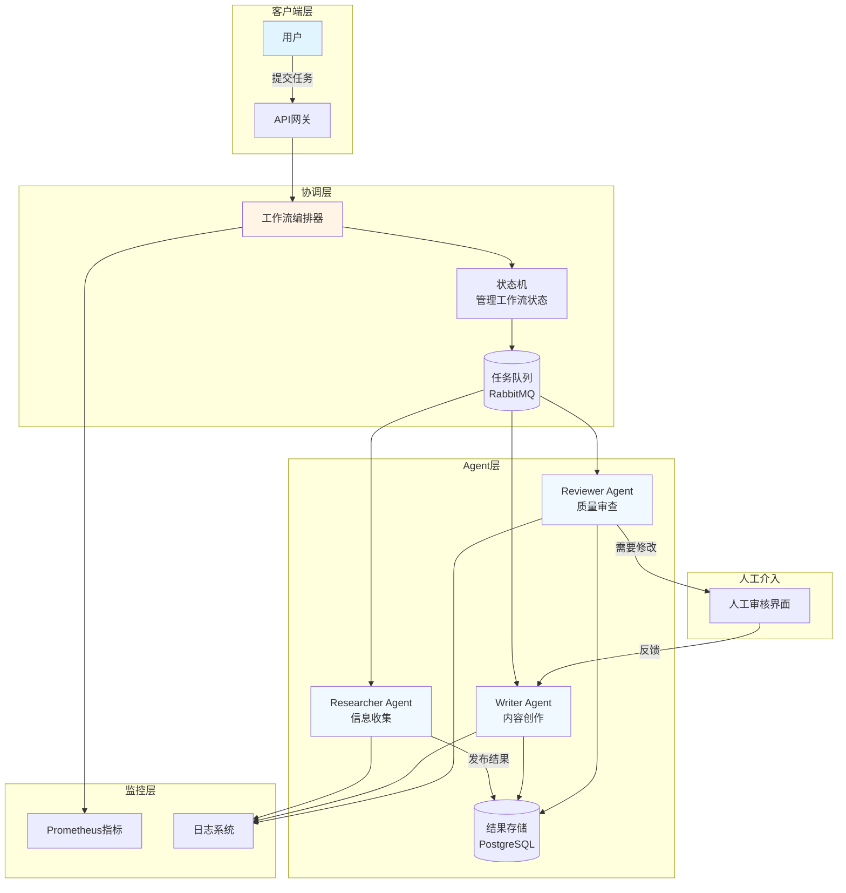

# 项目4: 多Agent协作工作流 (L3挑战)

## 📋 项目概述

### 业务场景
复杂任务(如市场研究报告、技术方案设计)需要多个专业角色协作完成。单个Agent能力有限,通过构建多Agent系统,让不同专长的Agent分工合作,模拟真实团队的工作流程,提升任务完成质量和效率。

### 学习目标
- ✅ 理解多Agent系统的架构模式和通信机制
- ✅ 掌握工作流编排技术(顺序/并行/条件分支)
- ✅ 学会设计Agent间的消息协议
- ✅ 实现人工介入节点(Human-in-the-loop)
- ✅ 掌握错误恢复和容错机制
- ✅ 了解分布式Agent部署方案

### 技术栈
- **后端框架**: Spring Boot 3.2+
- **AI框架**: Spring AI 1.0+
- **消息队列**: RabbitMQ 3.12+ 或 Redis Streams
- **工作流引擎**: Spring State Machine 或自定义状态机
- **数据库**: PostgreSQL 16(存储工作流状态)
- **JDK版本**: Java 17+

---

## 🏗️ 技术架构



**工作流程**:
1. **任务分解**: Orchestrator接收任务,分解为子任务
2. **Research阶段**: Researcher Agent收集资料,输出研究摘要
3. **Write阶段**: Writer Agent基于研究结果撰写初稿
4. **Review阶段**: Reviewer Agent审查质量,提出修改建议
5. **迭代优化**: 如需修改,返回Writer重新创作(最多3轮)
6. **人工审核**: 关键节点可引入人工确认
7. **交付**: 输出最终报告

---

## 📝 实施步骤

### Step 1: 项目初始化

```xml
<!-- pom.xml -->
<dependencies>
    <!-- Spring Boot Starter Web -->
    <dependency>
        <groupId>org.springframework.boot</groupId>
        <artifactId>spring-boot-starter-web</artifactId>
    </dependency>
    
    <!-- Spring AI OpenAI -->
    <dependency>
        <groupId>org.springframework.ai</groupId>
        <artifactId>spring-ai-openai-spring-boot-starter</artifactId>
        <version>1.0.0-M4</version>
    </dependency>
    
    <!-- RabbitMQ -->
    <dependency>
        <groupId>org.springframework.boot</groupId>
        <artifactId>spring-boot-starter-amqp</artifactId>
    </dependency>
    
    <!-- PostgreSQL -->
    <dependency>
        <groupId>org.springframework.boot</groupId>
        <artifactId>spring-boot-starter-data-jpa</artifactId>
    </dependency>
    <dependency>
        <groupId>org.postgresql</groupId>
        <artifactId>postgresql</artifactId>
        <scope>runtime</scope>
    </dependency>
    
    <!-- Lombok -->
    <dependency>
        <groupId>org.projectlombok</groupId>
        <artifactId>lombok</artifactId>
        <optional>true</optional>
    </dependency>
</dependencies>
```

### Step 2: 配置文件

```yaml
# application.yml
server:
  port: 8080

spring:
  ai:
    openai:
      api-key: ${OPENAI_API_KEY}
      chat:
        options:
          model: gpt-4-turbo
  
  rabbitmq:
    host: localhost
    port: 5672
    username: guest
    password: guest
  
  datasource:
    url: jdbc:postgresql://localhost:5432/multi_agent
    username: postgres
    password: postgres
  
  jpa:
    hibernate:
      ddl-auto: update
    show-sql: true

# Agent配置
agent:
  researcher:
    max-sources: 10
    timeout-seconds: 60
  writer:
    max-revisions: 3
    target-length: 2000
  reviewer:
    quality-threshold: 0.8
    auto-approve-threshold: 0.95
```

### Step 3: 核心代码实现

#### 3.1 定义领域模型

```java
package com.learnplace.multiagent.domain;

import jakarta.persistence.*;
import lombok.Data;
import java.time.LocalDateTime;
import java.util.List;

@Entity
@Table(name = "workflow_instance")
@Data
public class WorkflowInstance {
    
    @Id
    @GeneratedValue(strategy = GenerationType.UUID)
    private String id;
    
    @Enumerated(EnumType.STRING)
    private WorkflowStatus status;  // PENDING/RUNNING/COMPLETED/FAILED
    
    private String taskDescription;  // 用户任务描述
    
    private String researchSummary;  // Researcher输出
    private String draftContent;     // Writer输出
    private String reviewFeedback;   // Reviewer反馈
    private String finalReport;      // 最终报告
    
    private int currentRevision;     // 当前修订次数
    private double qualityScore;     // 质量评分
    
    private LocalDateTime createdAt;
    private LocalDateTime updatedAt;
    private LocalDateTime completedAt;
    
    @ElementCollection
    @CollectionTable(name = "workflow_events")
    private List<WorkflowEvent> events;  // 事件日志
}

enum WorkflowStatus {
    PENDING, RESEARCHING, WRITING, REVIEWING, 
    REVISING, HUMAN_REVIEW, COMPLETED, FAILED
}

@Data
@Entity
@Table(name = "workflow_events")
public class WorkflowEvent {
    @Id
    @GeneratedValue(strategy = GenerationType.UUID)
    private String id;
    
    private String workflowId;
    private String eventType;  // AGENT_STARTED/AGENT_COMPLETED/HUMAN_INTERVENTION
    private String agentName;
    private String message;
    private LocalDateTime timestamp;
}
```

#### 3.2 定义Agent消息协议

```java
package com.learnplace.multiagent.message;

import lombok.Data;
import java.io.Serializable;
import java.util.Map;

/**
 * Agent间通信的消息格式
 */
@Data
public class AgentMessage implements Serializable {
    
    private String messageId;
    private String correlationId;  // 关联同一个workflow
    private MessageType type;
    private String fromAgent;
    private String toAgent;
    private Map<String, Object> payload;
    private long timestamp;
    
    public enum MessageType {
        TASK_ASSIGNMENT,      // 分配任务
        TASK_RESULT,          // 任务结果
        REVIEW_REQUEST,       // 请求审查
        REVISION_REQUEST,     // 请求修订
        HUMAN_INTERVENTION,   // 人工介入
        WORKFLOW_COMPLETE     // 工作流完成
    }
}
```

#### 3.3 Researcher Agent

```java
package com.learnplace.multiagent.agent;

import com.learnplace.multiagent.message.AgentMessage;
import lombok.RequiredArgsConstructor;
import lombok.extern.slf4j.Slf4j;
import org.springframework.ai.chat.client.ChatClient;
import org.springframework.amqp.rabbit.annotation.RabbitListener;
import org.springframework.amqp.rabbit.core.RabbitTemplate;
import org.springframework.stereotype.Component;

import java.util.UUID;

@Slf4j
@Component
@RequiredArgsConstructor
public class ResearcherAgent {
    
    private final ChatClient chatClient;
    private final RabbitTemplate rabbitTemplate;
    
    private static final String RESEARCH_QUEUE = "researcher.queue";
    private static final String WRITER_QUEUE = "writer.queue";
    
    // Researcher System Prompt
    private static final String SYSTEM_PROMPT = """
        你是一个专业的研究助理Agent,名叫Researcher。
        
        你的职责:
        1. 分析用户的研究主题
        2. 从知识库中检索相关信息
        3. 整理关键要点和数据
        4. 输出结构化的研究摘要
        
        输出格式要求:
        - 背景介绍(100-200字)
        - 核心观点(3-5个要点)
        - 关键数据(统计数据、案例)
        - 参考文献(如有)
        
        保持客观中立,引用可靠来源。
        """;
    
    @RabbitListener(queues = RESEARCH_QUEUE)
    public void handleResearchTask(AgentMessage message) {
        log.info("Researcher收到任务: {}", message.getCorrelationId());
        
        try {
            String topic = (String) message.getPayload().get("topic");
            
            // 执行研究(简化示例,实际应调用RAG检索)
            String researchSummary = performResearch(topic);
            
            // 发送结果给Writer
            AgentMessage result = new AgentMessage();
            result.setMessageId(UUID.randomUUID().toString());
            result.setCorrelationId(message.getCorrelationId());
            result.setType(AgentMessage.MessageType.TASK_RESULT);
            result.setFromAgent("researcher");
            result.setToAgent("writer");
            result.getPayload().put("researchSummary", researchSummary);
            result.getPayload().put("originalTopic", topic);
            result.setTimestamp(System.currentTimeMillis());
            
            rabbitTemplate.convertAndSend("", WRITER_QUEUE, result);
            
            log.info("Researcher完成任务: {}", message.getCorrelationId());
            
        } catch (Exception e) {
            log.error("Researcher任务失败", e);
            handleError(message, e);
        }
    }
    
    private String performResearch(String topic) {
        // 实际项目中应结合RAG检索外部知识
        String prompt = SYSTEM_PROMPT + "\n\n研究主题: " + topic;
        
        return chatClient.prompt()
            .system(SYSTEM_PROMPT)
            .user("请研究以下主题: " + topic)
            .call()
            .content();
    }
    
    private void handleError(AgentMessage message, Exception e) {
        // 发送错误消息到死信队列
        AgentMessage errorMsg = new AgentMessage();
        errorMsg.setCorrelationId(message.getCorrelationId());
        errorMsg.setType(AgentMessage.MessageType.TASK_RESULT);
        errorMsg.getPayload().put("error", e.getMessage());
        
        rabbitTemplate.convertAndSend("", "dead-letter.queue", errorMsg);
    }
}
```

#### 3.4 Writer Agent

```java
package com.learnplace.multiagent.agent;

import com.learnplace.multiagent.message.AgentMessage;
import lombok.RequiredArgsConstructor;
import lombok.extern.slf4j.Slf4j;
import org.springframework.ai.chat.client.ChatClient;
import org.springframework.amqp.rabbit.annotation.RabbitListener;
import org.springframework.amqp.rabbit.core.RabbitTemplate;
import org.springframework.stereotype.Component;

import java.util.UUID;

@Slf4j
@Component
@RequiredArgsConstructor
public class WriterAgent {
    
    private final ChatClient chatClient;
    private final RabbitTemplate rabbitTemplate;
    
    private static final String WRITER_QUEUE = "writer.queue";
    private static final String REVIEWER_QUEUE = "reviewer.queue";
    
    private static final String SYSTEM_PROMPT = """
        你是一个专业的内容创作Agent,名叫Writer。
        
        你的职责:
        1. 基于研究摘要撰写完整报告
        2. 保持逻辑清晰、语言流畅
        3. 遵循指定的结构和风格
        4. 确保内容准确、有说服力
        
        报告结构:
        - 标题
        - 摘要(100字)
        - 引言
        - 主体内容(分章节)
        - 结论
        - 建议
        
        字数要求: {targetLength}字左右
        """;
    
    @RabbitListener(queues = WRITER_QUEUE)
    public void handleWritingTask(AgentMessage message) {
        log.info("Writer收到任务: {}", message.getCorrelationId());
        
        try {
            String topic = (String) message.getPayload().get("originalTopic");
            String researchSummary = (String) message.getPayload().get("researchSummary");
            Integer revisionCount = (Integer) message.getPayload().getOrDefault("revisionCount", 0);
            String feedback = (String) message.getPayload().get("feedback");
            
            // 撰写报告
            String draft = writeReport(topic, researchSummary, feedback, revisionCount);
            
            // 发送给Reviewer审查
            AgentMessage reviewRequest = new AgentMessage();
            reviewRequest.setMessageId(UUID.randomUUID().toString());
            reviewRequest.setCorrelationId(message.getCorrelationId());
            reviewRequest.setType(AgentMessage.MessageType.REVIEW_REQUEST);
            reviewRequest.setFromAgent("writer");
            reviewRequest.setToAgent("reviewer");
            reviewRequest.getPayload().put("draftContent", draft);
            reviewRequest.getPayload().put("topic", topic);
            reviewRequest.getPayload().put("revisionCount", revisionCount);
            reviewRequest.setTimestamp(System.currentTimeMillis());
            
            rabbitTemplate.convertAndSend("", REVIEWER_QUEUE, reviewRequest);
            
            log.info("Writer完成初稿: {}", message.getCorrelationId());
            
        } catch (Exception e) {
            log.error("Writer任务失败", e);
            handleError(message, e);
        }
    }
    
    private String writeReport(String topic, String research, String feedback, int revision) {
        StringBuilder prompt = new StringBuilder();
        prompt.append(SYSTEM_PROMPT.replace("{targetLength}", "2000"));
        prompt.append("\n\n研究摘要:\n").append(research);
        
        if (feedback != null && !feedback.isEmpty()) {
            prompt.append("\n\n上一轮审查意见:\n").append(feedback);
            prompt.append("\n请根据审查意见进行修改。");
        }
        
        prompt.append("\n\n请撰写关于\"").append(topic).append("\"的报告。");
        
        return chatClient.prompt()
            .user(prompt.toString())
            .call()
            .content();
    }
    
    private void handleError(AgentMessage message, Exception e) {
        AgentMessage errorMsg = new AgentMessage();
        errorMsg.setCorrelationId(message.getCorrelationId());
        errorMsg.setType(AgentMessage.MessageType.TASK_RESULT);
        errorMsg.getPayload().put("error", e.getMessage());
        
        rabbitTemplate.convertAndSend("", "dead-letter.queue", errorMsg);
    }
}
```

#### 3.5 Reviewer Agent

```java
package com.learnplace.multiagent.agent;

import com.learnplace.multiagent.message.AgentMessage;
import lombok.RequiredArgsConstructor;
import lombok.extern.slf4j.Slf4j;
import org.springframework.ai.chat.client.ChatClient;
import org.springframework.amqp.rabbit.annotation.RabbitListener;
import org.springframework.amqp.rabbit.core.RabbitTemplate;
import org.springframework.beans.factory.annotation.Value;
import org.springframework.stereotype.Component;

import java.util.UUID;

@Slf4j
@Component
@RequiredArgsConstructor
public class ReviewerAgent {
    
    private final ChatClient chatClient;
    private final RabbitTemplate rabbitTemplate;
    
    @Value("${agent.reviewer.quality-threshold}")
    private double qualityThreshold;
    
    @Value("${agent.reviewer.auto-approve-threshold}")
    private double autoApproveThreshold;
    
    @Value("${agent.writer.max-revisions}")
    private int maxRevisions;
    
    private static final String REVIEWER_QUEUE = "reviewer.queue";
    private static final String WRITER_QUEUE = "writer.queue";
    private static final String ORCHESTRATOR_QUEUE = "orchestrator.queue";
    
    private static final String SYSTEM_PROMPT = """
        你是一个严格的内容审查Agent,名叫Reviewer。
        
        你的职责:
        1. 评估报告的质量(准确性、逻辑性、完整性)
        2. 指出具体问题和改进建议
        3. 给出质量评分(0-1之间)
        
        评分标准:
        - 0.9-1.0: 优秀,可直接发布
        - 0.8-0.9: 良好,小幅修改即可
        - 0.7-0.8: 合格,需要明显改进
        - <0.7: 不合格,需要重写
        
        输出格式:
        ```json
        {
          "qualityScore": 0.85,
          "strengths": ["优点1", "优点2"],
          "weaknesses": ["问题1", "问题2"],
          "suggestions": ["建议1", "建议2"],
          "recommendation": "APPROVE/REVISE/REJECT"
        }
        ```
        """;
    
    @RabbitListener(queues = REVIEWER_QUEUE)
    public void handleReviewRequest(AgentMessage message) {
        log.info("Reviewer收到审查请求: {}", message.getCorrelationId());
        
        try {
            String draft = (String) message.getPayload().get("draftContent");
            String topic = (String) message.getPayload().get("topic");
            int revisionCount = (int) message.getPayload().getOrDefault("revisionCount", 0);
            
            // 执行审查
            String reviewResult = reviewContent(draft, topic);
            
            // 解析评分和建议
            ReviewResult parsed = parseReviewResult(reviewResult);
            
            if (parsed.qualityScore >= autoApproveThreshold) {
                // 质量很高,直接通过
                sendCompletion(message, draft, parsed);
                
            } else if (parsed.qualityScore >= qualityThreshold && revisionCount < maxRevisions) {
                // 质量合格但需改进,返回Writer修订
                sendRevisionRequest(message, draft, parsed, revisionCount + 1);
                
            } else if (revisionCount >= maxRevisions) {
                // 达到最大修订次数,请求人工介入
                requestHumanIntervention(message, draft, parsed);
                
            } else {
                // 质量不合格,返回重写
                sendRevisionRequest(message, draft, parsed, revisionCount + 1);
            }
            
            log.info("Reviewer完成审查,评分: {}", parsed.qualityScore);
            
        } catch (Exception e) {
            log.error("Reviewer任务失败", e);
            handleError(message, e);
        }
    }
    
    private String reviewContent(String draft, String topic) {
        String prompt = SYSTEM_PROMPT + "\n\n请审查以下关于\"" + topic + "\"的报告:\n\n" + draft;
        
        return chatClient.prompt()
            .user(prompt)
            .call()
            .content();
    }
    
    private ReviewResult parseReviewResult(String reviewText) {
        // 简化解析,实际应使用JSON解析器
        ReviewResult result = new ReviewResult();
        result.qualityScore = 0.85;  // 示例值
        result.recommendation = "APPROVE";
        return result;
    }
    
    private void sendCompletion(AgentMessage originalMsg, String content, ReviewResult review) {
        AgentMessage completion = new AgentMessage();
        completion.setCorrelationId(originalMsg.getCorrelationId());
        completion.setType(AgentMessage.MessageType.WORKFLOW_COMPLETE);
        completion.getPayload().put("finalReport", content);
        completion.getPayload().put("qualityScore", review.qualityScore);
        
        rabbitTemplate.convertAndSend("", ORCHESTRATOR_QUEUE, completion);
    }
    
    private void sendRevisionRequest(AgentMessage originalMsg, String draft, 
                                     ReviewResult review, int revisionCount) {
        AgentMessage revision = new AgentMessage();
        revision.setCorrelationId(originalMsg.getCorrelationId());
        revision.setType(AgentMessage.MessageType.REVISION_REQUEST);
        revision.getPayload().put("draftContent", draft);
        revision.getPayload().put("feedback", String.join("\n", review.suggestions));
        revision.getPayload().put("revisionCount", revisionCount);
        
        rabbitTemplate.convertAndSend("", WRITER_QUEUE, revision);
    }
    
    private void requestHumanIntervention(AgentMessage originalMsg, String draft, ReviewResult review) {
        AgentMessage humanRequest = new AgentMessage();
        humanRequest.setCorrelationId(originalMsg.getCorrelationId());
        humanRequest.setType(AgentMessage.MessageType.HUMAN_INTERVENTION);
        humanRequest.getPayload().put("draftContent", draft);
        humanRequest.getPayload().put("reviewFeedback", review.suggestions);
        
        rabbitTemplate.convertAndSend("", "human-review.queue", humanRequest);
    }
    
    private void handleError(AgentMessage message, Exception e) {
        AgentMessage errorMsg = new AgentMessage();
        errorMsg.setCorrelationId(message.getCorrelationId());
        errorMsg.getPayload().put("error", e.getMessage());
        
        rabbitTemplate.convertAndSend("", "dead-letter.queue", errorMsg);
    }
    
    // 内部类
    private static class ReviewResult {
        double qualityScore;
        java.util.List<String> strengths;
        java.util.List<String> weaknesses;
        java.util.List<String> suggestions;
        String recommendation;
    }
}
```

#### 3.6 工作流编排器

```java
package com.learnplace.multiagent.orchestrator;

import com.learnplace.multiagent.domain.WorkflowInstance;
import com.learnplace.multiagent.domain.WorkflowStatus;
import com.learnplace.multiagent.message.AgentMessage;
import com.learnplace.multiagent.repository.WorkflowRepository;
import lombok.RequiredArgsConstructor;
import lombok.extern.slf4j.Slf4j;
import org.springframework.amqp.rabbit.core.RabbitTemplate;
import org.springframework.stereotype.Service;

import java.time.LocalDateTime;
import java.util.UUID;

@Slf4j
@Service
@RequiredArgsConstructor
public class WorkflowOrchestrator {
    
    private final WorkflowRepository workflowRepo;
    private final RabbitTemplate rabbitTemplate;
    
    private static final String RESEARCHER_QUEUE = "researcher.queue";
    
    /**
     * 启动新工作流
     */
    public String startWorkflow(String taskDescription) {
        // 创建工作流实例
        WorkflowInstance workflow = new WorkflowInstance();
        workflow.setId(UUID.randomUUID().toString());
        workflow.setStatus(WorkflowStatus.PENDING);
        workflow.setTaskDescription(taskDescription);
        workflow.setCreatedAt(LocalDateTime.now());
        
        workflowRepo.save(workflow);
        
        // 更新状态
        workflow.setStatus(WorkflowStatus.RESEARCHING);
        workflowRepo.save(workflow);
        
        // 发送任务给Researcher
        AgentMessage task = new AgentMessage();
        task.setMessageId(UUID.randomUUID().toString());
        task.setCorrelationId(workflow.getId());
        task.setType(AgentMessage.MessageType.TASK_ASSIGNMENT);
        task.setFromAgent("orchestrator");
        task.setToAgent("researcher");
        task.getPayload().put("topic", taskDescription);
        task.setTimestamp(System.currentTimeMillis());
        
        rabbitTemplate.convertAndSend("", RESEARCHER_QUEUE, task);
        
        log.info("工作流已启动: {}", workflow.getId());
        return workflow.getId();
    }
    
    /**
     * 处理工作流完成消息
     */
    public void handleWorkflowComplete(AgentMessage message) {
        String workflowId = message.getCorrelationId();
        WorkflowInstance workflow = workflowRepo.findById(workflowId)
            .orElseThrow(() -> new RuntimeException("Workflow not found: " + workflowId));
        
        workflow.setStatus(WorkflowStatus.COMPLETED);
        workflow.setFinalReport((String) message.getPayload().get("finalReport"));
        workflow.setQualityScore((double) message.getPayload().get("qualityScore"));
        workflow.setCompletedAt(LocalDateTime.now());
        
        workflowRepo.save(workflow);
        
        log.info("工作流已完成: {}, 质量评分: {}", workflowId, workflow.getQualityScore());
    }
    
    /**
     * 查询工作流状态
     */
    public WorkflowInstance getWorkflowStatus(String workflowId) {
        return workflowRepo.findById(workflowId)
            .orElseThrow(() -> new RuntimeException("Workflow not found: " + workflowId));
    }
}
```

---

## ✅ 验收标准

### 功能验收
- [ ] **工作流启动**: 能成功启动多Agent工作流
- [ ] **Agent协作**: Researcher→Writer→Reviewer按顺序执行
- [ ] **迭代优化**: 支持最多3轮修订
- [ ] **人工介入**: 低质量报告触发人工审核
- [ ] **状态追踪**: 实时查询工作流进度
- [ ] **错误恢复**: Agent失败时能重试或降级

### 性能指标
- ⚡ 单Agent执行时间: **< 30秒**
- ⚡ 完整工作流耗时: **< 3分钟**(无修订)
- ⚡ 消息队列吞吐量: **≥ 100消息/秒**
- ⚡ 工作流成功率: **> 90%**

### 质量指标
- 📊 报告质量评分: **平均 > 0.8**
- 📊 人工介入率: **< 20%**(高质量自动化)
- 📊 修订次数: **平均 < 2次**

---

## ❓ 常见问题

### Q1: 如何保证消息不丢失?
**解决方案**:
1. **持久化队列**: RabbitMQ队列设置为durable
2. **消息确认**: 消费者处理完成后手动ack
3. **死信队列**: 失败消息转入DLQ,后续人工处理
4. **事务补偿**: 关键操作记录到数据库,支持重放

### Q2: 如何实现Agent的横向扩展?
**方案**:
1. **多实例部署**: 同一Agent类型启动多个实例
2. **负载均衡**: RabbitMQ自动轮询分发
3. **无状态设计**: Agent不保存本地状态,状态存储在DB
4. **会话亲和性**: 相关消息通过correlationId路由

### Q3: 如何处理长运行工作流?
**策略**:
1. **超时控制**: 每个Agent设置timeout,超时则标记失败
2. **心跳机制**: Agent定期上报进度
3. **断点续传**: 失败后从最后一个成功节点恢复
4. **异步通知**: 工作流完成时通过Webhook通知用户

---

## 🔗 延伸阅读

### 官方文档
- [RabbitMQ官方教程](https://www.rabbitmq.com/tutorials)
- [Spring AMQP文档](https://docs.spring.io/spring-amqp/reference/)
- [LangGraph(多Agent框架)](https://langchain-ai.github.io/langgraph/)

### 进阶学习
- [Agent设计模式](/guide/agent/design-patterns) - 深入理解Agent架构
- [项目5: 智能客服系统](/projects/project-5-customer-service) - 企业级多Agent应用

### 相关项目
- [项目3: 代码助手Agent](/projects/project-3-code-agent) - 单Agent的基础
- [项目5: 智能客服系统](/projects/project-5-customer-service) - 更复杂的Agent协作

---

> 💡 **下一步**: 完成本项目后,可以挑战[项目5: 智能客服系统](/projects/project-5-customer-service),构建企业级AI应用!
