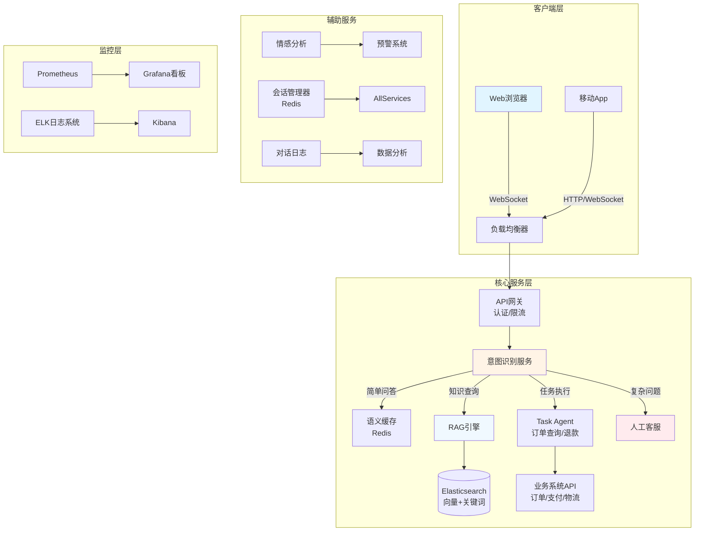

# 项目5: 智能客服系统 (L3综合)

## 📋 项目概述

### 业务场景
企业需要7×24小时在线客服,处理用户咨询、投诉、订单查询等。传统客服成本高、响应慢。通过构建智能客服系统,结合意图识别、RAG知识库、多轮对话管理,实现80%常见问题自动解答,复杂问题无缝转人工,显著提升客户满意度并降低运营成本。

### 学习目标
- ✅ 掌握企业级AI应用的完整架构设计
- ✅ 实现意图识别和路由(Intent Classification)
- ✅ 构建情感分析和用户画像
- ✅ 实现WebSocket实时通信
- ✅ 掌握会话管理和上下文追踪
- ✅ 学习人工转接和工单系统集成
- ✅ 了解监控、日志和成本控制

### 技术栈
- **后端框架**: Spring Boot 3.2+
- **AI框架**: Spring AI 1.0+
- **向量数据库**: Elasticsearch 8.x(同时支持向量和关键词搜索)
- **实时通信**: WebSocket + STOMP
- **缓存**: Redis 7.x(会话存储、语义缓存)
- **消息队列**: RabbitMQ(异步任务)
- **数据库**: PostgreSQL 16(持久化会话、工单)
- **JDK版本**: Java 17+

---

## 🏗️ 技术架构



**系统工作流程**:
1. **用户接入**: WebSocket建立长连接
2. **意图识别**: 分类用户问题(FAQ/订单查询/投诉/闲聊)
3. **路由决策**: 
   - 语义缓存命中 → 直接返回
   - 知识查询 → RAG检索生成
   - 任务执行 → Agent调用业务API
   - 复杂问题 → 转人工客服
4. **情感监控**: 检测用户情绪,负面情绪触发预警
5. **会话管理**: 保持多轮对话上下文
6. **人工转接**: 必要时无缝切换到人工客服
7. **工单生成**: 未解决问题自动生成工单

---

## 📝 实施步骤

### Step 1: 项目初始化

```xml
<!-- pom.xml -->
<dependencies>
    <!-- Spring Boot Starters -->
    <dependency>
        <groupId>org.springframework.boot</groupId>
        <artifactId>spring-boot-starter-web</artifactId>
    </dependency>
    <dependency>
        <groupId>org.springframework.boot</groupId>
        <artifactId>spring-boot-starter-websocket</artifactId>
    </dependency>
    <dependency>
        <groupId>org.springframework.boot</groupId>
        <artifactId>spring-boot-starter-data-redis</artifactId>
    </dependency>
    <dependency>
        <groupId>org.springframework.boot</groupId>
        <artifactId>spring-boot-starter-amqp</artifactId>
    </dependency>
    <dependency>
        <groupId>org.springframework.boot</groupId>
        <artifactId>spring-boot-starter-data-jpa</artifactId>
    </dependency>
    
    <!-- Spring AI -->
    <dependency>
        <groupId>org.springframework.ai</groupId>
        <artifactId>spring-ai-openai-spring-boot-starter</artifactId>
        <version>1.0.0-M4</version>
    </dependency>
    <dependency>
        <groupId>org.springframework.ai</groupId>
        <artifactId>spring-ai-elasticsearch-store-spring-boot-starter</artifactId>
        <version>1.0.0-M4</version>
    </dependency>
    
    <!-- PostgreSQL -->
    <dependency>
        <groupId>org.postgresql</groupId>
        <artifactId>postgresql</artifactId>
        <scope>runtime</scope>
    </dependency>
    
    <!-- Lombok -->
    <dependency>
        <groupId>org.projectlombok</groupId>
        <artifactId>lombok</artifactId>
        <optional>true</optional>
    </dependency>
</dependencies>
```

### Step 2: 配置文件

```yaml
# application.yml
server:
  port: 8080

spring:
  ai:
    openai:
      api-key: ${OPENAI_API_KEY}
      chat:
        options:
          model: gpt-4-turbo
          temperature: 0.3
      embedding:
        options:
          model: text-embedding-ada-002
  
  elasticsearch:
    uris: http://localhost:9200
  
  redis:
    host: localhost
    port: 6379
  
  rabbitmq:
    host: localhost
    port: 5672
  
  datasource:
    url: jdbc:postgresql://localhost:5432/customer_service
    username: postgres
    password: postgres

# 客服系统配置
customer-service:
  intent:
    confidence-threshold: 0.8  # 意图识别置信度阈值
  sentiment:
    negative-threshold: 0.3    # 负面情绪阈值
  cache:
    ttl-minutes: 60            # 语义缓存TTL
  human-handoff:
    max-waiting-time: 300      # 最大等待时间(秒)
    escalation-keywords:       # 触发转人工的关键词
      - "投诉"
      - "人工"
      - "客服"
      - "不满意"
```

### Step 3: 核心代码实现

#### 3.1 定义领域模型

```java
package com.learnplace.customerservice.domain;

import jakarta.persistence.*;
import lombok.Data;
import java.time.LocalDateTime;
import java.util.List;

@Entity
@Table(name = "conversation_session")
@Data
public class ConversationSession {
    
    @Id
    @GeneratedValue(strategy = GenerationType.UUID)
    private String sessionId;
    
    private String userId;
    private String status;  // ACTIVE/CLOSED/ESCALATED
    
    private String lastIntent;       // 最后识别的意图
    private double sentimentScore;   // 情感分数(-1到1)
    
    private LocalDateTime createdAt;
    private LocalDateTime updatedAt;
    private LocalDateTime closedAt;
    
    @ElementCollection
    @CollectionTable(name = "conversation_messages")
    private List<ConversationMessage> messages;
}

@Data
@Entity
@Table(name = "conversation_messages")
public class ConversationMessage {
    @Id
    @GeneratedValue(strategy = GenerationType.UUID)
    private String messageId;
    
    private String sessionId;
    private String role;  // user/assistant/system
    private String content;
    private String intent;
    private double sentimentScore;
    private LocalDateTime timestamp;
}

@Entity
@Table(name = "support_ticket")
@Data
public class SupportTicket {
    @Id
    @GeneratedValue(strategy = GenerationType.UUID)
    private String ticketId;
    
    private String sessionId;
    private String userId;
    private String subject;
    private String description;
    private String priority;  // LOW/MEDIUM/HIGH/URGENT
    private String status;    // OPEN/IN_PROGRESS/RESOLVED/CLOSED
    
    private String assignedTo;  // 分配给的人工客服
    private LocalDateTime createdAt;
    private LocalDateTime resolvedAt;
}
```

#### 3.2 意图识别服务

```java
package com.learnplace.customerservice.service;

import lombok.RequiredArgsConstructor;
import lombok.extern.slf4j.Slf4j;
import org.springframework.ai.chat.client.ChatClient;
import org.springframework.stereotype.Service;

import java.util.Map;

@Slf4j
@Service
@RequiredArgsConstructor
public class IntentClassificationService {
    
    private final ChatClient chatClient;
    
    // 意图分类Prompt
    private static final String INTENT_PROMPT = """
        你是一个意图识别专家。请分析用户消息,判断其意图类别。
        
        可选意图:
        1. FAQ: 常见问题咨询(产品功能、价格、政策等)
        2. ORDER_QUERY: 订单查询(订单状态、物流信息等)
        3. REFUND: 退款/退货申请
        4. COMPLAINT: 投诉或不满
        5. TECHNICAL: 技术问题(使用困难、Bug反馈)
        6. CHITCHAT: 闲聊(问候、感谢等)
        7. HUMAN_REQUEST: 明确要求人工客服
        
        输出JSON格式:
        {
          "intent": "意图类别",
          "confidence": 0.95,
          "entities": {
            "order_id": "订单号(如果有)",
            "product": "产品名称(如果有)"
          },
          "urgency": "LOW/MEDIUM/HIGH"
        }
        
        用户消息: {message}
        """;
    
    public IntentResult classify(String message) {
        String prompt = INTENT_PROMPT.replace("{message}", message);
        
        String response = chatClient.prompt()
            .user(prompt)
            .call()
            .content();
        
        // 解析JSON响应(简化示例,实际应使用Jackson)
        return parseIntentResponse(response);
    }
    
    private IntentResult parseIntentResponse(String json) {
        // TODO: 使用JSON解析器
        IntentResult result = new IntentResult();
        result.setIntent("FAQ");
        result.setConfidence(0.9);
        return result;
    }
    
    @lombok.Data
    public static class IntentResult {
        private String intent;
        private double confidence;
        private Map<String, String> entities;
        private String urgency;
    }
}
```

#### 3.3 情感分析服务

```java
package com.learnplace.customerservice.service;

import lombok.RequiredArgsConstructor;
import lombok.extern.slf4j.Slf4j;
import org.springframework.ai.chat.client.ChatClient;
import org.springframework.stereotype.Service;

@Slf4j
@Service
@RequiredArgsConstructor
public class SentimentAnalysisService {
    
    private final ChatClient chatClient;
    
    private static final String SENTIMENT_PROMPT = """
        请分析以下用户消息的情感倾向,给出-1到1之间的分数:
        -1表示非常负面(愤怒、失望)
        0表示中性
        1表示非常正面(满意、高兴)
        
        同时判断是否需要紧急干预(用户情绪激动)。
        
        输出JSON:
        {
          "score": -0.8,
          "label": "negative",
          "needs_escalation": true,
          "reason": "用户表达了强烈不满"
        }
        
        用户消息: {message}
        """;
    
    public SentimentResult analyze(String message) {
        String prompt = SENTIMENT_PROMPT.replace("{message}", message);
        
        String response = chatClient.prompt()
            .user(prompt)
            .call()
            .content();
        
        return parseSentimentResponse(response);
    }
    
    private SentimentResult parseSentimentResponse(String json) {
        SentimentResult result = new SentimentResult();
        result.setScore(-0.5);
        result.setNeedsEscalation(false);
        return result;
    }
    
    @lombok.Data
    public static class SentimentResult {
        private double score;
        private String label;
        private boolean needsEscalation;
        private String reason;
    }
}
```

#### 3.4 语义缓存服务

```java
package com.learnplace.customerservice.service;

import lombok.RequiredArgsConstructor;
import lombok.extern.slf4j.Slf4j;
import org.springframework.ai.embedding.EmbeddingModel;
import org.springframework.data.redis.core.RedisTemplate;
import org.springframework.stereotype.Service;

import java.time.Duration;
import java.util.List;

@Slf4j
@Service
@RequiredArgsConstructor
public class SemanticCacheService {
    
    private final RedisTemplate<String, Object> redisTemplate;
    private final EmbeddingModel embeddingModel;
    
    private static final String CACHE_PREFIX = "cache:semantic:";
    private static final Duration TTL = Duration.ofMinutes(60);
    private static final double SIMILARITY_THRESHOLD = 0.95;
    
    /**
     * 查询缓存
     */
    public String lookup(String question) {
        // 生成问题向量
        float[] questionVector = embeddingModel.embed(question);
        
        // 在Redis中搜索相似问题(简化示例,实际应使用向量索引)
        // 这里使用近似匹配
        String cachedAnswer = searchSimilarQuestion(questionVector);
        
        if (cachedAnswer != null) {
            log.info("语义缓存命中: {}", question);
            return cachedAnswer;
        }
        
        return null;
    }
    
    /**
     * 存入缓存
     */
    public void store(String question, String answer) {
        String key = CACHE_PREFIX + hashQuestion(question);
        redisTemplate.opsForValue().set(key, answer, TTL);
        
        log.debug("语义缓存已存储: {}", question);
    }
    
    private String hashQuestion(String question) {
        // 简化哈希,实际应使用向量相似度搜索
        return Integer.toString(question.hashCode());
    }
    
    private String searchSimilarQuestion(float[] vector) {
        // 简化实现,实际应使用Redis Vector Search或专门向量数据库
        return null;
    }
}
```

#### 3.5 RAG问答引擎

```java
package com.learnplace.customerservice.service;

import com.learnplace.customerservice.dto.KnowledgeQueryRequest;
import com.learnplace.customerservice.dto.KnowledgeQueryResponse;
import lombok.RequiredArgsConstructor;
import lombok.extern.slf4j.Slf4j;
import org.springframework.ai.chat.client.ChatClient;
import org.springframework.ai.document.Document;
import org.springframework.ai.vectorstore.SearchRequest;
import org.springframework.ai.vectorstore.VectorStore;
import org.springframework.stereotype.Service;

import java.util.List;
import java.util.stream.Collectors;

@Slf4j
@Service
@RequiredArgsConstructor
public class RagEngineService {
    
    private final ChatClient chatClient;
    private final VectorStore vectorStore;
    
    private static final String RAG_PROMPT = """
        你是专业的客服助手。请基于以下知识库内容回答用户问题。
        
        知识库内容:
        {context}
        
        回答要求:
        1. 严格基于知识库内容,不要编造
        2. 语气友好、专业
        3. 如果知识库没有相关信息,告知用户并建议转人工
        4. 适当提供相关建议或替代方案
        
        用户问题: {question}
        """;
    
    public KnowledgeQueryResponse query(KnowledgeQueryRequest request) {
        // 1. 向量检索
        SearchRequest searchRequest = SearchRequest.builder()
            .query(request.getQuestion())
            .topK(request.getTopK())
            .similarityThreshold(request.getSimilarityThreshold())
            .build();
        
        List<Document> documents = vectorStore.similaritySearch(searchRequest);
        
        if (documents.isEmpty()) {
            return createNoKnowledgeResponse();
        }
        
        // 2. 构建上下文
        String context = documents.stream()
            .map(Document::getText)
            .collect(Collectors.joining("\n\n"));
        
        // 3. 生成答案
        String prompt = RAG_PROMPT
            .replace("{context}", context)
            .replace("{question}", request.getQuestion());
        
        String answer = chatClient.prompt()
            .user(prompt)
            .call()
            .content();
        
        KnowledgeQueryResponse response = new KnowledgeQueryResponse();
        response.setAnswer(answer);
        response.setSources(documents.stream()
            .map(doc -> doc.getMetadata().get("source").toString())
            .collect(Collectors.toList()));
        
        return response;
    }
    
    private KnowledgeQueryResponse createNoKnowledgeResponse() {
        KnowledgeQueryResponse response = new KnowledgeQueryResponse();
        response.setAnswer("抱歉,我暂时没有找到相关信息。建议您联系人工客服获取帮助。");
        response.setSources(List.of());
        return response;
    }
}
```

#### 3.6 WebSocket聊天控制器

```java
package com.learnplace.customerservice.controller;

import com.learnplace.customerservice.dto.ChatMessage;
import com.learnplace.customerservice.service.*;
import lombok.RequiredArgsConstructor;
import lombok.extern.slf4j.Slf4j;
import org.springframework.messaging.handler.annotation.MessageMapping;
import org.springframework.messaging.handler.annotation.Payload;
import org.springframework.messaging.simp.SimpMessagingTemplate;
import org.springframework.stereotype.Controller;

import java.security.Principal;
import java.time.LocalDateTime;
import java.util.UUID;

@Slf4j
@Controller
@RequiredArgsConstructor
public class ChatWebSocketController {
    
    private final SimpMessagingTemplate messagingTemplate;
    private final IntentClassificationService intentService;
    private final SentimentAnalysisService sentimentService;
    private final SemanticCacheService semanticCache;
    private final RagEngineService ragEngine;
    private final SessionManager sessionManager;
    
    @MessageMapping("/app/chat.send")
    public void handleChatMessage(@Payload ChatMessage message, Principal principal) {
        String userId = principal.getName();
        String sessionId = sessionManager.getOrCreateSession(userId);
        
        try {
            // 1. 情感分析
            var sentiment = sentimentService.analyze(message.getContent());
            
            // 2. 意图识别
            var intent = intentService.classify(message.getContent());
            
            // 3. 检查是否触发人工转接
            if (shouldEscalateToHuman(intent, sentiment)) {
                escalateToHuman(sessionId, userId, message.getContent());
                return;
            }
            
            // 4. 尝试语义缓存
            String cachedAnswer = semanticCache.lookup(message.getContent());
            if (cachedAnswer != null) {
                sendReply(sessionId, cachedAnswer, "cache");
                return;
            }
            
            // 5. 根据意图路由
            String reply = routeByIntent(intent, message.getContent());
            
            // 6. 缓存答案
            semanticCache.store(message.getContent(), reply);
            
            // 7. 发送回复
            sendReply(sessionId, reply, intent.getIntent());
            
            // 8. 保存会话
            sessionManager.saveMessage(sessionId, message.getContent(), reply, intent, sentiment);
            
        } catch (Exception e) {
            log.error("处理聊天消息失败", e);
            sendError(sessionId, "抱歉,系统出现错误,请稍后重试。");
        }
    }
    
    private boolean shouldEscalateToHuman(IntentClassificationService.IntentResult intent, 
                                         SentimentAnalysisService.SentimentResult sentiment) {
        // 用户明确要求人工
        if ("HUMAN_REQUEST".equals(intent.getIntent())) {
            return true;
        }
        
        // 负面情绪且需要升级
        if (sentiment.isNeedsEscalation()) {
            return true;
        }
        
        // 低置信度的意图识别
        if (intent.getConfidence() < 0.6) {
            return true;
        }
        
        return false;
    }
    
    private String routeByIntent(IntentClassificationService.IntentResult intent, String message) {
        return switch (intent.getIntent()) {
            case "FAQ", "TECHNICAL" -> {
                var request = new KnowledgeQueryRequest();
                request.setQuestion(message);
                yield ragEngine.query(request).getAnswer();
            }
            case "ORDER_QUERY" -> handleOrderQuery(message, intent.getEntities());
            case "REFUND" -> handleRefundRequest(message, intent.getEntities());
            case "CHITCHAT" -> handleChitchat(message);
            default -> "抱歉,我不太理解您的问题。能否换个方式描述,或联系人工客服?";
        };
    }
    
    private String handleOrderQuery(String message, java.util.Map<String, String> entities) {
        // 调用业务系统API查询订单
        String orderId = entities.get("order_id");
        if (orderId == null) {
            return "请提供您的订单号,我帮您查询订单状态。";
        }
        
        // TODO: 调用订单服务API
        return "您的订单 " + orderId + " 正在配送中,预计明天送达。";
    }
    
    private String handleRefundRequest(String message, java.util.Map<String, String> entities) {
        return "关于退款申请,我需要了解更多信息。请问您的订单号是多少?退款原因是什么?";
    }
    
    private String handleChitchat(String message) {
        return "您好!很高兴与您交流。有什么我可以帮您的吗?";
    }
    
    private void sendReply(String sessionId, String reply, String type) {
        ChatMessage response = new ChatMessage();
        response.setMessageId(UUID.randomUUID().toString());
        response.setSessionId(sessionId);
        response.setContent(reply);
        response.setRole("assistant");
        response.setType(type);
        response.setTimestamp(LocalDateTime.now());
        
        messagingTemplate.convertAndSendToUser(
            sessionId, 
            "/queue/chat.reply", 
            response
        );
    }
    
    private void sendError(String sessionId, String error) {
        ChatMessage errorMsg = new ChatMessage();
        errorMsg.setMessageId(UUID.randomUUID().toString());
        errorMsg.setSessionId(sessionId);
        errorMsg.setContent(error);
        errorMsg.setRole("system");
        errorMsg.setTimestamp(LocalDateTime.now());
        
        messagingTemplate.convertAndSendToUser(
            sessionId, 
            "/queue/chat.reply", 
            errorMsg
        );
    }
    
    private void escalateToHuman(String sessionId, String userId, String message) {
        log.info("触发人工转接: sessionId={}, userId={}", sessionId, userId);
        
        // 创建工单
        // TODO: 调用工单服务
        
        // 通知用户
        sendReply(sessionId, 
            "我已将您的问题转接给人工客服,请稍候。预计等待时间: 3-5分钟。", 
            "escalation");
    }
}
```

---

## ✅ 验收标准

### 功能验收
- [ ] **意图识别**: 7种意图分类准确率 > 85%
- [ ] **语义缓存**: 常见问题命中率 > 60%,响应时间 < 100ms
- [ ] **RAG问答**: 知识库检索Recall@5 > 80%
- [ ] **情感分析**: 负面情绪检测准确率 > 80%
- [ ] **人工转接**: 触发条件准确,转接流程顺畅
- [ ] **会话管理**: 支持1000+并发会话,上下文不丢失

### 性能指标
- ⚡ 平均响应时间: **< 3秒**(含LLM调用)
- ⚡ 语义缓存命中响应: **< 100ms**
- ⚡ WebSocket并发连接: **≥ 1000**
- ⚡ 意图识别耗时: **< 1秒**
- ⚡ 系统可用性: **> 99.5%**

### 业务指标
- 📊 自动解决率: **> 80%**(无需人工介入)
- 📊 用户满意度: **> 4.0/5.0**
- 📊 平均会话时长: **< 5分钟**
- 📊 人工转接率: **< 20%**

---

## ❓ 常见问题

### Q1: 如何降低LLM调用成本?
**优化策略**:
1. **语义缓存**: 相同问题直接返回缓存,减少80%LLM调用
2. **模型分级**: 简单问题用便宜模型(gpt-3.5),复杂问题用gpt-4
3. **批量处理**: 非实时任务异步批量调用
4. **Token优化**: 精简Prompt,减少不必要的上下文

**成本对比**:
- 无缓存: 1000次对话 = $2.00(gpt-3.5)
- 60%缓存命中: 1000次对话 = $0.80(节省60%)

### Q2: 如何处理高并发场景?
**架构优化**:
1. **水平扩展**: 多实例部署 + 负载均衡
2. **读写分离**: Redis读,PostgreSQL写
3. **异步处理**: 日志记录、数据分析异步化
4. **限流降级**: 超过阈值时拒绝新请求或返回默认回复

### Q3: 如何保证数据安全合规?
**安全措施**:
1. **数据脱敏**: 敏感信息(手机号、身份证)加密存储
2. **访问控制**: RBAC权限管理,最小权限原则
3. **审计日志**: 所有操作记录,可追溯
4. **合规审查**: 符合GDPR/个人信息保护法要求

---

## 🔗 延伸阅读

### 官方文档
- [Spring WebSocket文档](https://docs.spring.io/spring-framework/reference/web/websocket.html)
- [Elasticsearch向量搜索](https://www.elastic.co/guide/en/elasticsearch/reference/current/vector-search.html)
- [Redis最佳实践](https://redis.io/docs/)

### 进阶学习
- [RAG架构详解](/guide/rag/architecture) - 深入理解检索增强生成
- [Agent设计模式](/guide/agent/design-patterns) - 构建更智能的客服Agent

### 相关项目
- [项目2: RAG知识库](/projects/project-2-rag-kb) - 客服系统的知识基础
- [项目4: 多Agent协作](/projects/project-4-multi-agent) - 复杂的Agent编排

---

> 🎉 **恭喜**! 完成本项目后,你已经掌握了企业级AI应用的核心技能。建议回顾所有项目,总结学习心得,准备面试!
